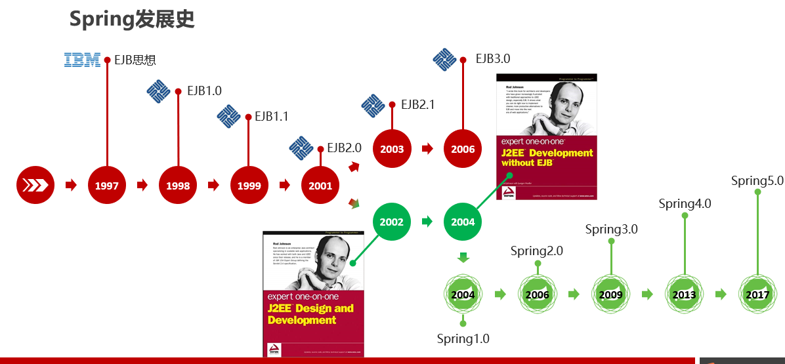
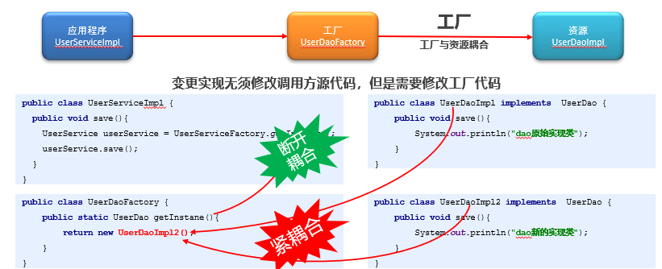
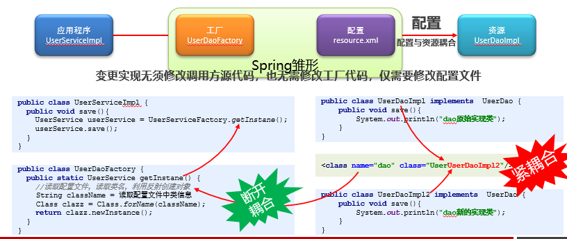
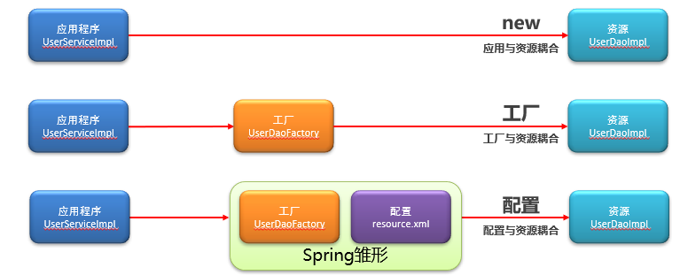
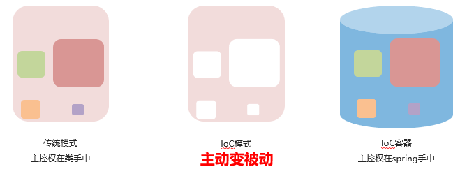
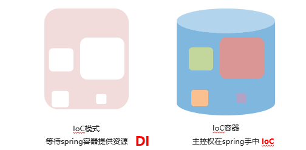
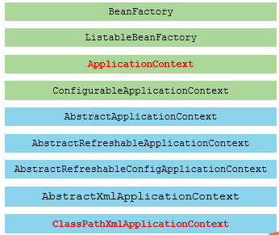

* content
{:toc}


#  Spring

## 一.Spring简介

### 1.什么是框架

- 源自于建筑学，隶属土木工程，后发展到软件工程领域

- 软件工程框架：经过验证的，具有一定功能的，半成品软件

  - 经过验证

  - 具有一定功能

  - 半成品

### 2.框架的作用

+ 提高开发效率
+ 增强可重用性
+ 提供编写规范
+ 节约维护成本
+ 解耦底层实现原理

### 3.Spring是什么

Spring是分层的JavaSE/EE应用full-stack（一站式）轻量级开源框架

+ 分层
+ JavaSE/EE
+ full-stack（一站式）
+ 轻量级
+ 开源

### 4.Spring的体系结构

![1](data:image/png;base64,iVBORw0KGgoAAAANSUhEUgAABGoAAAIDCAYAAABcnPiuAAAgAElEQVR4nOzde3iU9Z3//+c9x2RyPk1OBIZACIQAAhKqbSNEWzmkdVk5fNldXPl2bQvqutfX67LuXr/GhV5Xv+L38re1VVrX7eJXf10XgaW6QbRVkNRDDURRCAJDSDjkNDmfZjLH+/fHZMZMMgkTCCTI+9GrXs7pvj/3PcmY+zXvz/ujqKqqIoQQQgghhBBCCCEmnGaiByCEEEIIIYQQQggh/CSoEUIIIYQQQgghhJgkJKgRQgghhBBCCCGEmCQkqBFCCCGEEEIIIYSYJCSoEUIIIYQQQgghhJgkJKgRQgghhBBCCCGEmCQkqBFCCCGEEEIIIYSYJCSoEUIIIYQQQgghhJgkJKgRQgghhBBCCCGEmCQkqBFCCCGEEEIIIYSYJCSoEUIIIYQQQgghhJgkJKgRQgghhBBCCCGEmCQkqBFCCCGEEEIIIYSYJCSoEUIIIYQQQgghhJgkJKgRQgghhBBCCCGEmCQkqBFCCCGEEEIIIYSYJCSoEUIIIYQQQgghhJgkJKgRQgghhBBCCCGEmCQkqBFCCCGEEEIIIYSYJCSoEeJrxmazTfQQhBBCCCGEEEJcJUVVVXWiByHE9fLss8/S19dHQUEBCxYsIC8vb8TnPvroo5w8eTJ4e9u2bRQXF9+IYUbMarWSkJCA2Wwe8TmrV6+msLCQJUuWsHbt2oi2u3z58pDbYz32vXv3cuTIkeDtBx98kMWLFw97XkVFBXv27MFisWAymUhLS4t4jEIIIYQQQghxK9BN9ADE5GKz2fjNb35DS0sLAKtWrWLlypUTPKqrd+jQIex2O4cPHwZg9+7do4Yc15PNZuP06dMjPhY45wAtLS3B2729vdTV1QUf27Zt24jHsHfvXux2O5WVlVRWVrJr1y527dp13Y+5paUlJOTq6+sL+7z333+fkydPBp+7efPm6zouIYQQQgghhLjZSFAzzg4ePMjRo0eprq4OOwWlsLAQi8XCsmXLwlYcTLSf/exnIRfcJ0+eJCYmZtJVlkSioqICu90evG2xWK5rYDG0Iud6qa6uHvH9OHDgQMjt0tLSCQumhrLZbMHALGDFihUTNBohhBBCCCGEmJwkqBknVVVVPPPMM1fsDxKoJjCZTJMyqAkXNIwWDExmR48eDbldWFh4XfdnsVhuSFAzuLpmsIqKipDHTCYT999/f8jj17oPgMzMzFGnkI1k3759IbdNJhM/+9nPInqtxWLh8ccfH/M+hRBCCCGEEOJmI0HNODh48CDPPPPMRA9jXJjN5mFh09y5cydoNNemsrIy5PaSJUtGDSt6e3tDbo8WVgDExMSEhG3Tpk27ilH6mUwmcnNzg7fT0tJIS0sL7sdisYTd52B79uwJub1hw4aQapqnnnoq4vHs2rVrxMfWr18/5qDGZrNRXl4ecp/dbr8hwZYQQgghhBBC3EwkqLlGNpuN559/fsTHA1UcQ/uMTFZPPPFEsDLIZDJRWlp6U1bTWK3WkMApEFiMV1gB/vd2cGiyYMEC1q9fH7w9OOA6evTosKAicH7vv//+EacnVVRUjBrODH7e4NDDYrHwwAMPjPqaazU49BrcXwdCQ67i4mJ+85vfhExDE0IIIYQQQggRngQ11+jtt98edgFqMpnYsGFD2AvlgwcP8tZbb92o4Y3Z4sWL2b1790QP45p9/PHHIbdvRFVQXl7esEqTwCpHQytHli9fzsaNG0esTAk0dT58+DAmk4nt27ePGtYMDZUCTXorKip44YUXWLdu3dUc0qhGC70Gj2fbtm3DetMIIYQQQgghhAhPgpprVF1dPey+0tLSEasZVq5cycqVK6/Yy0Zcm6HBwOrVq0dcieh6CARyQwOawsJC/v7v/37UqUO//vWvKS8vDwaAdrudsrKyEcOaV155JaSCZfny5cEqqF27dmGz2XjhhRcA/7SlcKHV0NBl8+bNwelWQ2VmZo449nB27NgRcnv9+vVs2bJl1NdUVFSMqfpJCCGEEEIIIb4uJKi5RuGmcwR6i4wm3FQXq9VKY2NjyH2zZ88OPvfgwYMhF+QWi2XUpbPDLQc9uBFsYHsxMTHBYKmqqmpYoDF06tOVtltVVRXSHyYtLY3i4uKIVx8a7TiH9pgJNy3IarUOm2a2ePFirFZryNQk8L9/Q6ckDVVYWEhBQcGw+8O9z4EKlpFW/CooKOCXv/zlsMfOnz8/6tSg2NjYsNu0Wq0hFVAmk4kf//jHwPAAJ9BcOJL3wWKxjNuUt6Erb23ZsgWbzTZpVqMSQgghhBBCiMlEgpprZDKZht134MCBMQUTAe+++y6vv/56yH3btm3j9OnTI178v/zyyzz88MNhL6pPnz49rCph/fr1dHd3D1uhKhDUvPzyy8OqQIZWp4y03YSEhGHLewfs2bOHJ554YtTpOwcPHuT5558PG1i8/vrr7NixY9h+h/aJAXjzzTfDbj/c1KS9e/eOOJ7BrlQBEpCZmTlitVRgxa+xCPSxGWn/r732Wsj5stvtbNiwIexzH3nkkXENR7Zt2xb895Eqcnbt2hUSFj3yyCNYrVZ++MMfsnz5clavXh3R6mfhgjIhhBBCCCGE+DqSoOYazZ07d9jqQnV1dfzkJz9h8+bN11yVUF1dPSy8Gcxms/HUU0+xbdu2iPZlt9sjWkZ8rOx2Oz/5yU9GbJhss9koKytj165dYcOCvXv3BqfnhBM4p5EY+n6M5siRIyM+ZjKZgisTWa3WiFY6ysvLw2KxXHPj6EgaDYM/wIik/0tRURErV67k0UcfjWj/u3btGraKFMBdd93F2rVrga8qrQ4ePDjseYGKnNmzZwd/LjZv3szixYvZvn074A8ADx8+TGlpqSy9LYQQQgghhBADJKi5RitWrGD37t3DqkDq6up46qmnKCwsZN26dVcd2IwW0gz2wgsvRLSPQ4cOXZfVd640fQj8Yc6+ffuGVYcEpgtdSSThx969eyMOoaqqqkIqXAoLC0NuL126NBiCvPbaa5SVlUW03cLCQurq6oIrfg1eajtwe8+ePWHHOTig2bdvH5cuXRo1qCkuLr7iuTOZTMEgJNKKnpHOdbjKlqNHjw67b9euXcFpezt27GDfvn088MAD2Gw2Pvnkk5DnLlu2LKIxCSGEEEIIIcStQIKaa2Q2m9m8efOIF8uB6S5ms5kHH3xw1J4yI7FYLMHqHJvNxr59+4YFODabjb179warHUYSCGnMZnOwqWy4hshXw2Kx8Mgjj7B48WKqqqp4/vnnh13wnzp1atjrwp27wcdstVp58803IwqDRquQGerAgQPBfy8qKhoWYC1ZsiQY1Bw+fDjiaTqPP/542AoRq9XKa6+9FjZ8M5vNrFu3jrVr12Kz2YJVKOXl5aOu+GQ2myktLQW+qgAaGsb95Cc/uW79YGw2W9iKnkAF1I4dOzCbzcFwbt++fSFjW758ebB/0Llz567q90MIIYQQQgghvk4kqBkHgXBk165dI1ar2Gw2nnnmGd566y1++tOfRnzhHKhICDw/cNEbExMzbEnmo0ePXjGoAf/FcaTVIZEymUwh41y8eDH/9E//xA9/+MOQ5w2t6KiqqhpWWTL0mPPy8oLBx2hhzdAKmdFUVFSEBAxLliwZFvLExMRQVFQUnEr18ssvRxTUhNtXuCW6wV99s2rVqpCA4mc/+1kw4LrSik9ASCi0ffv2kJ/B0tLSkEqrQJXP1RraQHnfvn0jPreuro5HH3002JvIZrOFvH8mk4mNGzfy7LPPUl5ejslkYubMmRFNMRNCCCGEEEKIrysJasbJ2rVrWbBgAa+99tqoPUNOnjzJ5s2b+cUvfhHRBem6devChjorVqwYFtREElKYzeZxD2kASkpKho0zLy9v2HSiocL1kxnpmDdt2hRRVU0kBvdfMZlMrF27Nmw1zpIlS4JjPHnyJK+88sqIS68PtXfvXg4cODCsqshkMrF06VI2btwY9mfgpz/9aUi/n0jCmsD+Bv/sWSwWNm3aFPKcX/3qVxGNPRJDg5eRnlNWVsYvfvEL3n333ZAQacOGDTQ2Nga3Ybfb+bd/+7dhy3kLIYQQQgghxK1EgppxlJeXR1lZGRs3buTNN98csR+M3W7nl7/8ZUQXzQsWLAh7v9lsHta0NpLeM0VFRVd8ztUIt/pVJMJNhRrtmM1m84g9aCKtdnnllVdCwqOSkpIRn7t27dqQfjK7d+9m7ty5I+4rME0r3HtvsVhYvXp1yIpgQ5c67+vrC/a3GfrejhbWVFVVDQvuxnuVp6GGTmMabHAlUklJCQkJCSGhjtlsDgZeg8O8ysrKYUuwCyGEEEIIIcStRIKa6yAwVWfTpk1h+8mAvzqjqqrqiuHCaFU3sbGxYx7b1QYqN9JoxzxaUANfXfSPVMljtVrZvXt3yH3f//73Rx3PsmXLgu9hYNWsX/3qV2FDkH/4h38IG16YzWZiY2N54YUXImqcHM5IYU1gWt3g/RYWFlJZWcmBAwdoaWnBYrHw+OOP8+yzz17TilQPPvhgsKfM0GlMg/e/evVqwF+RtHbtWp599tmQxx9++OHgv69bty7kvdq1axebN2++6jEKIYQQQgghxM1MgprrKNBPpqioiLKysmEX8JWVlVfV8ySgt7f3Wod407nSMaelpbF8+XLS0tLCBjU///nPhzWzvdIUtPvvv5/y8vLg6wLNfgf30QkIBCRD2Wy2cVkSfWhYExjL0G0HmlgPVVdXF3Efn3D6+voAaGxsDDmPJSUlw6ZBBaYwHTx4MOSxoqKikL45gQqjwDHU1dXx/vvvX/UYhRBCCCGEEOJmJkHNDbB48eKwF7KRsNlsI05fGVoZcT2nudxIYznmoSwWCytWrAjb5Hb79u3DXr9x48YrjiewstLgyqihqxoFDO5pM1ZDG/0OXgq7srIypGdNbW1tMOS7lgqZqzV79uzgvy9fvnzESq3A6l+D2Ww2Vq9ePepUvdH6PAkhhBBCCCHE15kENdcokiWx4eqnHFVUVITd/sGDB4fdZ7FYrmofE2noKkIw8jFH0rtkpEa/zz777LCL//Xr10e8wtCWLVt4//33QypX6urq+M1vfhPSnHnBggUUFRUF34u0tLSQIGf27NnB28uXLw/Zx9CeRVarNTi++++/n82bN2O323n44YeD58dsNof0gwnHZDKFhD7jwWw2B6c7bdy4kXfffXfE5w4NZCYiWBJCCCGEEEKIm4UENdfoyJEj7Nmzh3Xr1o0Y2FRVVYWtpgkXUgx14MCBkOaz4K9IePnll4c9d8mSJWMY+eRQUFAwLEDZs2dP2GMe2ix3LMKd/8rKypBmxufPnw95fNeuXSGrQ4WzbNmykNt5eXnBKT+BaUmFhYUhS2hHoqqqirKyMsxmM4888giLFy9m+/bt1NbWDvs5W7ZsGSdPniQ3N5eCggJiYmKwWCxkZmZeMYi6UuXKo48+OuJUqdzcXNLS0sjLyxsxqFm8ePEV+woJIYQQQgghhPiKBDXjwGaz8cILL7Br1y6WLl0aEsDU1dWNWO0wuE/HSAJTbFavXh284B28ClGAyWSKaHuTTXFxMbt27QqpurDZbDz66KPBZbpHOuaxWL9+fcjUpaG3wwlX+VFaWhoMfUpLS0c851arlZ///OfU1dVRV1dHX19fxMuiB0Iau91OXV0dZWVlbNiwgQceeCBsT6OVK1eycuXKUbd5PYKSJUuWcMcdd1zxecuWLaO8vDwY7AT+HwjiBp/D7du309LSQlpamkx/EkIIIYQQQtySJKgZR3a7PeKLy/Xr10fcU6auru6KKwVd76WYr5dw/V/gq/BrsKErC43Fli1bgn1e1q9fz9y5c69qO48//jh1dXWcP3+eTZs2hX3OwYMHef7550PGGvi5iCSsqa2tDbltt9vZtWsX1dXVPP744yO+z4Glvm02Gy0tLdTV1WG324MVMdu2bYvoGCO1YsWKiH7mtmzZwpYtWyLaZuD8/PrXvw65PyYmZuwDFEIIIYQQQoibkAQ1E2D9+vURX7iOtMz0YA8//PAVKyomsy1bttDS0nLFkGvz5s1XvbQ1+MOs119/nS1btkTU72YkP/3pT6mqqhoWUthsNl599dWw06yWL1/Oj3/844i2v3btWqZPn87zzz8fUtVTWVnJo48+yhNPPBGsrNm7dy9Hjhy56pWcrnQeRltl63oGg0NXfboZ+y8JIYQQQgghxNWQoOYarVu3jrS0ND755JNRqz1MJhNLly5l9erVY1qSe926dSxZsoTdu3cP277ZbObBBx+8qUOagLKyMtLS0kKWwQ4YfJzXEtQsXrw4eO6Li4uHBUND+7Fs27Yt7NQms9k87JxXVFTwwgsvhJ1iVFpayve///2QYCNcM+ihY92xYwfPPvtsyNQ5m81GWVkZmzdvDvaquZbltp966qmrfu21sFqtwb42g6dB2Ww2jhw5Muw8ZmZm3vAxCiGEEEIIIcREkKDmGhUXFwcv5q1WK42NjfT19VFXVxe8AI2JiRlTODPUAw88wIoVKzh9+nTIdq+0zXBhxJUMXXnoWrcbyfYCAlNkKioqghfq06dPDx5nuBAkkobMN8LQFaHAH84FApXNmzePebUjs9nMjh07+PWvfx0yNcxutwebII+lqmWyTR+6Uo+ggMLCwohX5xJCCCGEEEKIm50ENeMoLy/vul1Qms1mzGbzTdkweKxGOsa333572H3jvez01SorK6O2tjYYxlgsluBqTeAPnEYLakYLXLZs2YLFYgn2vVm+fHmwl8vQcxX4OSkoKAgGeoOXBA+3WthEyMvLi7jn0IMPPngDRiSEEEIIIYQQk4MENWLCVVVVXbE6qKqqit27dw+7fzIFVzt27ODRRx+lqKho2HLcV+qxMnSZ76FWrlyJ2Wzm/fffH7btJ554IqIKq3Cu1GB4165dY64EilRubu6o07ZMJlNI2CWEEEIIIYQQtwIJasSEq6ys5JlnnmHZsmUUFRWFXJgHepmE611TWlo6qVa6MpvN/OpXvwo7prlz51JYWDjs/rS0NJYsWRJRn6HBPXYGu5YeRVcKuvbs2RPRdtLS0kKOL5JpVuvWrRuxImru3LmTKoQTQgghhBBCiBtFUVVVnehBCL+hvUhg5Ia2XyfhjvtKLBYLO3bsmFRBjRBCCCGEEEIIca00Ez0AIcaqsLBQQhohhBBCCCGEEF9LMvVJTLhIV24ym82sW7cuuCy1EEIIIYQQQgjxdSNTnyaRiooKqqurQ+675557bomliW02G6dPnx52/OAPcgYv0y2EEEIIIYQQQnxdSVAjhBBCCCGEEEIIMUlIjxohhBBCCCGEEEKISUKCGiGEEEIIIYQQQohJQoIaIYQQQgghhBBCiElCghohhBBCCCGEEEKISUKCGiGEEEIIIYQQQohJQoIaIYQQQgghhBBCiElCghohhBBCCCGEEEKISUKCGiGEEEIIIYQQQohJQoIaIYQQQgghhBBCiElCghohhBBCCCGEEEKISUKCGiGEEEIIIYQQQohJQoIaIYQQQgghhBBCiElCghohhBBCCCGEEEKISUKCGiGEEEIIIYQQQohJQoIaIYQQQgghhBBCiElCghohhBBCCCGEEEKISUKCGiGEEEIIIYQQQohJQoIaIYQQQgghhBBCiElCN9EDEEIIIYQQQtw6nF4H7fYmuvvb6PfYcXn78fhcqIAy0YMTQowq8HuqUXQYdVEYdNHE6hNJMWUQY0iY6OF9bUhQI4QQQkwCLq+THlcHLo8Dt8eJR3WjqupED0sIESGNosWgjUKvM2LSxxErFyxBHY5majtOUttRTV3XCRzu7oHPNxUV1X/lJ4S4+Sj+fyiAgga9NoqsuFnMSJrPtOS5ZMflTvAAb16KKn8FCiGEEDeU1+ehobuG2o5qLnWfwdZXh8Pdgw+v/wlq8B9CiJuGEiwHUVDQaQwkm7LJip2JJbEAS1LBLfVts9Pr4ETjBxxvPkxzby0+1YNP9eFTvSC1M0J8Dfl/rxVFg0bRolW0xBlSmJ+xnHnp3yTFlDnRA7ypSFAjhBBC3CB1Haf4vPEI5zqqcHh6UFVf8MJFHQhm5NJFiJtb4A9rZeB/GkWLRqNFQUN23CzmpRdTmH4HRp1pQsd5vfS5u/n44gE+bXwHl8eOR/WgqgMhtHzCCXEL8Qc3Oo0evcbIjKRFfMuyhsy46RM9sJuCBDVCCCHEdXa8sYI/X36DdkcDHq8br+pBRR24ZJELFyG+7gJBrEbRolP0GHVRzE+/mzunfo84Y9IEj258qPj4U+0bfHz597i8djw+18Aj8hknxK3N/wmoVXQYtdHkpSzh3pkPEmu8dSoMr4YENUIIIcR1Ut38ERUX9tLuaMDtdeLDJ+GMELe4QGij1xjRa40szryXYstf3tQVNhc6T/PW2X+lzV6Py9cvn3NCiLBUVHSKnhhjIt/OWUdRzr0TPaRJS4IaIYQQYpy1O5r5w7mXqes46Z/ihDrQak8IIfz8TXRV9FojSVEZ3D1jE3PSiiZ6WGP2p7rf88HFPfR77Kj45LNOCHEF/rg6ShtDXvIS7pvzYwy66Ike1KQjQY0QQggxjk40fcThut/R4WjEq3rlokVE7I59NSx75QxRve6JHooA3t5ayMf3z7ju+wkEuXqtkdszV1EyYz0G7eS/aHF7new/9Txn2ytxeRwoimaihySEuIkEqmvSYnJYP+8JUqKl2fBgEtQIIYQQ4+QP1lf4vPkwPa52AAlpxJj8431vSUgzifTH6vnfb6y6YfvzqV70GiPTEgv53uwfkxydccP2PVZ2dw97q/+F2o7P8fo8KIp81gkhroa/4XBydBbr5j5OVvz1D8dvFhJ9CyGEEOPgjdM7OdbwNj2u9uBqL0KMhYQ0k8uNfj80ihaPz8X5juPsOfksTb11N3T/kXK4e/jPE/+H8+2f4VUlpBFCXAv/50ebvZ7/PPk0jT21EzyeyUM30QMQQgghbnZ7q/+F0y1/HmiiKRct4to99d59Ez2EW9a2u9+YsH0rigYVlfqes+yt/hfuL3iMzLjcCRvPUE6vg/1fvsCFzi+k95YQYtwoikKHo5k91c/yN/P/H5JNk7ei8EaRihohhBDiGpSf+Ve+lJBGCDFOAp8jzb3nKT/zr7T0XZ7gEfl5fG7etf6OM62fSEgjhBh3GkVDa99F9lb/vzg8fRM9nAknQY0QQghxlY7U7uOLpvdxS0gjhBhHCgqKouFi1yn+WPP/0dXfOqHj8aleqps/4ljjQVRpki6EuE4URcPl7tP8wfp/B9aGunVJUCOEEEJchZr2L/ikvpx+b59ctAghxl2g09Xplo+pavgj/R77hI2lpe8yf6x5GY/PJas7CSGuL0Xh86ZDnGj6AJ/qm+jRTBj5pL1JlZSUsGnTpokexnVTUlJyVa/Lz8/HarVe8/7z8/N57rnnrnk7QoivJ4e7l3es/07vQONgIYS4Hvw9a3x8dPENatqPT8gYnB47FXX76OhvRqNoJ2QM4sZRUXF7ndjd3fR7+vCp3q8eU1WcHjt2dw8Odw8urwMG/TfQ63MPPNaL1xd5M+7ANp1e+y1fRSH8IbXb5+S986/Q6+qY6OFMGGkmfJP653/+Zx566CGee+45HnvssVGf+9xzz7Fz586r2s9LL71EcXFx8HZ+fv6YXn/mzJlh9+3evZuysrKwjwFUVFQA8OSTT/L0009HvC+r1cqaNWvYvn07r7766pjGOXQ7W7duZefOnSxcuDDk+MMJHE84Z86coaKigoceeijs4+Xl5eTl5V31WIUQE+Nw7es0912YtCGNT/Xi8vaHfBOlDPxTURQ0iha9xnBN34yrqHh9bnQawzWPN5SCx+fE7XOhqj60Gh16TRSaW+xbfEXR4HD34FO96DQG9FrjVf28qaj4Bqaq3CwX2T7Vi4qKRtGioKCi4vI48Koe9BoDuqs8FzcrjaLF7u7io4v/jTlmKmkxU27Yvr2ql5r2Lzhp+xNajf6G7VdMDFX1Ea2PZ372XSzILKal9zIfXPg9NnsdCgoxhkS+k/O35CTOwu11UdtRzZG619BpDGgUDdOSFlIyYyMubz8fXyinpvPTK/6uelUPfzHn7zHH5tDQVcuRC/+J0+u4pX7HxXAaRUubvYGPL/w3d8/8a3S34OePBDWT2GgBQMDOnTtHDGEGhwDZ2dkcOnQo4n1brVZKS0vDPrZ9+3Y2bNgw6usjGftIiouLue+++9i5cyc/+MEPIg4y8vLyePrpp8nPz2f37t1XHGNJSQn19fWjPmekgAWGh1CDb4c7/sHvx2jhjRBicrvcXcMXTYdhkn7r51U9mGOm8c2pa0iMSg1+G6qi4vY4sbt7ae67yGeN7+HwdKHXGMe+D58b0DI39dtYO46Oa2my29tPgfmbzE8vJj4qmbr2U3za+C4d/Y03TdBwNTxDvn1ON01nXsa3mJo4m1O2P/N502F6XZ1jCqw8Phd6TTSZMTPo99pp72+Y9IGX02MnJXoKcYZk2vsbcHi6idEn8Z0Zf4slsYDPG4/wRfMR+j29t9QUHL3WwIXOE5xq+TN3RJVi0EbdkP32u3v48OLv8fhct+SF0i1HUXB7nWgVPVPi80mOyuJ8+0ka+86hUbRE6WJYnP1dTPpYAOIMyRyu/d1AsKpjetJ8LIlzAXjv3O8i2qWqqkxNKCArPhctRrSKXJ4KP41GR2XDWyzMWo45dtpED+eGk9+Em8BIlScTpays7KpDmHCefPJJ9u/fH/axoWHR1q1br1hBtHXrVl588cUrBjWRbm+oawmhhBA3vyO1u3F4eiZ6GCNSVZVoXSwzkxeREJUc9jl2dw+5yfP4+MKb1HQeRz/GqhhL4ny+MWU1yaYsaj79dNznkM9JXcr8DH81Y3rMdOp7rNjsdRi1pnHdz2TiVT1D7lGYnjSf7PgZdDnaqLZ9hIqPSGet+1QfU+Ly+da0v0SvjeLDC/tpdVya1EGNT/WxJHsVt2d9l4tdZ/jz5f+mz92JTksdjxMAACAASURBVGNkVspi0mOn0W63carl44FVh24lCqDyacMfmZ40l6kJc677Hn2qlwudp7jQeVJCmluEgoLTa8dmvwD4A8L0uGn4GrzodUYSo8zBkAYgxhBPWnQOHc4mtIqO7PiZAHT1t9LUdx4FBZ/qxe114lN9KAooihaDxhgStAamSXl9HjyqB6fHjqqqKIqCXmOQaq5blIKCw9NDVcN73DPjr9Frx/7F0s1MgppxtGnTJiorK4O3x1rFMh4ClRrXc0rN1VbUDK1gCUyjKi8vD05xCrxu6JSr0ZSUlJCdnR2c7vTYY4+xc+fOiKaFDRaoIhp67kpKSrjvvvuuuK0rTQsbqUJJCHHzqO+uobbj84kexhWpqMEKjctdZ3m/7nWMumiitCamxM9mXvq3KUj7BlFaE7YTl3B4uwfKzFXcPhdenwdV9RGYKqXT6INTnFzefmalLKEw41v0u/tweh34VG+wMsfjc+PxuQder4KioFP06LSGiErgs2JnkR5rCd4XrY8hJz6fmvbjeHzOYVUUqurD7XPhUz2o+MultYoOrUYXsj//OQkcm4pG0aDV6NAqupBtBvoz+FTvoOfph12oelUPHq8LHz4YuKDQKLphU5R8qndgfF5Q/edDq2jRD7lQ8fm8Idt3eHqC4Y3X5/a/FnB7nXhVNzqNEY2i4B4Yg8JX71Pg/U+PtTAv49u09tXj9rlweR3B4wg5bypoNBp0in7YBdFX58N/frUDx+jyOADQaQ1oFR0+1YPb60IFDFojLm8/Kio6jR69xjhkfyoMrGpk0BrRKFp8qheP18OCjLuYllRAS189Lq8dn+rD4enm4Nl/JzHKTHNvLf2evuC5U1UfXtWD1+cJngetokOn0Q86v2rw59L/s6HH43PiHag20yl69FoDTPLoR6vR09J3kZr2z8mIzcVwnS9a7K5ujtW/OxAQiluJ3dVFm72RFFMmaTFT8KpejFoTOfH+gNDh7vWHKNoopibMpa25HkVRyI6fiaqqNPbU4vG50Sga4o1pLMq8hxRTOi6vi3Z7E0fr38blcwwLjj0+N2bTNO6Ych8ppkzsrm6+aDpCQ985AJkOdQvSaQx82vhHiqasJMWUOdHDuaEkqBkHI00Tqq+vJz8/P6JgIxKR9odZs2YNjY2NIWFDYCwTKRBajdaj5sUXX2Tr1q0hIc2mTZsoLS0d0zncvn075eXlwdvh3ofBIVqgj89LL71EY2MjP/rRj4LPefHFF/nRj37Ezp07KS8vZ8OGDWHHIlOfhPj6++jim7h9zokexph09rdQ1fAO0fo4dIqes22f0uFoomTGRnISZ3N79r28X/cfaDV6FBQKUr9FbvK84Lemfa4urK3HOdtRiV4TRVFWKbPSFgGg1er57oz/SX3XOc62f4LTa2d64m3kpSwkwZiMRqPF6XFQ136KU60f4lW9o1Z0uLz9zEpbjDl2Km32RhQUkk0ZTE+az5etn3Cxqxqd8lX1j8fnIkafyPyUJeQkzEKj0dFmb+Ri52kae8/h8TnRKNqB3iZGZqd9A0tSAUadiQ6HjUtdZ7ncfRqX145G0QbDqcWZK8iKzyVKH0OHw8b5ts+p6fwMozYa8IcvadHTKEz/JglRKei1Rvo9fTR21/J502F8+AMAr89NYlQmheZvkmzKwKiLxuXtx9Z7ic+b3qff0+NvFqv6SDCaQ87F0IoRFR8GbTRz0u9gSvwsTtj+RJ+rk7nmO0mOzsDldXKm5Sg1Hccx6KKYmbSYRVnfASBKH8sdOd8nNSabL5rfx+fzYtTFsChrBZlx09BpjLT2NVDT/hkXu6ox6vyVS+pAOLQkexVZcTPQarTUd9fwWeO73DvzB6DAl7ZPaO47T3pMLnPTv4mCwp8vlXNP7veI1sdyvv0EZ9o+QaMxsCjzXjLiLETrY/D5vHQ526hq+COd/U2Y9AksyFlOZlwuAFnxM/jOjM0crT9Au6OZ+KhU0mJy6HF1otgvgeoPy6K0sUyJn83UxHzijSm4fU4udJzC2v4p/Z4edBo9Wo2B3KRF5KUs4lLXaWraj7MgoxRzTA4+VOo6qjlp+wDNTXANqCgaqps/YmbyInISZl3XfbU7mjnXXiXVNLcYjaLB4emlsaeOFFMmccZkEgxpGHRRTEsswKd6udxlRa81MjVxNlMT5/Bp0zvEG1KIMcTj8bm52HkGraLFHGNhxawfMDVhdjBY7Hf3kZOQz4Gz/0afuz1k3ymmDL43+0fBzwFVVclNns/b1l1c6DqJT/Uw2QNVMb4UFHpdHdS0f0FCVOot9XkkQc04CFzUj6SsrIxFixaNS4XL0LAh0mqP8exRc61Tnz777LOw9+/evZvs7OyQY6moqKCysnJYqPHcc8/xxhtvjHhMg8MUq9VKUVERZWVlwwKWQGBSVFQUDFo2bdoUrPwJVOUcOnSIiooKSktLWbNmTUiT43DBTeC+wPsTaCo8+PWTbUqbEGJ0va4urO3HJnoYY6YoGvRaI/qBSosORwOnWj7izml/QZQuGkviXH9FjBLF1PgCVuX/HcnR6cHXq6rKjOSFaM5pOd/xGYuy7iFjoOJFrzFQbPlLvmj8AGvHUcymaXx35gPkJOSHBDL5qUsx6k2csB3B5e0P+62oqvqI1SeRM/AHfV3HSXqd3SzMWkZO4iwy42ZwobM6+HyPz01q9BSW5nyPeenfIs6YBIDb66LVXs+J5g/46OLv8ahOYvWJLMlexeKs75AYnQb4p9m09F3mfPsX/LHmVdw+OwZtFMssG5mfcRcJUSnB5+Wn3M6HF3/PCdsRtIoOs2ka35u9hSnxs9Bpv/qjsdfZSZQulk/q/3sgpMlg1ayHmJE8H6MuOvi8fo+dOEMyH17aj93djU/1khU3M+R8aBhaOaSi10QxJ+0bFKb7wxkfXuakLQ0+Z1riXA7X/gfn2o6Tl7IYS1IBALGGBBZkFhMflcSnjX8kwZjK8ul/xVzzncQY4gfOm5uZKbfx4YX9nGn7xF9FpNVTPG09i7K+Q/zA+S0095EeO41FmfegKAqtvQ00950nJXoK35z6FyhAgjGNhVnLAXC5XZxq+ZDi6etYlHUPCVGpwfF6fR6mxM/izTM70aCjKHslMYYEALLic8mKz+VS95f0OrsoNH+TWamLUFCo7z5Dv6eHKG0cRVNWsyjrbpKj04M9jArS7iCneTafXD5Aq+MSRm0MlsS53Dn1ezR0z2VG8gIWZd0T/BmdkXQbsYZE/nRxbzCMm6x0Gh0Nvedo7Km5rkGN02Onpv1zXL7+SX9OxPhSUOhzddPYU0Nh+h1E62LIiM2l19NBTmI+/R4759q+INYYjyWpgOyEmWgUHZlx/uscVfVR13kSjaJj2fT/wczkBfR7+vig7m0UYPGU7zI3/U5svZepuPifwf2qqkpKTAZd/e28X/s68cZUCtPvJCPOwl2Wdez78hJd/S1f615lIjydRs/xpsMUpt8pQY2I3O7du6/YkBbgt7/97ZhWMIpUdnb2uG8T/I15RwoSrrWZ8Ej9aMJV2fzzP/8z27dvHzYN6tixYxQVFY06hoC8vDzKysooLS0NWUkq0Btn8D4D07PKy8v59NNPg8fw2GOPUVxczJkzZ9i0aVNwO5FUxgxt+Lx///6QczBeFVdCiOvrbOsxnJ6+iR7GNVEGppu4fP109bcSFZtDnDEJn6oSpY3hnhmbSI5Op7G7luPNh4nVJ7E0ZyUZcRZuz15BTcennGk9RowxnlRTFh6fm2rbx9R1VOP1uVk2fSPTEufQ1d/GsYY/oKoqtw+EI/7Xf4bTY0cJ84e2R3WTl7gEsykHgMvdZ6lp/4KcxDzio1KYmjCHM61H6XbaUBQNOo2BOeY7uXPq9wCoaf+C+u5zTE+cS05ivr8Zrb2JL2yHmJY4j7umr0On0VPfXUNN++ekx0wjP20xqaZs2uxNfFL/BrmJt/GtaWtQFAVr62dc7PqS2WlLmZKQR0nuRs61H8fts7Mw4x4sSXNptTfwwYW9eHwe5qTeydz0b3B71nc51fIR7f0NzDMXU2AuotvZyaHzv6PH2cHM5MUsyi5hUdZ3ONNWyeXuHjw+Lxlx00PfqzCVR4qqBPsJ5acu5mLXWd6reY0UUyZzzXeSHT+D2anfoLbjJBe7vmR6TyEZcdNwuHtp6D7PmbZjGLUmZqd+g6IpK/CpXqqbP6bFfokC853MSJ6PRtFwvuME4GVK3Gy+Pe0v0Wp0tNgbqG7+kDTTFBZl3YNxoJltoPGnVqMNfmO+IPMuatpOEGdM5FzHZ2TF5XHn1Psw6qI53niExp4apsTPYo55KTNTbmNaQiG1nSeotn1M0ZR7idbH0trXQJu9kda++uAUKSD4R7qiaFmYdTffmrYGkz6W5t6L1HfVYI7NYUrCTO6YWorL28+h2t+hql+NMys+F73GwAcX9qPT6FmYeTepMVksyFjGsYZ38KqRLyk8MRRU1cvFrtPMSr2dxKi067IXh7uXM21Hb6mLIuGnKBqc3j5sff4+NUatiSkJs2juu4BBa8Tu9n9p4Z+GsoZ4YzLpMRay4/1BjdNjp6n3HCmmbArM30BVVY5dfpc/1rwMKGg1Or4xdTVFOffycf0buLyDq1QV3q15leqWjzBqTfh8HhZkLmN6ciGJRjPd/a03/HyIiadRtFzq+pLu/jZM+riJHs4NI0HNNRqpOmSoSMKcq5GdnU1jY2PEzx+tce9QQytHIPLGxiNND9q9e3fw3zdt2sRDDz1EcXExmzZtAoZP71qzZs2w7VitViorK3nppZciGgv4w5o1a9awf/9+Vq1aRXFxMU8//XTw+AZXEAWmKOXl5ZGZmclDDz1EY2Nj8LmDl/4OhDdDBQKcrVu38sYbb1BUVHRdgjohxI1zovkDAg09b3aq6sPh9jdEjtLHYNBG4/G5+KzxXU63/Jm6zmrOth0jKSqT3KT5ZCfMIM2UhYrKp43vkBFnIcWUidvr5ND5/8Dh7kFVVc60VdLad5HG3lpOtXwEaDDHTCU+KoWU6IxRl/L2+rzkpS4iJSaTdkcztr4LXO4+TUNPDbnJ8/3jiJtBm+MSOsVAeuw0ZibfBsDZ1ireOfcy7Y4mLiUvpMizCru7G7fPQZwhhVmpt6PT6GnuvUD5md/Q3HuB9IEVJDw+F06vnShdDLdllqAoCu32JvZ/+Rwd/U2caz/OQ7f/b9JispmTdgdfNL1Hepy/okiDhj5nL/XdVmo7qjnV8gGq6sPl9TfCTI+14FNVNIqCw+3gYudpajuqOdP2CXqNga7+VhQ0eH1uMuMsIedDUcKX9wf6hXT0t3D08kGqGv9IdlweccYUZiTPI86QhFFr4kxbJeaYHDLiptHr6qKy/m3OtlWSGGVmnvlbAFzqOsP+L3+B3d1NQ08NfzX/H8mMm86slNs511HF7NSlaDU63F4nh2te48vWj0mMMmPQRpGXutA/VUwJjMv/c6UoGuo6TvGHmpcxaI3U91iJN6TwzrmXidHHcbT+D9j6LpCfspRpSQXEG5NJjs7kbFslf77838xKXUS0PpaG7nN8eOlNmnpriNUnoQ783vmXG/eQHJXJnLSlmPSxXOw8Q0XdPup7zpJmmsJd09cxI3kB+alLONtWRXNvbfD82V09fN50hCMXXifOkIxJl8BtWXcRpY8hwWimzXFpDL9JE0OnMXCh8xRt9obrFtT0uruo7z6LVqoXbkk+1Uevq4NeZxcmQyyWxIJgH7JeZydNvTWAF5+qotcayE26jax4/3QlW+8lXL5+MmKmoxmY2hmlNXF79r0AwRXLYgwJxBqSsbu6AP9nnr9ytQq314HD3c3p1mPMNi9FrzWQFJVJQ885PKpbetXcgjw+Jw3dNWQM+W/l15kENTeZkaYdhQtfBgcIgcqbweFEpMZjlaPA6krl5eUUFRVRWVkZ/P+aNWuorKykqKgoGIIEGgQHxlpRUcFLL73Eq6++yltvvQUQcbPhgKeffpr9+/cPa1Qc6E8DDGskXFxcTHl5OaWlpcOqb0YS2N6aNWt47LHHWLVqFaWlpdTX14eEPEKIm4fL66C++zRfh5AGCDaeBX+/FRUfTq+DDy7+F5kxM8mIm87KWX9HqimL+IEpQFqN/0+GPncnbm8/4C9V73a24PG50Chajl4+QGr0NDLipnOXZQMppkyy42egURQ0inbEmMunekkzTSUzbgYAtp6L6JQoMmKn0+vspsfZSXxUEtnxeZxtO4bT20dSlJnk6AwA6nuswd4qtR2f0+5oxOtz0+VsIc2UQ0aMv1qlpe8y59qriNLF0NRbwzvndqHio8fVTpTOFPxG2IeX3KQFGLRFaBQtLq+TKJ2J6QkFfN70Lhc6q8lLvY1kUwYrZ/1P2h1NNPfV0dB1njNtR3F7HSiKwsXOU8zP/DaxhkTuzv0rbstcTov9Ag3dtZxpraTP3YkCROsTSDFlDXuXRtPYU8vFri9R8dDtaqXD0QTMQ6vRodcY6OxvDq5O5lM99Lk66XN1kBU346ugSdGSn1qEXmMk1pCIR/Wg0xjIScjnfMdnZA5U+fS6ujhp+xMqXtoc9XzR9CfyUhf6BxLmDa1u/pDGHuvA9vS02C/R1HOeqQmFzExZyJ05paTGTCVaFwP4q2RU1UefuyO4+ovL66TH2YLb1z/sVHhVLxmx00mK8k/RO9/+OV+2fgT46OxvJjt+JjOSF5AUbSYrLpeGbmvwtV3OVqxtn+Hx9eP02mnqrQXuQkHBqI0OBkKTmUbR0GavH3jPF4z79r0+D7bei7i8DqIG3iNxa1EUBYenj4ae88xKXUh2Qh7R+lh8qo/Gngt4VH/A3dB9nsx4CzNTFmKOyfH3p+k6i1bREWdMGdiWhjnpS5nLnQMb/+p3LMGQik2pC/7W9fR3+Juzo0Gn0dPr6vQ3Ysffa0ujaGHSV72J60Gr6LjQdYpF2XdP9FBuGAlqrtHChQsjqlC52ilKQ183dJrMk08+ecUAYCwVN+GMVB0TMFpz4MEClTDbt2+nsrIyOI0oMzMz5LX5+fkh1TxWq5WHHnqI7OxsrFYrb7zxBmvWrLmqY9m6dSs7d+7EarXS2NgYMm1ppPEHpoFt2rSJ/Pz8Efv9DF7VanAYFHh9SUkJ+fn5IYGUEOLm0NhTh9PrmOhhjAsV/wpFsQM9R/pcXbi9/Zj08SzNLmV+xl2kx1qINcTT4+yAgQqOwB/S/sDlq2k5GkUbbNg7L/0ubssoYUpCPgnGVOzublS8qOroEZfb52RW6u2kDAQv5tgciqevxevzYNLHDazI4+/BkhGbS03Hpxh0URi00agwsLqIFq2ix+m1D4Rq+Fec0hqI1vsvNl3efjSKxj9en4eG3rMDKztpidHHYzL4S6rjjcmsmvXVfx8C041iDImoqo/Pmw+TYspkVupikk0ZJJsymJlyG32ubgo67uCNM8/T7+nlVOtHpF7MpsB8B4nRaSREp5CbXIjT42Be+rcpP/sbWvouMCV2FrGGpDG9j26vM3jcPtUXvJgJrKakUZRB75OCRtGgDKx0FT3QKNocO5XVs340cKoUNGhQUTHp40EheN56XZ24fQ4M2mgUFDr7baOOrd3RhEajQ69qAJVoXRx3TP8+05PmkR2fh4JCu6Pxq6qh4CpQWhi4TwmGe+H7GcUY4okaOI4eVztuXz/RulicHju9rg48PjcGbRRROlNI+OL1uXF5HWgUHaDiJfS83RwUvKqbVnsDTo892Px5vDi9Dpp7LwSni4lbjwYNDncPjQNBTawxEZM+Foe7l8tdZ9Fp9Li9Li52nmJKwgymJeYHm6XXdZ1CQcE9MKVJVX2caP4TrfbLKCi4vE5/o3eNlnZHw0Aw45cQnTrw+6riU70YtdHBfl397p5Bn3PiVqMoGhq6z030MG4o+QS+Rhs2bODFF1+84tSmH/zgB2PedlNT0xUDnkiCovr6em6//fZhy2NHanCAEZjSM5blswN++9vfsnXr1pD7BgcWgcAnUH0DX01JCgQ3FRUV1NfXs2rVqoj3G9jGSy+9xGOPPcZjjz0WnAJWVFREdnY2+/fvj2hVrKKiIkpLS4OBS319ffCcZmdnjxpWBcKd5557LmRf4aaYCSEmE5WGrhoUlJvi2/bh/H/w+peb9ocuCcYMEqNS8apeWvsa0Co6kqMyuTdvM3HGRGrbT1BRt5tORwu3Z69gjrko+FpgWIWDir/Hzd25f8OUhDyaey7wft1rXO6yUmC+k4VZJQQCn6GX3SoqOsVIbtI8Yo2JAMHwY6gpCXlkJ8zkXHsVHq8Lt8+Fgj9I8R+jh2hdHNMSCtFrjNjsF/B4nbgGKoCMumi8AxVEOq2R7LjZROtjaHc04VX9S3ejNdLZ38onl8rRaw34VB9OjwMVFYe7FxQFW98FDpz9V862LSIjzkKqaSqZsRaSTRnMTb+DU7Y/82Xrh3T0N/KHmv/L+Y7PyYyf4a/uiZ2OOXYKM1MWUJB6Jx86msiMyyV2oInuGN7VgWlQSvA8fvXY8DMdeFRVVXw+L4pWobn3Ascb38OgjcKrenF5+lHx0dXfhlbR4fK6/OdNGw1oBi6SFNJipo46NrfPGVxO3Kf6mGv+Ft+23I9Ba+RY/R+42HWaNnsj6wr/F4lRaQPHMXSVq5HDPUXRYHf34PT0YdLHEq2PHfgZ8E+9itLFoNPocXrsuLzOYcu0q/iC1V2Bla1utmo5raKjw95Mj7Nz3IMat9dJu6PpJgquxHhTFGUgqKnx30ZBq9Hj8rZzoasaraLD7XNS13mSO6d9j6iBUNftdXK560tUoLHX/1oV6HF2cKj2P1BVH7dl3I05Joc+dzddrpavpjWqKiZ9LFPjC6hu+QCNYiA/dXGwEXtHfzMen0t+Lm9RiqLQ6rg+rUQmKwlqxsGLL7444gpJ4K+CuZoVnxobG0cNajZt2hSckrR79+4Rq14qKyspLS0dVgWyadOmYGVLQGCVo5G89dZbFBUVhQ1pRgo6AqFOZWUlhw4dCulTM/S14ZawHhxkjNQTZjThKooGTwF78sknI6pyCVQvDa0wCgRM4ZZAD6z2NFLD4aFTrYQQk48KtNjrb7LLuK/oNHri9CkDF7NGUkzZLJ3iD7v7XT181vgeem0UWfF5xBkTcXkd/OnCfj5t+gMmfQJ35fo/70KW1R64uNVotLi8/XhVDznxBcGpMkfr/8CfLr5Ov8fO/Ixl/j4XSqDHSCifz0NOwlzMAxf/Ne2fc7Hry2Ao4FO9JBhTg41Tc+JnkxSdSWd/C139rSRFp5EVN5PM2Jk09dZiSZzPd2c8iE6rp6rhj5xs/hOtffVkxE0j1ZTN9IT5XOo+TVJsFt+Z+bfE6OM42/YpFRd2Y+u9zLSkfHw+L3++dAC7p4sEYxp3TL0Pu6uDlr7LaNDwran3E2OIp9PRSvmZfyXVlI3ZlMPGBf9ElM7EjOQFfNn6IUXZq0mKTqfP1c2hmt9hMsSTEp3NusL/RYopi6kJczjaEEVmnAX9QLPciF3hB1IdFHUoKKiq6u/H47HTam8kI24qDncvH1z4PW5fP+YYC7dnf4dOh412eyNe1Ut99zmmJuaTEJXK7Vn3cqb1KKmmKSzMWjbqvr2DvvX2qV4K07+JQWukx9nJ2+f+nZa+i1gS5gfjE0XRoiihQaiCBo/Xjdc3/Bt0jaKlzd5Aj7ODpOh0LInzyI7N51L3adJjLeQmzQegq78NW9/F4avE3Ky/zIMoioZuVxsOT++4b9vjc9HhaAr9nRe3GH/VVpfThtPTj1Hn7yvT4+qgxX4BnUaH1+fG1ncBr8+LVqNFVVXa7U3Y3Z3otUZa7Jeo764hO34GRVNWoCgKdnc33552P0nRZr5o/JAvWz7GjTNkz3fP+BvMcTmY9InMzyhGrzVysfMMXU5/qCPdaW5NCkqwt96tQoKacTB4akxlZWXw/rEuiT1UZWVl2KW/B1eeBJrklpeXh4QH+fn5bN++nczMTAAWLVoUso1wIc3u3bvZuXMnx44dCxtaWK3WYPWO1WodFjBcKUAJdy7CVdFAaNPjhQsXjrrdKwkENWOtABqroedyaF+fcCGUEOLm4P8W52a7uvOPNyPWQmn+j9Fp9Bi00SRFZ5AR5w9FTtk+4VzHp0RpTcGScp3GwMyUheg0OrIS8pia4A+gjbpofKoXraLD6fEvsW3QGlk+/a9oszfQ1d8aLOKYmjibRa7vEBeVwpy0Jf7pUdqBi2VVDSn2cPtczElbSlK0GYCq+j9wrOEdUPx/mPlULzH6RIxaE4mZdzEtsYBpCQWcbv2ES11fYkmaw/SkeazM+wH1PVamJswhJzGPfo8Dt9dFj6uNmo7PKMy4E3PMVFbO+jvOd3xBqimL3OS5AJy0fYTTa+dEcwXTkvJJj53KX8x5lMvdZ5gSn8+SKffS5+rmlePbAEiPyaUo57u4PP0YddF09tuIMSQEL2xbHfV4VQ9JUdmU5K4HFUyGeJp6ajFoo9AO9Adq728C1T/Vy+11M17r6yj4+4y4B/q9xBoSWTplBfFRidS2V3O65RMy4qZiSSzgvtmPYLNfYmbSQuZlfJOW3sv87ouf43I5qLZ9yJIp92LURfPdmX/L9KT5pJqyQxsfh7lq+qpKxS8Qtui0Bm7LKKHP1cWCjLuIMyYDoNcYUdDg8vYHK7emxM+kZMZGqurfwe7uCwlxtIqWVvtlajtOkJMwi9zkedwz82+o7z6HOXYqean+v3lqO/2rX30dVy7SKBq6ne3X5cLF43PT4+qQhq23OEVRcHoctPZdJjthJgAtvZfw+twDv1MqLq+D5p6LZCVMR1EULnefC34Our0O3j33CiW5f01O4izumfHXwW039dTx0aXfB3tSGbRRKIrCpc6zGHTRfGfGA8HntvY1cKRuD72uTqmmucWN0GP/a0uCmnE0nn1HrFYr9fX1wwKWwMV/oMHtY489xtNPP01+fn6wGsZq9TfNy8zMDFbADA5VAn1WhgYr3QvYvwAAIABJREFUGzZsYNGiRZSWllJSUjIsWPnRj34UnCoUqCAaa3XLUEOrU4auvhRYIvuzzz4bcXpQdnb2qFO6Ag2MhRDianU7b6YlQf2NGA1af7l4QlQai7PvCXlGm72J062fcPTy22gH+stc7jrDxc4zZMfP4M6p3+O2jGVoNFrOt58gN3keMYYEUqKy6XQ2U9d5gqKce9FqdJTk/g8aus7zyudP8aXtE2Yk38b8jG8zK2URGo2Oy11nyU2eB0BKdDZt9obglB2f6iMpKpO8lIX+b2B762l3NKHXGkJWiHJ4/L0SFmTcRVK0mZkpC/my9WOONx0iMdrMXPOdzDEvZY55KQD9bjuV9W/zZctHgMrZtqNUXn6b2zKXk5s8Lzgej8/NiaYPOdbwNqqqcqrlQ7LjZzAvo5glU+7ldvVeFAW6+9s43nSEhh4rGkXDh5f+i/TYHNLjprE6/yHsrl5MhlhUwNp2nGrbhwAcrT9AZpyFaUlzuDv3r3C47UTr/dNULnad5XjTIeKNqaSZptDad5nMQe+RgoJ+YHUUncbo/wtVUdBrBu7TGhi8ClngfPkveDSo+OhwNGF39WAyxDEv49tkxE2npu0fOd70HubYHArM3+Cb0+5DHdhSm72RTxvfw2avQ6fouNzzJe/WvMo3ppSSGJ3GoqwSOh2tVF46yJ3T7vP/tA0EK1pFG7yIGlyJoVG0fNb4HolRaWTETWNV3t/hVb20ORrocXaSEJXClPg8jDoTXoeby11WchLySY+bSnrcVHr62znR/GFwxRmdxoCiaHF6+6hqeAejzsRtGcuYlbqYWamLAXB7XXxaf4ijl9/G4ekmwWAOhjWBC8JA7BNokm3URd9UF4H+b5e7r0vvLJ/qxenpu/WuikQIDRp6XR18fOlNpnTn0e+xc779i4HPHkBRcHodfHjxv5iSmIfb6+RM67FgBZuKytn2Y7i8/cxMvY04QwoaRYOt7xJNPbXU95we6HGm4VjDOyRFp3Ou7The1cP0pEISosz0e3qxtn7K+Y7j+FTvTfU7Kq6HW+szSYKaSeq3v/1tSMBSUVEBfFWlY7Va2bp1K/n5+ZSXl/PSSy8FKzQyMvzz+jMzM4OrHEFoCBJums5g9fX1IWFNSUkJ8FUY9fTTTweb6waMtr0rTS0aPLbB1TV5eXnB8CgwdWqosrKyYN+Ykfz/7N13fBzVufDx35mZLerVki1Z7sIGN1wQpglj0+I4AdGcXEJCcwCTxAkJiUluzA25b67vTTUBAzEQasAk4JiYEjqiC7BxL2pW712rrTPz/rHSYrlKrpL9fD8fgbV7dvbszpE059nnPOdgAaWCgoI+16jZn4M9/kDL44QQA1vA7DreXegzTel0BJr4pHItca4ErN1qcISsIN5AB41dNexs+pyg5Y18Mtrmr+flnX9hTPJU0mNGELKDVLUVUda2jTOGX4xtW5HJbnHLet4ueYYhsSOwrBBV7cX4zE7eLH6K0pZNZMaPQ1MG9Z1l7Gz6nInpZxHnTMYX8nQXHrYifXIZUWyp/5CqjkJ2tWyjxVe3VxFTh+aiqHkdrxcbJEcPpaajmBhHAjWdJbxZ/BTVHUWkRg/HqbnxhTqp6ihiR+NneIKtGJqTdn8Tb5X+jXpPOemxI3HrMQRML/WecrY1FNDur8fQnHQGmnml8BHqPOUkR6UR5Yin1VtPvaeM7Y2fonVPXJu9VbxS+DAZ8eNIjckkwTUEf8hDi6+ezXXh2jQKRUegkTdKnmR4fDZDYoaT6E4nZAVo8zeytf4TajoKyYw9haKmL6juKOkVqPGG2llf/QZpsVmUNm8maHqxbJvN9e/R5q+jpGUzQcvX/X4GKWz6HIVNVXsRvlAHDs1JTUcxrxU9zujk8FKgqvad2MqisauSl3c+THV7EYlRQ3Dq0TR7a6ntKKaweT2G5kBDx6XHsKHmHTz+duLcSehKp6ZzF01dNd2BGhWuRwM0eMr5sOJFNKXREWjqVXx6W8NHWHaI4fHZJEUNwxfqZEvdh8S6ksiIH03A9BO0/Dh0F59V/xu/2UVyVAYhy09lx04CVhcbat+mwVNGYfN6gqYPh+6msauK98uep6ajhPTYkcQ44glaAWo7S9nR8CmN3ipcehQhO0Bxyxc4DSd1neV4Q53d2wabVLfv5PPq12j1NtAZaO5VKHtAU4qgFcC0Q0f80JZtEbB8kSLa4uSklIbP9PB5zWsUVL2MUuHdAnuCwqr7539d7et8Wv1K9/3OXhlshuZgV9smilrW4dJjUYDf9ISLjXcfR1M675U/j2WZGLoDUOxoLCDGkUBXqAOlegK0g+RnUxw1J1uWn7L3zE8VA8L48eN7FewtLCzklltu2StQsXz5cmpqali2bNlewQ4gct+hmDNnDrfccgtr164FjlzG0J67RPUsw9pzR6s97bkb1JHSl52zDtRuX7te7X5bzzKnfS19kho1Qgx8Nja/fueaSIr2YGDZZvcykt5/4pUK1/7QlI6hO/aalIasIKYdIkqPJWj5CdlBDGUQ6N69w2VEoSkdG5tAyEeMM5Gg6SNo+XDqUZh2iJAZwG3Ehpfe2H4MZRC0Ali2hVN377UMxbItgqYP0zYxNAeOfV6Qh+slBE0/VnfAyKG7UChMO0TQDODU3bj0GHyhTkLdk/7da5NYtknQDKApg2hHPAGzC7/ZhUN39QoM9fRHKZ1oRwKdgWY0pe3Vr573yrYh3pmCz+wkYIYntz1ZGhBegmTaQSzbJs6ZTMDyEQh1oWsGuubAqUXh1KLwW1388oLnIo9b+sbXuuv/mJHXCxA0fYSsUK/3AGyC3cWVDc0ILyVSOpZtYtqh7qVFOj6zA6ceXmbU874ZyoHLiMETbN3tdYYnXNnJZzJhyEzqPRWUtW5hV+tmoow4ZmZczKWn3ADAA5/cQa2nBNMOEQh9WbS5d12YcP/M7mVs3mA7StOwbQvTDkW2xlZKx7QCWNi49Tj8pgewwoWNLT+mFcKhOTF0Z+SC3bJNgpYfDSMclLECBCwfTt29Wx9sglaAoBlAV3ok66jnPPbsBtbzmF/NXRPp+d1vXsZA5Te9XD3xJ8zIuOiIHreyfSd//vh22ZpbHFE9yxf7Otm2bat7Z7iTa3Iu9i9o+vnNRa8c724cMxKoEUIIIQ7Atm3ufvvyk+qTHNu2QKmDvub9tetZ2nQs3zMbG9sObz1+4Oe1sfrYLny8g3+Ka3VPKA7l/Qr320KhuOfCf0VuP5IBAhsLbPb5Wmzs8Pa4ve6z0ZTBhNRZLJh8JwAt3gY2179PlB7L+CEziHMlU9lWyKPrf96vIKbdvTPTwXps23afxuDhPWbfBkugpivYwTWT7uSMzEuP6HEr23dy70eLItu4CyHEQHCyBWpk6ZMQQghxECdTkAb2PaHvT7vjsXxEobo/fT14S62P7fp2vD12xDrQEffRLtxvfR+tjxyFtt8PpRVqH7VIwplKRc3r+bh8LWOSpxLvSuG8kXlYtoUn0EZR0xe8X7Y6vF1uP34++ja2+v7eH95jBreT69UKIcTJRQI1QgghhBCiF4XCH+rk5cK/MDZpOqkxmbj0GEw7QKe/lV2tW2jyVUaK/AohhBDiyJFAjRBCCCGE2Et49yibnc0FbG8yIzWPlNK66wlJkEYIIYQ4GiRQI4QQQggh9kmhem2VLoQQQoijTwI1QgghhBBCiONGaRAul6Sk+M5A170NjW3bYMHR2pZGxsQgcozGxMlGAjVCCCGEEAPM7jsPCXGi6qktHfDYBDssQj4LK4TM9AYyTaE7wIjScMZpOKIUlkVksn64dh8TgQ4LU8bEwHeUx8TJSgI1QgghhBBC7MEX6zjeXTihKR2CHhtPXYjmwgBtJUG8TSZBj4UdspE0ioHIRjkUrjiNmKEGCWOcJGcbRKU60B1gW4d39MiYqA3RXCRjYnA4umPiZCaBGiGEEGIg6949WdK/Byg7nO5t2xz2p4evLprEpSs2H5FuicPji3XwyVVj0YyD/NDZYIf/IxOSflAa+Nssaj/3U/VhF8FOC02n+5N5BQ75ZTcwhc9L0GPTUhigZWeAunU6WedHk3qqC8OlDjnxpfeY8BDstGVMDAr7GROzo0mdcHhj4mQngRohhBBigFIamH6bQKdFyG9jm0gq8QCj6aC7FY5YLXxBehiT9Y+uHMtHV46NfK80sEwIeixCXRZWULL/j7ldwQPfrwin/EdrOGO18JxFztGBKQh5bUpf66Rhgx9Q6E6ZhA8mSgOlhc+Zr9GiaE0nQY9F5qzoyNKl/h1QxsRgt88x0XkYY0JIoEYIIYQYcLone74Wi6btfhq3+OmsDhHsChfqEwOHI0YRm2GQMslFyngn7kT9iBxXaRDy2bSVBWnc7Ke1JICv2cIOIZlVA4gywJ2okTDWSfpUN3FZRniCKcGa/bOh4t0uGjcFJFPwBKD0cDZZ2ZtduBJ00ia7+h+wtqH8HRkTJwqlg21C+eGMCSGBGiGEEGKgUQo6akKUve6haXsApSk0HQyXXL0ONLYJ7WUhWouDNI93MvarsUSnHl6wRmkQ8kPlR16qP/CGl4U4uj9hlp2yB5xAh039Oh/1X/gZ/ZUYMma40WSZxj4pBW2VIaoLvNh2+Hsx+CkFWLDrdQ9JY50Y7r6f2J4xUVPgDQc4ZUycEJTqDuC94SF5rBO9H2NChEkikhBCCDGAKB18rRZlb3XRtD2A7lRoBnLxOlCp8DnTXYrWogDFL3cS7DrcipqK6gIvNR95MX02uktJ6vgApjTQDIWmQenLnTRu80tGzf5oiqoPPCBBmhOPDSGPTf1GX/9+X2mKqvc94X/LmDix2BDstKnr75gQgARqhBBCiAFF0xV16720lQbkU/lBRjMULTsCNO0IhOsJHQKlQ2dNkKZNfoKdFurIrKQSx4imK0pf9xDyS57/voT8Nm27Qof88yEGMAW2adO83R9evtRHMiZOYLuPCU2uZ/pLAjVCCCHEAKE08LVZdFaZhLps+cR5ENIcioYNPqyQfUifDmuGomVnAH+bidJlAAxGwXab1tKgZNXsSUFXQxBkQn7Csi3w1JrYVh8Hf8+YkLjmCSsyJkz5hdhfEqgRQgghBgilKXwtJiGvLWnCg5RS0FllHnLhRKVBV4NJsEvGwGClFHTVBmWHrj0oIOiRnctOdLYVLoTeF73GhMSlT1j9GRPiS1JMWAwo48eP3+ftK1euJDc39xj3Rgghjj0raGGF5OPFwSzYZWEfxszD9NlYpo0uqeKDVtB3vHswMFk92TQytE9olgl9XbVpSYbVSaE/Y0KEyWc1YsDJyclhx44dka+8vDwWLlzIqlWrjnfXhBDiqLNtJSsmBrkjsWRN5rGDnPwQCyGEOAwSqBED3rJlywB46KGHjnNPhBBCCCGEEEKIo0sCNeKQFRYWMn78+F5fy5cvPyrPlZmZeVSOK4QQQgghhBBCDCQSqBGHZPny5cyfP3+v21esWLHfOjOHqrCwkKqqKnJycvZ5357BosLCwr3aXXfddb3azJkzp9f9+fn5jB8/niVLlrBq1apebZcsWXLQ573uuuuO3AsWQgghhBBCCHHSkkCN6Lf8/HxWrFhxwDZHMnBxyy23AF8ugeqxatUq5s+fzz333NOrns38+fPJz8+PtFuyZAkLFy7sVfemqqpqr2ANwOrVq1m/fn2k3aJFi1i9enWvTKH8/Py9nldq6AghhBBCCCGEOBIkUCP6beXKlQdtU1BQ0CtY0h8FBQW9slWqqqpYu3ZtrzaFhYUsXbqUvLw8FixYELm9J5izex+XLVu2145RixYtoqqqaq8+ZmZm9goILV68mMzMTNasWRO57eWXXwbo9by5ubm9vhdCCCGEEEIIIQ6FBGpEvxUUFPSpXU1NzSEdf89dn+655x7mz5/fK0unJ1gyb968fT7+QH1csmTJfjOC9rW8KjMzk6qqqsj3Pf8+1ECUEEIIIYQQQgixP8bx7oAQB7NgwQJqa2tZsWIF+fn55ObmRoJACxcuPOjjV61axdKlS/d5X3+CSYWFhWRnZzNz5kwKCgpYuHAhmZmZvPXWW30+hhBCnEgcTgcAwUAQAMNhoHr2prZtQiGz+5+99yru1Q4wQ2akzZ5teygFQ9LScBhOGhoaCAR8yCbWx59SiqSUZGJj4qisKMe27YOe71AwFPn37m172lmWhWVakfs0TUPTNZRSmCETy7KO8qsSQgghji8J1Ih+O1jGSo9hw4YdseecNm0aAOvXr++1jGnt2rVkZ2fv93H5+fmRIM3uQZXly5cftM7O/ixevJiamhpWr15NVVVVpHjyjh07Dul4QggxGBmGwZqX/o3T6eRrl15MS0szL615g4TExEgbv99PS2sLL//rRf75/PN0dnbg8Xh49ImnmThpUq/jBYNBSktLeOyRh/ms4BNMMxy8iYqO4vK8K7ni6mtISUkFwOvt4uWXXuK5Z/5GfW0NuiGXM8daVFQUNyy8hQvmzCEpKRkIn8PPPi1gxX33UltdTSgU4pzzcvn5L+8mOjq61+O7urrYuOELVtx/L7uKSzjzrLP48Z1LGDpsGF3eLu76yR2sX7eOQMDPT+/6Ty7LuwJd13nz9dd4dOVfqKqqxJDzLoQQ4gQlf+FEvy1cuPCggZqcnJy96sIcST1BoHXr1h0wULN+/XoA7rnnniNaQ2bZsmUsW7aMJUuWsHr1aiBcQPnJJ588Ys8hhBADXSRLQkVuAOBvTz1JR3s7UVFRnHn22dx483cZP/5Ulv/ht3S0t/c0Y+2/1rCrtBRsGDF6NLNnz+bOn93F/7vnv/j4ow+IjormtkXfZ/5ll1NaUsyrr7yMp9PDubm5XHnV1SQkJPDAfffS3NSEruvH/g04SSUmJrLsd39k7LhxlJQU8/q//01bWxvTZ8zgjJwzWfHgSm6/ZSGVlRVAOCOmoaGBl/71Ij6fF4AzZ53FmbNm4Xa7+e9f3Y1lWpFxER0VTebwLDZv2kR0VDRZWSO+PL9KSSKVEEKIE54EakS/5ebmsmjRogNmpBzpgEVPwKUns2bevHmsWLGCtWvX9ikAs2d2z2effXZE+tUTsDnSW5ILIcRg9urLa6mprgbgueee4f4HVnLOeefx6itrqeheHgPw0Qfv8eH77wOKxMRExowezSnjJ2AYBj6vj8vyriL3gjls3bKZ+/+8nK2bNwGKTRu+4Lzzz6eutlYCNMeYrutcMPdCxmVnU1pSzG033xi57+/P/o3bvvcDLr/iSm65/XZ+ffdSsG2UUrS3t/Gvf75Aa2srlmWxdctmfvXr3zBq1ChcLhe2baNpOvX1dQxJS2PylKl89MEHjBg5krT0dFpamomLi0dTEqURQghx4pNiwuKQLF68eK+dmCC8m9KRXgK0atUqVqxYQV5eXiRLJzs7m7y8PAoKCnptnQ3hzJaerbJ7Ajs9xYchvOyprwWR92XPrccLCwsBmDlz5iEfUwghTiSWZWFZ4RojLU1NVHcXYR+WkYnT6aSnLMnciy7lhpu/y403f5elv/pvJk2ewjtvv0VZ2S6UphiaMYz4+HiKCgupqqgAFLqus33bVh75y0OsfXENLc3NEqw5hjRNY8TIUQAUfPwRpmlGzrdpmnzw3ruYpsnYcaegdZ8X27ZxOV1kj5/AxEmTmD5zJldcdQ1Jycls2PAFXR4PSlNoukZZaSmtLS1MOPVU4uLiGJedTeqQIZTt2kVrayuaJpeuYuDaV40mcWKQ8yqONcmoEYcsOzv7qNRl6dmee3f7Wrq0bNkypk2bxtKlS3tl96xcuTIS0MnNzeWee+5h6dKlkSVKeXl5B80IOpAnn3yyT/0TQoiTldrju9a2VgDS0tNxOJxA+IJ3ztwLe7X0en18/lkBjQ0NKBSJCeF6N+3tbXi6uiKTdNu2MU3zKL8KsSe7OztmeFYWlmVR39DQ636lFLW1ddi2TXp6OppS2IBtWQzPyuK//+d/sW0L2wan08n2bVv5x99XRQIwCkUgGKC8rIzTJk4iNj6OsWPHEQwEaGxoICMz8/i8cDHg2XQHSOzwOOwpSh0esz23ffn7w7YtUApNHTjwFy5cbQPqgEHCUCgE2GRkZhEKBKirr0PTtCMaRLZsC2y7ux/9zyyzbRvLslDqwK9FfKknAB0XF0dKSgoN9XV0erpwOBy9CqQf8ee1uwum2/T5XJmmGf49KlmHJwwJ1IgBpb+BnwULFhw0QLK/NosXL478Ozc3d7/Pva9lXFI4WAhxsjn0i3ybKHcUAN4ub68de15c809KioswDIPMzOGcf8Ec7vrFUgJ+P2tWv0AwEADA7Xbjcjrp6uqKTMBM00SpcIaNXJgeGz3vs9frRSlFbGxsr/tt2yYuPh4AT5cH2w5PJ5VStLW1s2H950w4bSJpaWls3rSR39zzK+rqasPjqnviqWs6JcXFjB2XzewLLmTCaROprKygpaVFJpdinzweDwtvvY1vX38ja19cw+N/fYTammounTefGxd+l6ysETz9xOOsuO9ebNvma1+/nLt+uZQ3X3+N3/z6VwB7/Q6xLIuk5GS+ff2N5M6+gMf/+ggvPLcKp8vVq51t20THxHDb7d/nvPNnExUVhW1ZNLc08/xzq3ju2WcOu+h1TwDqT/etYOy4bH56xw/ZvGlDd9C7b0KhEEOGpHHGrFk0NjTw8Ycf4HT2/fEnG9u2MQyDs889l5sW3kpGZiaapuH1evns00/468MPU7ar9KgUNA8Gg/z0rl8w96KLWf6H3/HOW28SCAT2+3fOtm2cTiffuPZbfFbwCTu2b5cs0xOEBGqEEEIIcUBKKTIyhzNtxgxqqqtZ99mnkQtByzThACnhwWCI5JTwrkB1dbW9Ljg/K/iYjz/8AE3T8fl8mGaIq675BtOmz+TjDz+kuaUZgLS0dBISEuns7MQ0Q5x62iS+8tX5dHS08+rLL1FZUSE7AB0jlm1TV1uLUorxE07FNM3Ie29bFqeedhq6ptFQ3xDOWgCUpmhuamDFffcSCgb4/fL7mDR5Ct+58SYeXHEfDfX1kePrhk5R4U6mz5jJpfPmER8fzz9f+ActLc0SqBH7pGkaTQ2N+Hxexo4bR1paOuVluxielUVW1ggARo4eTUZmJu3tbYweOwaAlpZmujwe3FFRhEKhcJ0kpdANI5KV43K5iImJQdcN/H4/VndGi9HdJjo6mtt/8EPmXngRH7z/Hls2bSQ+IZHL8q7glkXfA6V44e/PAeEJdSgUwrJM7O5MiT0zM0zTxAyFws/THYjW9HAGTVRUdHdfdCzLJhAIYFsWhsOBruuR4/dkGxqGjq4bWJZFQkIC1990M+flns/99/4Jn8+H0+miJ7tR9BYKBpl5Rg53/efdNDc18cRjj+L3+Th9+gxmXzCXYcMy+OmPf9RdHF/1et91XY+MDyB8nroDP8FgEE3Twple0Cvw19MOwOV24Xa7MRwOgF7P0TNODYcDTdNoa23l18v+l6/Mm09R4U78fh9RUdHyAcYJQK5qhBBCCHFgSjF5yhRuu/37rF/3OR998D6Zw4d3Z0q07RWn8QcC+H0+QqEQF8y9kKwRIzFDJoU7tuPz+SIXkD6vl46ODjRNJxgMENW9hbPhMHC6XOzcvp3KigpyZs3i/fx3KSkpxrYsTp82jcvyrmD79m189mkB5WW7kEuaY8MMhch/923yrryKmWfkcPY55/Leu++AUmQMy+CKK69C03U+fO+98HIQpQCFZdv4/X6aGht57NFH+MlPl3DJV+bxyScf885bb0YmKIZusG3bFlpbWxg5KlwLp3DHdkKmiabJp8Rib7quU15eRm1NLcOHZ5GSkkx6+lBGjxmDp7OTYDDI8OHhoE1NTTWjRo+my+OhvKwMpWlMmz6D79x4M+lDh1K+axf/enE1r736KikpqdiEMwkzMzP47Z/uZfz4CezYsY2/PryS0uJiDMNgXHY2mqZRXVXJC/94Dk0z2PTFek6ZcGp4VzvCQZrY2Fi+c8NNTDl9WmTp318euI/W1jYA/H4/uedfwNevuIJRI0dSVraLN15/jffz38Xb5QXCmTWmGSIpKYnv3no7k6dO5Zmnn+KN114lJTWVqxd8k3PPyyUYDPDqyy/z0toX6Whv52uX53HhJZfidDj47qLvEZeQwN+efJzo6JjjeOYGLqUpkpKSiIqKorOzg/x33qG4qJB333mbDRvW4+3y4jDCQbDY2Fiuu/5Gzj7nHLCh4NNPePjBBwgEArjdbu5cchdDMzJZu+affPuGGyktLiE1NZXWtlaW/nwJEM6i+fkv72b0mDHdWV7dQRYbQNHl8XDZFVcy72tfJ627ZtdfHnyAbVu3cPMttzLrrLMB+NFPfsao0WN47ZWXpabXCUCuaoQQQghxYLbNjh3bcLvd5OScyZ/uf4BhQ4dhGAbr1q3DtHrXi7nrP5fi9/mJjYtj5KhRxMXFseqZp6ntzsTocePCW8m76hp0XScpMYkR3RPzndu309Hezicff0jBJ2dzxVXXcPviHzLnoouJiori1FNPA2Dr5k1s3bwFw3Acu/fiJGfbNju3b+f9/Hc4N3c2v7j7V2zatIEuj5eJEyeSPnQozU3NrH7+OYLBYK/HKhSGYfD2m29wbu5s5sydy80Lb2Hzxg2YZggUKE2jraWVmupqpp4+jZBpUlNTS3xCvHxCLPbJMAxKioupqa5iXHY28QmJDM8awdix2axfvw5vVxez58wlI3M4Xd4uskaMor6+np07tnP69Onc9cu7SUxMpLW1ldOnT2NYxjAsy2LTxo1YloXb7Wbe/K+HM2osi9zzLyA9fSg/WHQbgUCAzz8tYNy4bPKuvJrzzp/N+nWf88F7+ax69ulIDRyn08Hdv/5/TJl6OrZloes6WVlZjMs+hTt+sIjW1lbOPudcfvCjO0gfOpTqqkqmTJ3GjJk5tDS1sO7zz7DtLwva3njzd5l/2WXkv/sOmzdtwOl08t1bF3HhxZfZA3iDAAAgAElEQVTQ0FBPVHQ0371tES63i7+veobY2FhcTie2bZOSkkJSUlKvZaiiN8uyqa+vp62tjfETTuX3y/9MaUkxH77/Hvlvv01dbS2appGYmMR119/AFVddjc/no7m5mcvzriQtLY2f/fgOoqOjGTsuO/w1diyxsXGU7SonKiaaCaeexoTTTmP71q1kZGaSO/sCPB4PjY2N2D3nRkEwGODreVdw08JbSEpOpra2lukzz+BX/y+LH31vEfEJibi7lxenpqaSnJwcybASg5uE2YQQQghxQLZtU1lewVOP/xXdMJgxYyYZmZls3bqFlQ/eF6klE92dETNt+gxmnX02kyZPxjRNnnz8Mf6xahWezk6UUpGLygmnnspZZ59DzpmzyB4/Hq/XyxOP/ZUP3n+/u2imzmOPPMxjjz6MpuvMOutspp4+jabmJp7466P8Y9UqgsGAfGp4jPn9fv7wu9/y7DNP43A4mDXrbObMnUv60KEUfPwRP/7h92htDReQNnQdl8tFVFQUPXEWpRQrH7yfhro6MjIzueqab5A6JA23y43b7e7OkKgAoKG+jra2NgyHg+joaFxutwRsRC+aptHc3ERNTTUA6elDmThpEpnDh1NSVMSnn3yMpmlkZmYyZMgQMjMzqa6upLWtldlz5jJkyBD++cLzXJP3dX677H/IGjGSiy6+hGAwQE9mQ2lJMd/+5jUs+ckdVFdVMXLUaOZefDEeTyd/X/Usb77xOlFRUWRljWD+1y7j57/8L5b97g+43W4ALrn0q0w9/XTKy8u49eYb+fa132Rn4U7GjB3LvK9dhqbpXH7lVaQPHcqTTzzGD79/O395YAUV5eWMP3UCMTEx2LaFL+Dn+psWcuHFl7Bp4waeeepJSoqKOP+CC8iZNYsv1q/j5z+7k7vuvIMd27cz58KLGZc9nn++8Dwff/QhwUCAh1bcx+OPPkJMTOz+3tKTnsPhYNvWLdx/759obm4mNTWVM3LO5Nbbv8///u4PzP/65bS3t5GYnEjeVVfT1NjId679Bnf+6AcU7dzJ9BlnMG3GjHD9re4Cv+vXr+cbV+Wx8sH7yH/nbTRd4/zZc1BKcf4Fc4iOjuKD9/Px+3xfdsSGUCjIZXlXkDpkCP/1y19ww7f+g5deXENm5nDmXHgxf3vycb5Yvw6AP/7u/3jskYdpa2uTOjUnAMmoEUIIIcRBhUIhVj3zN/796isMy8igtqaGrq4uWltaAHC5XHzn2m9Edu9BfbljRmdnJz6vF4DY2FjuuvPHOF3Ons1UujP6w/UVOjs78ft8ka2dPR4P/1i1ildfeonU1FRCpklTUyM+rxef1ycXo8dJW2srTz/xOC++8AIJSYlERUdRV1OL1+ulvS28lEPXdT79tIBrF1yFGTK7l7mFg2qNDQ18//ZbcTldeDydBAIBNm/cSMgM0drayto1L/DuW29Evq+rreE7136DQCBAR3s7hpx3sRulFFVVVfh8PkaPHYOjO8uutraGyspKamuqGTsuO7LUp7K8Asu0GDlyFKZpkjl8OP9x3XcYnpUFwNBhmSQkJEL3blKbNm6krq4WUGzauIGLL/0KY0aPwQyZ1NXW8Pv//R9WPf0UZ597HjNmnsHkqVM5/fTpLLxtEX/63W85fcYMdN0g/523qagoJxDw837+u4wbl82UqVN54e+rIkv9PsjPp6G+nldfeYn389/B7/fT1dUFQJTbzYwZZ6DpGuvXfU5lRTkh02R41kji4uJxR0UxZ+5FmGaI6Ogo0tOHMmTIEAp37sDn82HbNu1tbXR0dBATI8ueDqSrq4vX//0qGzd8wcRJkzn3vFymTZ/BiJGjuOKqqykpLiI6JgZNhZd2XvrV+bjdUShNw+12c8opEygpKgbCtYfefvMN6mprMQyDf7/8Et/69vWRmkG5588GFK++8hKhUJCeqLZtW6SlDyN1yBBs22ZmzpmMGjOGIenpAIwbl00oZOL3+QFoa2ulo6Mdl8t9XN4zcWRJoEYIIYQQfdLV1YXH00ldbW33drRfbh2qlKKmunqvxyiIfKLY076hoX6fadl7tu05rtcbft7GxobI7lOyDenxpVS4bkJnRwd1deFlAKFQaK9dwXxeL9Uezz53C2uor49s+a2UorM740rTNDweDx0dHZHvQ8Egnt2PI+de7EbXdSorKqiqqmLGzBx0XaO6uor6+nrq62opKSlmxswcRo8ZQ0dHBxUV5RiGA4fDiaZp4do2ySkoTaN81y7qa2uJjYvrrglj4vV2dS8nsWhuakIphdPlJDklhasWfJNQKMgjKx+ipqaaV15ay7SZM1jy81+Sc+YsgEiAqLamBgClNOrr67Esi5iYWJwuF67uwrLt7eFAZ5fHQ3NTE7qu4XS66cnu8fv9REVHccHcC/ngvfeorKzE0V3QOyU5henTZwAQDASprCiLZB0qpSLLCzX5+dkvy7KIi4tn+syZjBo9mi/Wr+PtN9/g808LGDlqFAtvXcS47FOYcvo0SoqLgPDOhGefdQ6aFt6FsKSoKPw3rqfUjG3T2FAfKSTc0NDAxg1fcPq06cy58CLGjsumtLiYqopKLOvLv4024HSGx6hpmkyeNJlgKIQCKsvL6fR0dv8+DLfffRt6MfhJoEYIIYQQfRK+CNSxTGufy436mt3S36VKPdtw7/lvcXztfi5s297neTnQ+dpzHOzebs/HyXkXB2IYBmWlpdRWVzF27FgAKsrXUVtTQ21tDaXFxZyXO5vo6GiKi4qorKygvb2Niooypp5+Ou+8/SbPPv0Uw7OymDhpMjt3bKe9tRWlwnWVMjKH09nRSVJyCiNHj8Y0Q7S0tKCU4uoFC/B5fWzZtIn33n0H3TCYcFq4jlZPHZjKijJyzjyTiZMm88pLa/F6vUyYcCoOh4P6+np8Xh8eTycpKamkpKSwq7SEiZOmcO1136asbBf/fP75SN2SP/7u/5iZcyYXX3op55yXS0lxEeUVZXR1dbF9+zaeevwxOjraOWX8eECx8YsNOB0ObNvGtsOFa4PBIFHH5UwNfD2/y8afeirf+Oa1ZGRm8tEH79He1oZhGJH6L4GAn+rKSiCcYbjkp3cQEx3LKRMmYFs227ZuRo/8jgu33/053njtNaZNn8ENNy/E5XLx9ltvRpYR99CUorammubmZlJSUrn/vuWUFBeTfcp4EhIS2VVaQnt7a+R5QsEQoWBwr93ExOAkgRohhBBC9I9c/wkhBhBd16mpqY7UqQGoKC+jqjK8xKm2tha/34/L5aK+vo5dpaW0tjSzc/t29MuvYMbMM6ivq2XsuFPIPX82a19cw3PP/g27e/vqWbPO4qc//wVOp4ucM2fh8/l47913CJkmmzdtZOYZZ/LTu37BRZd+BU0ppk6bDsCmDV8A8MF7+Vx+xVVcfMml4axA2+LCiy4B4OV/rcHv9/PpJ58wYsQofrLkF7z15utMnTKV6TPP4IH77yUQ8KO6J+MVFeWUlpYwafJkLsu7gg/fz2fr5s00NtQzfcZMigp3YpomF11yKWWluygtKaGpqYFgMIjb7WbuRRfT0FDP559+isMhhdj3pGkara0tFO3cAcDsC+Zy34MPU1VZydhx2Zx62kSampr4Yv06vD4vu0pLyByexTXf+A/Ky8u59lvX4fP5uOvOO7486G6FoHvkv/M2tyy6neHDs7Btmzff+Hc4K3H3RkphmibFhYVkZ5/C5XlX8vZbb3LJV+YxfvwEfv9//8OWTRsjBf0vnTcfpWls2riBzt2WmorBSQI1QgghhBBCiEHNskwa6usj3zfU1+P3+dANnYaGBpqbmxk2bBhNTY3U1dbidDpZ99lnvPLyS3xl3lc5bdIkzJDJhi/W89Zbr+NyuSMF0jdu3MDXvn458QkJmJbFs397mpLiYnRd58H7/8wPfuhiyumnc8mlX4k8/7vvvsPKhx4EYOuWLfz+//6X7952G1+/PA8An9/Hivv+zPZt29B1nWeeepLU1CGcf8EcbrjxZgKBAJ99WsBHH3xAV5eX2Nhw8V+Xy8X6dZ/z6aefcNnlV3DFVdew8qEH+PuqZ7lx4Xe54aaFWFZ4iVbBxx9RVVmBP+CnbFd4q/CcM2fR1NjIxg1fYJs2SpPI++6UUliWxbrPPuOvD/+Fb37rOmaekcPMM3IAqK6q4pGVD7GrpARd11n50APc8ZOf8R/f+jYBvx+Px8MrL71Ea2sbUVHRxMTEYDgcaFrvjECPp5PPPy3ggrkXsmnjRpqbmsEOhwajosL5Tg6HA6fTxROPPcqQtDTOO382Z51zLgDvvPUmpaWloBRbt2zhnHNzyZ09G9MyKdtVSntbmwRqBjlly95dQgghxH7Zts1/vZ13TJ5LMxTNRQFK/91JZ2UIzZAL6MHICtrM+nkKjhgN+nmVZUQpNj3aRuMWP5pDzv+gZMPQHDdjLo3laJaL8AY7uHrSnZyReekRPW5l+07u/WgRUY4juyuQUtCwPUjh8+1YwSM//bAsi6TkZNLT01FKo7amOrI8KTo6mvShQ4mJiaG+vp7amhp0PVxPJCEhkawRWcTFx9PR0UldbU246KvDQVpaGnFx8bS0NJOaOoTUIUOoq62hqqqKjvb2yER46LBhpCSnkDY0Hb8vQENDPS0tzdTV1kaWyrhcLjIyhzMkbQi6ptPY2EBlRSU+nzfS/7T0dNLShpCSMoTGxkaaGhtpbGzANE3GjB2L2x3FrtJSOjraw4WC09PwdHZSXVWFw+kkLS2dzOHDCQYC4fo89XV0dXaCUiQmJpF9SjZR0dHsKimhsnvZzhFlg+5WzPhBMo7og//+Otpj4nDFxMQwLCODlJRUYmJjaWiop7WlhdqaGvx+P5qmYRgGWVkjSEpOJioqmsrKChrq6/B4POi6zqhRo3G6XOwqLcG3+45OwJC0NFJTh9DW2kpNTXX38jSbzOHDSUxMpLq6mrbWVkzTZFhGBqlDhpCUlExzUyM11TW0tbUSCoWIT0hg7NixxMXFU1lZSVVlBYFAYGAsf+rnmDiQoOnnNxe9coQ6NvBJRo0QQggxoAy8i1XRP/IRmJAf42NP0zRamptpbGgAwsuhegIpXV1dFBUWYlkWuq73qq3U1BQOhui63l1TxkbXDcxQiMqKikjx8prqagzDIBQKoml6r2yFqsoKKsrLcblcWJZFMBhE07RetbX8fj9FO3dQUlyEUgozFELbrY+aplFXW0ttTTWG4YgU5+4JKBXu3IltWxiGA8MwqK+vo7a2JlJHJ9TVRXFRIWW7SrFtG9M0MQwjsoNeS0sznxYURDJGpObTwXV0dNC2bVskIBPoriGz+9gKBoMUFu6MnKtgMBi537Isdu7cjm2H6yjtGTipramhuqoSTWno3QWhlVJUlJdRVlqKbhhomoamaVRXVVJVWdk9Br8cG5qm0d7W1r1Ft+pVoF0MbhKoEUIIIQYQzVCSij7I6a7Du0hWDkAy1gc1TUp/HBc9k9o99QQz9uVABbF3D+r0tDGMvU+urhvoeniHKGCftV+UUhiR2+3d/r1nX/Tu5+nd3z2/37NvSikc3UWD9/U+HKzwt9jb7u9jT+BrT7uPLdu29zr3+xovPfY8h1/eHh5Pe97W8xx79qOnjz3nXpwY5EwKIYQQA4Rt2zhiNHSXkk/kBysb3EnaoRdctsEVr6E7ZQwMVjbgStKl6PYg05fg6sHa9D2T4eDHOVR96aPovyMxPo52P+TcnlgkUCOEEEIMELYF0Sk6UUma/IUepCzTJinbiaZzSIEWy4S4LAfOOI3u3XjFIKMUJI5xIHMmIYQQh0ouA4UQQoiBwgalK1ImuohOMzADklIxmNgWOKIV6dOjDrkQtB2yST7FRVymEZ7oyxAYVKyQTdp0N1FJsrRECCHEoZNAjRBCCDGAWCGbxNFOMma5cSVqmH5bJusDnR3e6UlzwqhLY4gecujLXmwbDJci87xo4kcbWKaNbR7Z7oojz7bADNgkjnOQdV601JkSQghxWKSYsBiwlixZwurVq3vdds8997BgwYLj1CMhhDgGbNB0SJvixnBr1K7z0VYSwPRyVLf6FYfGtsOFYxPHOUmf4SL1NNdhL3mxQjZxwwzGXBpD3To/jZv9+FqscOxH5v8Djm2DO1kjdWIUQ2e4iErWsGXZmhBCiMMggRox4KxatYqlS5eSmZnJjh07et133XXXAUiwRghxQrMtMNyK1IkuYtJ1Oqtd+NqsL7NrZLI+YOhOhTtJJyZNJ2ZY92XVEciAsi2Iy3TgjNVJznbS1WQS9Fjh7Bo5/wOGUgpHjCI6VScmw8Adr2OZkgInhBDi8EigRgwoPUGaRYsWsXjx4r3uf/LJJ49Dr4QQ4tizrXAGTewwB7HDHIQCFlYQCdQMMJqhMNzhHZqs0JGdoNtmeAcod5KLpJCN6bfDmRpy/gcMpcLBOs2hsE1bgjRCCCGOCAnUiENWWFjI/Pnze922vwBLXy1dupScnJzDOoYQQpwwdpv867pCl7/aA093fZqjdngLbMsGFa5dI0Gagcc+ymNACCHEyUcu+cQhWb58OStWrNjr9hUrVrBixYq9liz19ZgACxcuPOy+7FnLJj8/n4ULF5KXlwcQqX2zez/3rImTl5fHsmXL+vcihBDiKLFtpKjwyaynprSMATGIyZblYk8yJoTYNwnUiH7Lz8/fZ5Bmd9ddd12/lyl99tlnAOTm5vb5Mddddx0FBQWsXLky8rie5VPr16/fK9CyevVq8vLy9gokzZkzB/gycNOTLVRVVSXLrYQQx43SwktrpIjwwGVb4ayno1E8Vqnwdu1Kl8nMQGXb4SVqlim7s/WF7uLLbedlTJ+YbNBdfT+5muso9kUMDP0cEyJMAjWi31auXHnQNgUFBeTn5/cr6FJVVUVmZmaf2y9fvpyCggLuueeeXs+zYMECamtrWbFiBfPmzdurD3sGb5YsWUJVVRVr166N3Jadnc2iRYtYsWJFv1+HEEIcLqVAGQpfi0lHRRBvi4Xlt8NZNWLAMFwKd7JG3AgH7kT9iC5/0RyKkM+mszxAV22IgOfoBIPEoVM6OGMU0ekG8SMcKA05RwdgA64ETX6PncgUGDEKw6X6VLPLBtwJWvgfErw7MfVzTIgvSaBG9FtBQUGf2tXU1BzVfqxZs4bMzMx97gA1bdo0ANavX98ryNKz9Gl3q1evJicnh+zs7D4dQwghjialgWVC61Y/DRv9tFcG8bVKoGYgMlwKV5JG3HAHQ6a4SBnvCteTOUyaQ9FZG6Jho5/WogBdDd07PkkQYEBROjiiNaLTdRLHOBk60407Qbbm3i8bohJ0XPEa3ibzePdGHAVKg/gRRt+zy2xwJ+i4EhTeJvkDdyLq95gQERKoEQNGZmZmn4NAEM7AycnJ2ed9w4YNAw4eLCosLATCwafx48f3+bmFEOJosW1o3Oqn/C0PnloTTQ8vfZK04QHIBl+TRVedj86aELYFKeOdh3VIzVB4akNUvNtF4yY/VtBG6QrdKed/IDL9Nu27grSXhfC3mYy+OAZHtKxV3B/NUKROcVH5bpdsNX+iscPBy7SpUf0KWOuGInWKW8bEiegQx4QIk0CN6LecnJw+BVR6giV91bPs6XgsNZLCwUKIgUBzKFpLA1R+4MVTZ8rkfKBT4YtQXVd01YXY9bqHmDQdd5J+yMczgzZVH3tp3OzHtsJjQgxcSgOlhc9R3ec+nPEao+bEHOdeDVyWZTN0upvGLX68dZJVc8LonoMnjHGQONrRr+zPyJjY7MdbL2PihHEYY0KESchf9FtfdmXKycnpd7Bl3rx5ALz88st9ap+ZmUlVVdU+7+vJpDlYsKhnuVN/MnmEEOKoUOH6Fo2b/HRVh9ANmaAPJpqh6KoJ0bDZHy4seyjH0BVtuwK0FQfDmTRylTaoaIai5hMvvjaZbO6XDe4knazcaByxSpaJnQjs8N+umGEGIy+I6f/vLRvciTpZ50djyJg4Mew+JuYcwpgQgARqxCHIzc1l0aJFB2xzKDsl5ebmkpeXx+rVq8nPzz9o+8suu4yqqqp9tl2/fj3wZfDnQPLy8vZ7HCGEOFaUAl+LSVeDiRm0Jf17ENIciqYt/kNO31c6tBYHCXRaKF0GwGBk+qBtV0DqMRyAFbRJn+pieG40Ual6eNc0iW0NPnZ4tzPbtkkYbTByTjTxWY5DCrRYofCYyJIxMbjtPibGdI+J4Yc2JoQEasQhWrx4ca9dknosWrRor62v+2PZsmXk5OSwcOFClixZstf9c+bMYdWqVZE+ZGZmsnDhwl5BllWrVrFixQoWLVq0V4HgfbnpppuAvTOF8vPzI9t2CyHE0aY0hb/NJOSTTIpBS0FXvXnIF6VKA1+ziemzZTvuQUpp4G00JU5zEFYIss6JZtTcaFInu3Ala1iWjRm0seRrUHyhICbdYOjMKEZdHEPqRBdm4NBHvoyJwf+F1j0mzjgyY+JkJzVqxCHLzs4+rKDM/jz55JMUFhYyf/58Vq9e3eu+tWvX9gq+vPXWWyxfvnyvIMue7Q6k53XMmTOnV0HhnJwc3nrrrcN4JUII0T9WyA4X3JNZ+qB1uBelZgBsy5aMmkHMDBzvHgwOZtAmbZqb+NEOWoqCtJcHCXZaWEHZ4W4gU5pCd4IrUSNhpIOkbBe6Ux2RCXlkTIzqHhMVMiYGg95jwklSthPdcWTGxMlMAjViQOpPEGjx4sUsXrz4gG1yc3MPejwJygghBg4bWfs0SB3maZMYnTiZmH4bZ4zGsBluhs2IIug1CfpskKUSA5amK4wohSNKYZlgh7qzKY4Q02/jjNUYNtPNsJkyJgaDfY6JkARpDpcEaoQQQgghhBDHhW31ZKLZ6IZCj5No5YBnQ8h39CbiMiYGoaM8Jk5GEqgRQgghhBBCHHd2eG4uRISMCXGyknKFQgghhBBCCCGEEAOEBGqEEEIIIYQQQgghBggJ1AghhBDisNi2jS1bcogjRMaTEEKIk53UqBFCCCFEv9m2jWma2LaNy+XCsiyCwSCapqHr+l5tdENHU+HPh8K3WSgVbmtZFpZlATZKKTRNR3Vvf9TTFkDTdDRNPmMaiHrOs6ZpaJoW+R5AKbXXmAiz0XXjy3MdCmFj43S6sG2bYDDY67FCCCHEyUICNUIIIYToF9u20XWd4VlZxMbGMTwrC5/PS1NjE42NDTTU14Ntk5CUxPCsLDSlKCkupquri1AoxLCMDIakpWGaJqUlJcTHxzMkLQ2Hw0FrSwu1NTX4fT50wyBr5AiSkpJRSlFVWUldba1M3AegMePGEhcXT2V5Oa2trYwcPZqEhAQ0TaOhro76+npM08ThcDDhtFNxOJzous6Obdvwer1omkbG8CxSUlLIyMwkFApSV1tHdXUV7W1tWJYVCegIIYQQJzoJ1AghhBCiX9xuNzNm5vCdm25i9JixBP0BDIeBruu8/14+Tz/xGDu2bSMrawT3/L//ISExkQf+fC8vrlmNUopF3/sB550/m62bN3P3f/6cefMv49vXXw9ASXExv132GzZ+sZ4RI0dyx09+xuQpUwF47NGHefD+PxMbG3c8X77Yhx/fuYTTJk5i+R9+z4v/fJ5F31tMzplnAvDhB++x7L9/TXt7O9mnjOePy+/H6XIBcMtNN7Bl8yZOnzaNhbfezvgJEzBNE6fDge4weP3f/+aZJ5+goqL8eL48IYQQ4piSQI0QQggh+uWsc87lP+/+FW1tbaxds4YN69cTGxfD5Kmnc+FFFzNq9BjuuvMOPv3kYx7/6yPcuPAWbrr1NgqLdjJp0mTOPOssWltbuf/Pyykv24VlmXg8HqKjoxk6bBjJKSkEgkGyx08gMTEp8rzBQACFZFUMRF6vF4BgMAAovF4vlmVhmianjD8Vp9OJaZpMn3kGwVAITdcxDAPLMgmFgiz63mJOmzSJF/7xd95/712io6K5asE3uOjiS9i5Yzu1tTWRpVBCCCHEiU4CNUIIIYTolyuuuhqA5555mqcefwyb8HKovz31BMmPPsb06TOZPXcuzc3NPPvM00ycNJm5F13MD++4k4zMTAzD4L7lyykpLorUnNE1naqqSoYNy2B4VhaGYTBq9GhiYmNobGwgNXWITNIHGaUUpSXFnDJ+AmlDh1JXW8uUKVPw+Xx0eTwMSUsDwNB1lBY+t7Zt09HeTuGOHTQ2NZKUlExdbY2ceyGEECcVqcgnhBBCiL5TMHToMAAKPv4Ip8uF0+nE5XIRHR3D5o2bME2T0aPH4HA4cDqcPPTA/ZSUFDNi5EgMw+DN11/jw/fz8Xq9qJ5AjaGzq6SUpsZGTps4kREjRzJixEg62zvCNW/EoKOUYtvWrViWRc6Zs0hMSmLcuGxKi4vwBwI9rQiGTD58/z2am5q48uprWPnXJ/jtH5czecpUKivKKS8rIxDwS7BGCCHESUMCNUIIIYToM13XSUwKL0dqa2vvtY2yUgpPZyeWZZGUnBzZAaimuppdpSWYZgiAd995i9bW1l5FgXVdZ9euUhoa6hkzZhxnnX0uwzIyKKsop6Gh4di+SHFQe2+hve/ttLdt24rP52PK1NPJmXUWMXFxbNu+Hb/fH2njdrt56snH+fuqZ9lVWkpnRwennDKB27+/mP/7/Z+YOm0aliXbdQshhDh5SKBGCCGEEH1mBsP1ZADS09N7ZTlYlkVKSjK6rtPS3IJlWYRCQc459zymzzgDTQsHZhZ881sMzxrRvSV3mFIa7e2tVFZWkpKayllnn8PQocMoKSqivq7u2L5IcUBKKaKiooiOjt79VgDsPQI2TY0N1NRUMy77FM46+xzcbjdbNm3E7/N1t7BxOBzEx8Xzwj+e47aFN/KbX/+Kf635J7W1NQzLyOCr87/OsIwMQqHQsXmBQgghxHEmgRohhBBC9J2CqsoKAGbk5KAbOrZtY1kWDoeD8aeeiqZpVJSXEwwEcLlcfOeGm0hMTKTgk49obmpi4qRJnH32OcTExPQK1iHQhgYAACAASURBVBiGg7Jdpfh9PmaccQYpqansKi2mubnpeL1asQ9Ol5MF/3Et1377+khmjcPhAMDj8fTKtNF1ne1btxAdHc05554HKAp3bCMQCGfUmKbJyNGjWfSDxfzozp+SnJLCe+++wz3/9Uv++vBfaGtrJWvESOITErBta1/dEScKJV+D7utoO96vT74G3pg4iUgxYSGEEEL0y1tvvkH2KeO56uoFbPxiPSUlJZimySVfmcdpEydjmiYfvvcunZ2dfPuGGxkzbhxdXR6W//EP5Oaez3XX38i111/Pli2be9Wf0XWd4qJCmpoaSUpOprGxkabGJjIzs47jqxV7seG679wAwCtr/0V7ezvp6UMBaKip7RWo0TSNrVu2cMHci4iOjqa4qAi/P7wzVI9QMMTkKVPJyMhk44Yv6OzsJNrrJStrJDExsbS27sDv8yE7fp24LBPskI1thZfV7WclnRgIFCilUDpoRvj/R+N8yZgYRI7RmDjZSKBGCCGEEP3ywnPPMmfuRYzLzub3y++jcOcOoqKiyRoRXs606pm/UV5eQWbWcL5+2eW4XC4eevAR2lpb+fuzz5Jz5iymzzyDy6+8irKyXViWhVJgGAYlRUU0NzVBNlSUl9HU2LBbLRuZqA8E/5+9O4+P6joTvP87997atLNISBQ7iGKx2YzlNYot220HyyZyFnWSJp20m3GPpjt0etV0ZtRu3pl5mbeTtJV0NEMTdzpREkdxEgVbxktiHCteQAbEapDFDkIgEGhfarnn/aNUZQESSKiEFp5vPvWJVXXr3FO6B1Wdp57zHNu2qd61i+UrVvBvP/ghLS0tTJ48mcOHazl+4hhaayIr4gzDYN+ePQQDAQBqDn2I3+/H6NnlyTItDuyvZnf1LiZNmszfFX6DY/lHcbvdpKdnoJRi544POHfuLEavmkZifNA2BDpsGmv8XDzkp/1cEH9LCB2Ued5opADlBHeySdJ0BxMWupg418JwGMSq1vdVY+JsEH+rjInRKjomUkySpg3PmLhVSaBGCCGEEIOjDL7+FwU8U/Dn3Hvf/cyYOQuAuro6fv7CT3j1lQo62tv5i69/HU9cHB8dOsTWN96go72dUCjEr375IpNT0/jkAw+ypeIlgsEgbW1thEIh6uvrOXXqFFl338Ph2louXLhAsKcIcSDgRz75jbxgMEjJd5/j7/7hvzFt2nQ8Hg/79+3lO9/+Ft3dfpSCrq4uujo7sW2b48eOcvbsWeLj49m7Zy/d3d10doZr1Ni2jcvl5t9KvkdHezsPPvQwXu80tNZcbGzk5z97gVdfqaCzo/Oy4tNi7NMaGvZ1c+LNdvxNIVAKFflm3jHSvRP90tB9yabhYjcNe7pJmGYy+7EEkqcP/aLJmBijNHRftGlo/HhMzHksgaQYjIlbmdKXl+wXYtQoLCykvLz8svvWr19Pfn7+CPVICHEr0lrz7Ft5w34ew1JcrO3m2OvttJ0JYpijPyARDAaxbZv09Aza29toa2vDMIzohDryuFIKy7KihYdt2yYUCqG1xrIstNaEQiFM08Q0TULBICE7hGmYmJZFKBQiFApimtaon6zbQc0935iM5VGD/vrX8ij2fr+ZxoPdGI7Rff211gSDQSZPnkxXVxdtbW2XXePItbcsC8MwCAQC0ettGAbBQAC7p7aNUio6BgzDYMqUKbR3tNPS3IJSatRf8yulZ7mZ81jCsMcUOwOtfO62v+VO72Mxbfd0y0d85/0CPI6EmLbbm1Jw9I026rd1oUNIstwYpjVYbsXcJxJIu83Fjc4slYKjr7dRv13GxFgXHRNPJpC2+MbHxJUCoW7+1yOvxqaxMUCKCYtRp6ysDJ/PR1VVFTU1NZfdKioqKCsrG/Y+FBcX4/P5qK2tHdbzrFmzhpycnGE9hxBCDBfLsnA6nTQ2XqC7uxuHw3HZpDryeGQyHmEYBg6HA6fTGQ3sOJ3O6HNNy8LpdGFa4cTf8OOuMTdhH8+UUjgcDpqamqLXvvc1jlx7wwh/1Ox9vQGsnp8jz4kE8wzDoKGhgY72Dixr9AfmxOApA+re6+RsVbdMyMcBpSDUpTnychvNJ4M3FKCMjokPZEyMB0pBsEtz5KUbHxNCAjVilCkrK6OoqIiCggK2bt161eOlpaU3JaNmx44dw34OgKqqqptyHiGEGE5KPoXdsobj2st4GscUdDTanHy7AzugZUI+XigIdWsOV7Qy6M3ZImPidzImxhPVMyaOvHIDY0IAEqgRQ1BbW4vP57vsVlxcPKQ2i4qKyMrKYt26dTHqpRBCCCGEGA2Uoah7px07KBPycSdSu2ZfN2oQM0xlEB4TIRkT446Grks2DfsHNyZEmPzKxA0pLi4mNzf3qvtLSkrw+Xw33CbA2rVrB/28KwNGVy6PqqysxOfzUVhYGF1aFbkVFhZGj+u97AogNze3zwBUTk5Ov+crLCzs8zmRttesWRM9BsLFNyPtVFZWDuq1CyGEEEKMFXYQLn7kDy9vEeOLAh3SNB7sGlRWnB1UNNbImBiXVHiL9cYPBzcmRJgEasSgVVZWUlJScs1j1qxZM+h2I8uNsrOzB/ycNWvWUFJSwqZNm6J1bNavX09RUdFlAZiI8vJyqquro8cWFBRQXl4eDark5+dTU1NDVlYWABUVFdTU1EQzfCJZRFlZWVedL9LGhg0b8Hq9lJSUXFbjpqioCK/XS2lpKRs2bKCmpgYAr9cbbWswr10IIYQQYsxQ0H4+gO1H9lkep7QNraeCAy8e2zMmdAAZE+NUdEyMdEfGIAnUiEHbtGnTdY+pqqoadHZIXV0dXq93wMcXFxdTVVXF+vXrLwtw5OfnRwMwV/bB6/WyYcOG6M/r1q3D6/WyefPmAZ3zmWeeuaqN/Px8srKyLgtePfvsswA8//zz0b4CbNy4ccCvTwghxBgkn0aF6JMCAq06ZjvAiFFIgx2CYNfAipIowB8ZE5JwMT7pcCZdsFMK1QyWBGrEoA20AG59ff2w9mPz5s14vd4+iwsvX74cgOrq6svuj2TK9Ob1eqmrq7vu+SorK6mrq2P16tVXPbZy5croMRDOCsrLy4sGi0pKSigoKCAzM/P6L0wIccsynAaGNfhtncXoYcUNbbZhukGNga3ZRf8sl1y//tjBnv+QX9H4pXtd5wEYzLFi7JLrPHgSqBGjxkADJhHXysDJyMgABhcsut5W3JG2InV4et/6WgoWybpZu3YtXq9XCiQLIa5J2xpnkoHpkkDNmKUhLtW84aKJ2gb3BBPLjWQdjGGeVFPiEP2QYS2EEANjjXQHxNiTlZU1oKyaSLBkoCJBl8rKylFdq2X9+vUD3iJ8sMEnIcStS9sQP8kgPs2k+UhPsEZme2OKtmHSIhfK5IZmpDoEyXOcNB70EzwXAjPmXRTDzHQqUuY65N+uEEKIIZGMGjFoA9mVKSsra9DBllWrVgGwZcuWAR1/rSBIJPtlsMGia4m0deVyqv4UFxdTV1dHQUEBdXV1Q966XAgx/umQIm2Zm4TpFqGAfPc8lmgN7kkGU5Z7MG5w6ZId1Eyc5yR5lgPDgaQfjDHaBu8n43B6JMImhBBiaCRQIwYtOzubgoKCax5TWlp6Q+32rutyPatXr6aurq7PYyPBlEjwZ7D6WlKVnZ2N1+ulvLz8us+P1KXJy8tj3bp10WLDVy6vGkzxZCHE+GeHNAlTLaZ/Mo6EDIuQX2bqY4EOgSNR4ftcIg7P0FIptK2Z8VAcExc70Wi01F8c9bQOb0s8ZaULb5ZbsmmEEEIMmQRqxA1Zt24dFRUVV91fUFAQ3Xb6RmzYsIGsrCzWrl3b5/baOTk5lJWVRfvg9XpZu3btZcGasrKyIRfvjWTP7Nq167L7n3nmGeDq7ceLi4sv629k16dInZqioiIgvGyqt0hW0PXq4wghbh3ahonznPg+l0jG3W4MC0LdGjsgt9F4UwZMWeliyVeTScgY+pIXbYPDYzDv8QTmPp6AZ7Ix4q9Rbte+eSYbZH4miTmPJoSLgQshhBBDJDVqxA3LzMwcUlCmP6WlpdTW1pKbm3tV9kpFRcVlwZetW7dSXFx81XKsK48brHXr1rFjxw6KioooKiqioKCAdevWkZ+fz4oVK8jNzcXn80WPLygoiAZl1qxZQ11d3WVBmczMTAoKCigpKaGwsDB6bGlpKT6fj9zcXCC89flors8jhLgJemrTxKdZzHk0gen3x9HVFCLQGd7CVKaBo4MCTI9B3CQTy63CRaBjRYPlNpiy3M3kRS66mm38LTZ2SEvpolHEMBXOJAN3ioHpMjAsZLmaEEKImFBay74CQgghRH+01jz7Vt7InLxnRq5tQJbAjD4GH+/wNByfplR4CGjdMwbkE9voosLXX6mR2aWrM9DK5277W+70PhbTdk+3fMR33i/A40iIabtKwflDAWp/2YIdkME8Lmkw3Yo7vjYRR9z1Q8oyJm4BgxwT1xIIdfO/Hnk1Rh0b/SSjRgghhBitej63KoXsADRaDefcQn/c/I1u+S2Gn3zlKYQQItbkbV8IIYQQQgghhBBilJBAjRBCCCGEEEIIIcQoIUufhBBCiFFKGWBYKrzsRSrICjG66MjW3GAHZf2TEEKI2JFAjRBCCDHKKAXKUrSdCXDhgJ/WM0GCHXa4oLAEbIQYFQyXwj3BZOI8B5MXuwEdLvoshBBCDJEEaoQQQohRRBkQ8mvq3+ng3O5u/K02oW6NDoGWbX+EGDWUoWh1BGk67KdhdxezP5WAZ4IpxYXHGa1turq6AHA6XZimidaars5ONBqlFB5PXM+xms7ODlAKj9uDUv1H1gOBAIGgH9MwcTpd1zxWjIxQKERXd1f0+xHbttG2xjBNXC4XljX0qbTf78cwjGhbnZ0daLju+Ondx1AwiOVwYBhS1WQ8kUCNEEIIMVoosG04/V4nZ97rDGfRGCqcYWOCknQaIUYVHdB0N2n8LTb+zlYW5ifjjJd/p+NFKBRiqncaf/33hXS0t/N/vvddzpw6RVJyCuv+6q/JnO/jYmMj3yj8W0zTwuFw8K3i5zEMg6JvFNLW2tZnu7Zt80DOQzz12c/xwQdVlL/4c7q6uiRYM4r4/X6WLV/B177+1/j93TicTrTW+Lv9HDt6hFde3sz+fftwu903fo6An/s/8QDt7a0c/PAA3d1dPPfdElxuD0X/8Pe0trZeN9iXNiWdJUuXsn/fXs43nMMwZIvI8UICNUIIIcQoYToU5/Z00VDdRaDdxrDkQ7sQo5oKL1UEaD0Z5OTb7cx7PGF4t20XN5VhKFInp5K2+DbeevNNThw7hsvt4lOPP4HD4aCrq4s58zI5cewYM2fPYtnyFVy6dInOjg5sO5yNEwoFUUrhsBy43G601qSmpbJ02XLOnz9Pt99Pa2sLhmHgcrlxOBwj/bJvebZtk5yczLzMTNra2nj/vXdxOp2kpaXx2KrHmT5jBsXf/ibHjx3DNAwCwSB+vx/bDmEoA4fTidPpBMJZWe3tHZhmOIgSDAaxTJPPf/FLfD7/i5T+6AdU79qJbdssXb4Cp9OJZTnQPel5XV1dBINBACzLwu12Y9s2KRMm8Bd/+XUmT57MoYMf4u/24/Z4RuYXJmJOAjVCCCHEKKAUBLs1F2v8dDWGJEgjxBijFFzY0820++NwJ8kShPFAKUVHewf79u7hsVWPM983n9++8Rpz583D4XBwrv4sEyZNZMWKlZw8fpzFty0B4MD+fQT8QVxuF2u+8ifMn++jo72dHTu289qWLRiGQShkEwqF8Pv9fPGP1pCZOZ+Ojg5e+vWv+KimBtu2JcNmBCnCwRqAkydPUPKvxTgsB+npGXz1T9eyZOky7vtENrUf1WC6PSxZtozsTz7AVO80zp9vYNu771L59lvExSWQnDyBv/q7/8qxI4cxTYtFixdTW/sRj63KJWNqBrlPriY5OZmf/eTH+P3dWJb18VJnDflf+BJLly9H2zZ79+zmlZdfwrZt1nzlT7j3vvsJBYN8/W/+jv/zr9/hSG0tlgT6xgUJ1AghhBCjgQGdF0J0X7LRdnipkxBibAl2a9rqgrgTnVL4exxQStHe3s6+vXtZlfsEc+dlYpomd6y8E7/fz5ZXXuarf7qW25cs5de/+gWLFt+G1poD+/Zha5uvff2vefChh9Fa43A6WH7HHRiGwW9efx0IL626++57sCwLp8uF2+1mwaJF/OM3/oFTJ0+M8KsXEZ2dndR+9BEOy8IwDBISEwmFQliWA9O0uG3JEv7qb/6e6TNnhGvYGAZLly7DExfHW2/+lrh4D4/nPsH5hgaSU1JwOp0YpsmUKVMAmD/fR0tzMy/+7IVoNp4COjra+fN1f8UTT67G5XbjcFjccWcWLpeLrVt/y8KFC7EsC9M0WXlnFqmpaXxUUyMT/HFCrqMQQggxCiilCLTZhPxaJnhCjFFKQVdTCI38Mx4PlFJ0d3dx7OgRAKakp5OekcHSZctpb2vjzd++weq8p/AtWIDD4cDnW4Bt21RX72TJsmU88uhjnK2v53//r/+B2+1iwzf/hS+t+WPe2vpmeG93NBMnTeKfN/xPTp8+zX96poDFt9/OgzkP8YsXy+hob5esmlFg9uzZ/O9vfhuP20PalClkZs7n0qWLfLB9GxMmTuQLX/oyM2bO5NVXKnjrzd+ybMUKvvhHX2bNH3+Fqm3vR9tJTUvjly/+nNqPajh+/BhOp5O77r6HV7dU8MarWwgEAtG1lCHbZv6ChXzq8cfRGv7nP/0jjY0X+Kf/8f/yhS+tYfv2bbxY9jMyMqailOKFn5Ry6OCHsmxuHJFAjRBCCDFKaFuH16TL53IhxiwdkgI144umtbWFM2fqSExM5I4772TW7DkcOvghDefO8VHNIZbfsZLlK+7AO20aTU1NHD92lM/lfxHLsmhtbSF96lQAWltbmDZ9BhMnTkIphVIGNTWH+N1bWzl/roElty9l/oIFLL7tdl55+SXa29okUDMKTJw4icdzn4z+fPLkSTaX/5JDhw4yffp07rr7bhobGyn94Q84cfwYJ04cZ1Xuk0yfMZO5mZk0XjgPQFdnJ6U//AHNly5ho2k4exaAo0eOcGD/fmw7FD2HHbK57fYlJCQk0nDuHJNSU1GmSXt7G6lpaUyaOIkjRw7T3tGOZVp8ULWdxsZGXC7Xzf3liGEjgRohhBBCCCFiRebV44pSBt1d3Rz88CAP5uTweO6TGIbBoYMHCYVC7N27m7vvvY+nPvd5DMPgcG0tAX+A5ORkAFJSUvjMZz8PWtPS1Iy2NUlJST2BGsWF8+cxDROPx8OZ+noCgQBx8XEYhhEtJitG1skTJ/jBv2/CVAb+QIDmpiaOHK4lGAjgdIYDIx0d7Rw/fgyP20NHewdn6+uZO28eqalpXDjfAEBbWytNly5hmiYGRIsLW1Z4x7BAIBA9p0aTlJQMWuPxeFj1+BOEQiHQ0NrSiifOg8fjQRHeGdLpdMr23OOMBGqEEEIIIYQQog9KKTo7O/hw/14eevhhfAsW0t7exoH9+8LLnHbuBGDpsuUEg0EOHNiHUopjx44C0NDQwI9/+B9orVm0eDEtLS2cO3eORbeF69mkp2fg9/tpb28nNTUVy7Job2/HtkOSTTNKNDZe4OXNv8blcKIMA8MwwrVhDAO/vxvbtnG73aSnZ3Cmrg63281UrxelFOcbGqLXsavbj2kYKKXQWmP3tB8MBunu7u5ZDhdmKMWJ48cI2TYtrS288ONSLl26yIKFi7DtEIdra4mLiwMFWmu6u7sJhUKy9GkckbCbEEIIIYQQQvRBKUVXVxc1hw5Gf+7u6mZP9S4AztbX09zcjMMR3k55z65daK3ZWbUdgLS0KVgOC8thsfyOlcyZO5e21la01mjbZu68eXzm8/k8sfrTPPjQwzidTnbt+ICOjg4J1IwShhnOeHJ7PLjd7o+zV5Siva2d3dW7SE1N47987S/JfXI1z/zn/0JSUhInjh/ncO1H0et4ZYaUHQovdVq8eDF333tfNMMmcs7qnTsI+P2kpqbhcrtQhuK2JUvwLVyI3++no7MDtCYpOYUHch4iPSMjulOVGPsko0YIIYQQQggh+hEKhbh06RLt7e3Ex8dz6dJFGhrO4XZ7CIZCHD5cyx13rMS2Q9QcOhhe0nThAr/6xYvkPfVZCv/hv2NrTVxcPFVV28K7QDmcOF0uDtd+RO4Tq4lPSCApKYkPDxzgvXffobOzUwI1I0gTXpIEEBcXR1+L0JRS4WyXn5SSlJTMQw8/wj333EtcfDxHDh/m+U0b6ezowEidDEB8fHy00LhSikMHD/Lkp/N46JFHSZuSzo6q7SQkJABgGAatLS38vOxnfGnNl/nzdX9JIBAgKSmZ8l/9glAwSEPTJS5caGTa9Bl85U/+lJMnTvD2W1vRWsvYGQckUCPEGLZmzRq8Xi8bNmy47rE+n4+ampp+H6+srGTt2rVUVFSQmZk5pD4BlJaWUlhYCDCg/gkhhBBCjEamadLS3Mxz3/pnJk6axOlTp3A4nCil8Hd388KPS9mxfRstLS10dnZGJ/g//uF/cPTwYaZO8xLwBzh16iTvvfN7tNbsrt5Fyb9+h5qDB0nPyGDW7Dm0t7eya8dO6s+cGeFXLBwOB0eOHOYHz28KX2/Tuir4oZQiGAhQvXMn33nu2/h8PlLT0mi8cIHDh2vZtWMHpmXR3NTMxpLv0dLSfFkb27e9x/e+W0zq5FROnjyBUorv/Mu3cDgcdHZ04Ha72Vz+S86eqWP23LloDWfrz/D+e+/S0tpCwB/gxz/6Afv27sayLE6fOikBmnFEAjVi1CkrK6OoqOiy+zZt2kR2dnbMz+Xz+fB6vWzdujXmbV9pzZo1VFVV9flY5PVFgiV5eXkxDW5UVlaSlZVFTk7OTXmtEU8//TTPPPPMTT+vEEIIIUSsKKXo6OhgS8XL2HYI07Rwu91AONtm+/vv8W7l2yjDCNcN6XHp0kV+9csXcbtdBIMhQqEQLpcLwzCoOXiQfXv24LAsgqEQcXFxdHV1YhgmDodDJtwjzDRN6k6fZmPJv2KZFm6Pp8/jIvVmdu/cwc4PqoiLi6Ojox3DMHE5nQC0tbXxH89vwjAMPL3HR2MjL/y4NPyc9nbcHg8/+8mP0YSzeJRh0NHezmtbXsHpcmLbmmAwiNPpxDRNXC4X2957j927dhHw+1E9tXPE+CBXUowqOTk51NXVXZX5kZOTw8aNG4eU6XGl2tramLU1GNfKarlSbW0tubm51z2uvLz8mufLzs4mOzsbn89HYWHhsGa4eL1e6urqAMjMzGTr1q2sWbOGsrIy8vPzh+28Qohbk23bBAIBQqEgXDmx0eEP0Q6HhWU5w3eMIVprAoEApmliWRahUAi/349G43Q4L6tnIIQYXkopPP1M1l0uV5/bIpumGV42ozUOh4GzZ+IO4YyNSOFXJ+F/72533+2LkWGaJgkJidc9TimFs+f627aNxxN31ePxPUuaejNME7dpEgwGo4GguPj4y4/pCe5orTEMLisWHB4zbrTWWBLcG3ckUCNGjbKyMurq6ti0adNVjw1HNkZmZuaggiYj4Xp9HMzSJwhn7qxdu5ann3560EGvwsLCawaEruTz+S77uaqqio0bN0pmjRAiZuxQiAmTJnHX3fcwLzMTfyBAKBjEtm0sy8KyLDo6OqjetZPqnTvH3G4YtrZZfPvttDQ3U3fqFKlTpvCJ7E8SFx/PO5Vvc/zYMfn2VIgxYCATaJlkjw83ch0Hsq32tdqVsTM+ybu7uGF9ZXsUFBSwbt26G2qvuroagIyMjCH3TfQtOzubmpoaKisr+83U6ev+yFKsgQSEiouL2bx5swRkhBDDzu75NjFzvo+su+4GBRkZUzEMg+bmZi5ebKS1pZWTJ07S1tYW/Wbbtm1cLieGYdLdHd5aFa0xTANHT6aK1jq67arT6cLv92PbNoZhRJcuAD1bogbRmuiWrb0DQsFgkGAwQChko5TCNA2cTlf0g3UoFCTgDxDqaTvy/LbWVh58+GG+8vRafvqjH1Jz8CDTZ85kwcJFJCcns2d3dXR3j2AwSCAQQNvhc1i9vqm3bRt/d3f43JYVzsjRGsuycDrDNTa0ren2h7d2VYS/5Y0EuoQQQghx88k7sLghxcXFlJSUXHV/SUkJJSUlN5SpEgnQbNmy5ZrBnkiAKCsri6KioqsCC1eeO1IbJpJNAh8HlHw+H1lZWZSWlgIf18cpKCiIvp6I/oJQV2aa5OXlAeHlSEMtzNu7T9fSX6ZLf7V9IgGbvs4TiyyjyNInIYQYTqZpcrGxkfJfvsjrr21hypR0nvrs51mwcCGvvlLBb954DdMwcbpcfPbz+Vw4fz66s8qe3bs5f76Bu++5l8lpaTgdDhrONXDgwD4uXmjE6XKSdfc9JCUlsaOqipVZWSQlJdPYeIHt77/XE+AJkXXX3cycNQun08n58+c5fvQox48fR6lwAGXGzJnMnjOXKVPS6e7uor6+nj3VuwgGAwQCQTKmTmXhottIS0ulpaWFw4drOX70KAsWLeKPvvwVfL4FfDLnIc6fP097RzsnThwnITGRjvZ2lFKEQiGmTZvOwsWLSUpKorOjk0MHP+TokcMYhsnEyZNYsnQZHR3tnD51mhV33IHT6eTE8ePs2V1NMBjE4/Fw7/33kzF1Klpr6uvPcPTIEc7U1UmwRgghhBgB8u4rBq2ysrLPIE1va9asiQY/BmrVqlXRQE99ff11szeqqqrIzc29LLCQk5ODz+frM0AymB2NSkpKKCgoiLZdWFhISUkJ6enpl9VZidTU6d3utYoG34j8/Px+a7sMdOlT72VI69ev77O9s2fP4vV6h9ZZID09fchtCDH6KMZafZNbgVIKv9/PyRMn8Hd3M2vOHNraWrFtm7P19ezZtYu4uDgeeexTFH7jv3P0yBHSMzJAa779zf+PJUuX8dU/XYvb7cHpdNDR3sFvf/MaJd8txul0DlipxwAAIABJREFU8fk//CILFy3ijddf486sLDIyptLc1MQPkpKoeGkzM2fNpuAv1pGWlhatJXP82DG+9c8bOFNXR0rKBP5k7TPcvmQpnri4nmDQOb73nef4oGo7ySkTyP/DL/LY47k9BSg7OFz7Ec9985958KGHmTN3HgA5Dz1Me3s7775TyZKly0hNS2PnBx/Q3b2fJUuXkv+FL3HfJ7Jxu93Yts3299/jpz/+EVXbtnH70qV89U//E6ZpsH/fPu66+x6Sk5M5XFvL8//2f9m+7T2W33EHX/v6X+NxewgEA4TsENU7d/Ld575Ne09ASIxGCsVwXRv5eyeEECPp+gvihLhCXzVkrlRVVUVlZeWg2s3MzIy2XV5ejs/nu24bFRUVl/28ceNGAJ5//vmrji0oKBhwdktWVtZl2TORQEjv8xUXF0dr6vRu93oBKp/Pd9ktJydnQH0aipqamutmyuzYseO6gZpIIKy/W2Q7bhi5Ys1CxJwCy7i6SKQYHZRS4WU8Lld0pxSlwLTCmTQOpwPLMlFKkTF1Kgf27+MXL5Zx9uxZli5bxqWLjWz6v9/j37//b3jiPKzKfZKJkyaFC/Y6nbjdbpYuXUb5L16k4qXNJKek8NRnPwfAqtwnmTtvHu/8vpLv/Mu3+H3l21gOi5SUFAAyvF6mTZvO3t27+e6/fIu339rKVK+XnEf+AKfTxSOPPsbqpz7D+fMN/OD5Tez4oIrFt93OPffdx6FDBzl+7BgAO3d8wPvv/J7urm4SExNJTEjEUIoJEybw5KfzeOiRP+Bw7Uf89Mc/Ynf1Lu65737yv/AlJk2eHC5iajmYOtXLxAkT+cmP/oPt77/PvMxMch5+hLj4BFblPsmkyZN5aXM53/vuc+zfu5eExESSkpPQWibso5PGNBwoFfuC0go1LO0KIYQYOMmoEYM20GyR+vr6QbcdWZITWU4UWarUV5AhKyvrqsBLZmYmXq+3zz6uWrVqwP1YuXLlVff13s0IPg5s9LW0KC8vr9/lSINZWjTQAr7XOmYgdYNqa2ujv7NrbaXd+/7+lkpFgmv19fUx3aVLiJHktuJo83eNdDfEDYqEGk4cO8b6ov9Gc1MTcQkJVLy8mfT0DI4cqWX+/AV0dXZiGAaTJqVSV3caW4e3Qn1pczk//uF/MNU7jdwnV5MyYQIAkyZPBiAuPo6ExAT279/L+++9w9EjR9Bac+F8A//+/X/D3+3H7+8mc/58AoEAiYlJKAVZd92NaZqU/fQnbC7/FbNmz2ZPdTWXLl3k7be2svLOrHBGz2tbeKXiJVZm3QVKRXe68i1YyPIVKznf0MBPS3/Eyy/9mof/4FGmer0sWLiI5XfcQeOFRpShOHf2LC/+/AXeeO01ztSd4a577iExKRHLNEmZMBGA+IQETNPkvffe4ULDeRrOnRtQkUtx82nAYbiwjNh/lFfKwGm60ehhzNgRQojB0bdYpp8EasSoFClcG1lG5PP5rgoI9Jf90V+gJhZ6B2qqqqrIysoalvNE9FfAt3ednrq6uiEX7n3++efxer3RrbT7+n0PVKTW0I0E6oQYrdxWPG3+iyPdDXGDIlPNxosXOFtfT1JyMoZSuN0eli5bzmfz/xC3240nLo6uzs7oExThYrwnjh8jPj6ezo52AEwz/PHplZdfIj09nexP5vDJB3JoaWlmR1UV9XVnOHnyBIFAgMmTJ3PXPfeRmjqZpORkHA4HGo1pmSQmhrd9PX3qJJZlcerkSWoOHsS0LOxQKLrdq8vtxu32YCgjGnWybZuUCROYMHEihw5+yJn6MyQmJnGxsZFjR4+yfMUdTJw4ifMN51FK0drawvmGBtxuF52dHQA4LCeXLl2iYnM5ycl/zOq8p1id9xT1Z87w+7d/x4kTx2m6dEmWPo1GWuM03ViG8/rHDpKBgcNwE9TdMW9bCCHEwMjXJGLQBhqciMXuTaWlpdHCvsXFxUNub7zIzc0lLy/vsiLIvZWVlV21PXZ/KisrKS8v55lnngHCv/OsrKwBP/9KkaymyC5eQowHya7Uke6CiAG/34/lsNBaM2PmLL7xj8/y0CN/wPvvvsNPS0s5U1eHMgy0ffm3dpHdlXpnl2itqa05xEubf80Pf/B93nrztzRdukTOw4/wmc99HtM0eexTq/irv/17Jk2ayG9ef52Kl35NZ2dn+PlAKBQCwLIcBAIBkpOT+eSDOdx9z70kJCaie84bCoV6dpbSHweRlKK7u5uuri48bg9Oh5Puri5M0yIuLo5gMIg/4O8JsqjoblfhZS3hRpQRbmN39S5+8fMyXvjJj3n/vXdxOB18/gtf5NHHPkUwGBzGKyJulI1NnCMZl+mJeduGYeK2EmTZmxBiVLnVMmokUCMGLbIc6VqysrL6XBJ0IyJLlq7M0OhvZ6GbkekCVy+F6m24dj2qra2N7lQVybR59tlno7tCVVZW4vP5okuSrlfjp7a2lrVr15KXl3dZgeFIsOZG6+dkZWUNW1aTECMhNW4ayBKAMc/uCcAopUhOTiY5KZnDh2sp/eEPqD9zmkmTJvds031FfY4+PhsqpXjs8Vzuvudetr//Ht997l94+3dvATBn7jyUUixZuhyA37z+Gq+/tgXLcmKZJoZhYAdDHD8erkHzQE4OS5Yt45FHH6Pon/4HT+blkZCQEA3kTPNOZ/qMmTidzujk2TRNTp86yckTx5k3fz7ZDzzIkmXLufe++1m4aDFn6k5TW1ODZVk9I1dd9TJs2yYlJYXcJz/NnDlzeeXlzfyff/0Ou3ftir6OSJBKjC5a2yS5JuFxJMa8bctwkeJOQxP7ay/JWeIqMibEABncWrWzZOmTGLTs7GwKCgquufPTYHd8upZIgObKDJ2+AgGRzJK+aszEWlZWFuXl5VRWVl4WlOpd7yWWem+J3vv1ZWdns379+mgGTO8tua8VLIvUmMnLy+tzeVVpaSk5OTnXrFnTn+XLl1NeXk5tbW20Tk0st/8W4mZSwOT4abLv02inNUopHA4HTpcb0zShV1ADwGFZoMPZMBcaL3Dh/Hnmzcuk8BtFpE6ejNPlxDRN0jPSOX3yBA6HE6fTibqiTourZ0mSZVrcc+99ZGbOZ//+fUyfPoPmpibee+8dQqEQu3fvYuny5Xz6qc+x+PYlTJs2HYfTyZQpU4hPSOCNV7cwZ848nvz0U6xYmUVCQgIut4uq7du4ePEiTU2X0Frz6c98BmUYfHhgP6Zh4nK5cDqdnDp5kt9tfZOZs2aT/4Uv8uinVpGcnIzf7+fN37zBhwf2c899n8DpCr8OQ4WDNZHMIIfDgdaapKQkPvV4Lr6FCzl+7Bhz5s3jTF0dVdu3R393YnSxtU2Se3gCNQ7DycS4dE407435JNpw8PEmejJBH7cGUzrJdAxfP8ToYQzxOms0Ca6JsenMGCGBGnFD1q1bx6pVq8jNzb3s/oEUru1PZMegK4MGzz77bPScV+odRKitraWoqAiv13vDfRiMDRs2RAse9w4+RJYQxUplZWU0i6mioqLP9iPZMEVFRQNachYJ+vQO6vRl69at+Hw+ysrK+t0iHC7fkjyy/XdRURFbtmyJXotYbf8txM2n8CbNkyDNKKcMg87OTj48sJ/u7m7O1NVhWhagaGhoYO+ePdQcOoRlWRiGwflz5/j+v23kgQcfxOv1cuTwYbZve5/bly7DUIpgMMjePdU0Np6npbkZ1VPEt2r7Nrq6woWlf/bCTwBYsGghs2fP5syZM/zurTep2PxrbNvmzTdeJzk5hSVLl5KWlsbLm8tZsXIlpmmhlGL7+++TlJTMAw89REbGVI4fPUr1rh1UbduGAqq2bWPKlHTmZWYSCgVpa2tlz+5dnJwwkaamJkKhEK9teYXWtjYeevgRUlJSOHbkCL///du8+cYbOBxOWpqbqdq2jY6ONjo7OrFMk6amJg7s28eH+/fT3NzMD57fRHtbK7PnzmPGjBnUHDxI9a6d/Ob1V7Es+ag4Gtk6xMS4DBJdE2LetsN0McmTga1jm1GjAWeSIRHv8UyB6VQ44gzs4PUvtAacicbHP0jwbvyJjAnPwMZEf7S2mRI3K4YdG/3k3VfcsMzMzJhmR2zYsIHi4uKraqP0l/GRlZXFypUrLzu+v2OHS01NTXRr6ohNmzaxZcuWfndi6qv2S3/9jgRAKioq+t1BKScnB6/XS2lpKfn5+dH2r7w2ke2yN27cyNatWwcczOrrGvd+DT6fj02bNl2VRZWXl0dJSQmrVq0iMzOTHTt23JQlaUIMh/TEmXisRDqDLSPdFdEP0zQ539DAxpLvEQoGewrwutFa88H27bz91ls4nU7i4uLQWtPR0UHFS7/m5V//iviEBFqamzFNk2DPc51OJ9/+5/+NHQoRFxeHaVkEg0H+/M/+E0oR3rkJ+OG/f59gKMiElAk09bThdrtRSnHp0iX+9blvk5iUREd7GyiDn//sBQDi4+OJi49n65u/5Y3XXyUxIZGOzk60bePqKWy8f++ecBaNaRAIBAHNtnffxdY2brcHj8dDIBDg9S2v8PqWClwuNwF/gJAdxO324Ha7OXrkMP/9v/4dSik8cXG4PR4+qjnEV9Z8AYfDQWJiIpcuXuS5b38r/LoSEmlqbsbpcOByu0f0moq+aTQOw81kz1Qcw1BM2GV5SE+aFft6EBo8KQaWR+EPSLRmPFIGxHvNgQfjNHgmGFhuGRPjVXRMDJGtQ0xPXhCDHo0dSkulMDHG9N7xKJZLrGIpEmAZjmU+kboxkTo4/QVxIsGUgoICli9fHs38GUjwpy+RpUsw8C3Gc3JyqKuri9asiWTbCDEW/XzvN/nwwrvDVszOsBQXa7s59no7bWeCGKZ8tXiz6J5lU0Nh23a/W1kPpP3+jol8TBtI/wZz7GD7IQZuxsNxTLs3btjqsYTsIFMSZvPEgv/MrJRFw3KO8+2n2PjB3+APdcV0PBiWovblVs7t6CLGCTtipGkwnIp5TyaQtsQ14OtrWIral1o5t1PGxLgTGROrE0i7feBjoi/+UBd/vPz/YcHkO2PXv1FOMmqEGAZVVVXk5eXFvN3Kykrq6uoGlDnUO5ji8/moqKgAwrVnysrKrlq2dj2bNm0adOBp69at5OTkUFVVhdfrlSCNGNNuT/8EH154d6S7IYZBLCai/QVpBtp+f8cMpm+xeB0SpBn9gjrArJRFTI6bOmzncFvxzJ2wjP3n38FSsSsiYoc0GXd6uHjIj7/ZlqUu44kCT6rBpIWDm5DbIU1GloeLNTImxp2eMTF5kGPiShpNvCOZKQkzY9e3MUACNULcoLKysugyot4imSzDsQQrOzv7hrJ0rnxOfn7+TQuaDLYQsRCj1bzJy4hzJNEeaB7prgghblEajWU4mZ6ygARnyrCdx+NIxJd6J3sb3gZiWO1VQ2KGRfqdbure6STYpWUnqHFAa3CnGMzMicd0gg4N5skyJsaj6Jh4KB7DMcgxcQXbDrJwyr14rITYdXAMkECNEDcoPz+fjIyMAdfUEUKMbQ7DxZL0B3n/1GakGqYQYiQE7QBzJywnPWH2sJ7HMhxMT1lIonMCXcF2lOo/Y2ywQgHNjAfi8LfYXDjQTaBNg5Ktu8ciHb50uCcaeO/xMHmRi1D34N8fI2Oiu8WmcX83gfaeYI2MiTHnqjGx8MbGxGVtArel3YfTdMWkj2OFBGrEmBPrIsZDcaMZLkKIseku7yp21b9Bd7BjpLsihBithi2OG254UerdpMXPGK6TRCU4klmW8TDvnPwFDhXbCZIOQuaTibiTDc7t7sbfYhPs1hIDH0OUCQ6Pwj3JZNr9HqYscYev4Q3SQZj/ZCInkw0aZEyMSZeNiU94mHL70MYE9Oz2FD+L6RPmY6ihFyUeSyRQI4QQQgzQhLg0FqfeT3X9b4anqHDkK2X5YCrE2DVMWQBBO8CMpEXMnLAYI4YZLv3xOBJYlv5Jquq2YOsgKsYvzA5qZjwYz8TFLhr2dNNU6yfYYaNt+RM4WkVGgDIVrhSDSQucpC1z4/AYQ56QQ3hMzHwwnkkyJsaMYR8T2ubeGXm4jLghtzXWSKBGCCGEGIQHZudT0/gB7f5LsW1Yg+lWGA7J9RZiLHPEGzGP1Wg0Spnc4X2EjIRZMW69fxM86axIf4TtdS9jGTGsVdMj5NfETTSZ83A89kPxBNpC+Nu17P4zihkOhTM+fNO2wg5p7GDswigyJsae4RoTWttM8nhZNCUL07j1wha33isWQgghhiDZPYn7ZjzF1qM/ImgHYtau1hp3soEjzpCvDoUYqxTEpZoxz6oJ2QFun/IA8yYuj2m9mOvxOBK4e8an2N9QSVewbVjOrW0I2eE/eg6PgePW++J8zNEaQn4YrjcrGRNjz/CMCcXDc7+My4yPYZtjhwRqhBBCiEG6d0YuNee3cbL5w5gtgdI2uFNMEr0WzUf9hPxwE+djQoih0hCXbpI4NbYfr20dItmVSpb3MSZ40mLa9kBMcGfwwOw/5NXaTcNe21VrJFAtLiNj4tZka5v5k+5kYdqdmLdYbZoI+QgohBBCDJJC8dSivyTRNSmm7dpBTdpSFylzneEPpvLhVIixQYPpUsx6JB4Vw+2LwoFgg4fm/BGzJiyOWbuD4TCdLMt4gDkTlmEPZY9dIYQYAI0m3pHEY5lfxTKcI92dESOBGiGEEOIGpHhS+VTmWjyORGIVUdEh8Ey2mP7JOFIyHR+/S2u5yU1uo/WmDLDiFLMejWPivNhNKjQaW4e4d/qnWZh294jueBLnSOKJBX9GgnMiWoqFCCGGjcbA5In5BUyOmzrSnRlRSmutR7oTQgghxFj1/sktvHX8J3QH24hVYQrDVHS32Zzd2UlDdRf+Vk0Mv6QXQsSIMiBptoNp2XEkTbViWPBUY2ubJVNyeDTzj0lyTYxVwzfM1ja1jbso27+BoB2I+S5QQgihUNw9PY8/mPdHN2V3u9FMAjVCCCHEEL119Oe8f/rXdAfbiWUVUcNUhIKa7pYQgQ6NvGMLMXqYDnAnmzjiDHQolv8+NbbW+CbfxRO+Z0h2T45Vw0Nm6xB76t+m/FBxz186CdYIIWJDobgt7ZN8ZvHXbmrR9NFKAjVCCCFEDLx/8hV+d/wFuoKtxHzyInMhIUanYfgUbesQS6bk8FjmV0l0pcT+BEMU0kG2n3qV1w9/H/njJISIBYXCN+kuPrfkb7CU7HcEEqgRQgghYubDc9vYUruJVn/jSHdFCDEGaa25b8ZTZM/6LB7H6N2S1tY2e+rf5qWPvodtB0e6O0KIMUwpg6VTcli96D9jcGvu8NQXCdQIIYQQMXSpo4FfHXyO0y01skOKEGLAPI4knpj/ZyxMvQvDGP2TFa01hy9W86sDz9ERbBnp7gghxiDTsPjEjHwenPO5ke7KqCOBGiGEECLGbG3z3skK3jn5CzoCzVJ0UwjRL1vb3D7lAR6a+0UmedJHujuD1tR1nl8eeI6TzQdGuitCiDFCoUhwTuCpRV9nzsTbR7o7o5JU6RmDamtr8fl8lJWVDej4yspKcnJyhrlXA1dcXHzd/gzm9fVWVlaGz+eL/pyTk0NxcfGg2xFCiKEwlMH9M5/kz1Z+k+Xpj+AwXOjhKGYhhBizbB0iI2EeX172T3xm0dfGZJAGIMWdyldWPMun5q3FZXpGujtCiFFOoViR8Sj/5a5iCdJcg1TquYX4fD4qKirIzMy8LJhxLZHjAdasWUNVVdUNnbumpuaGnjcUtbW1rF69mpKSEjZv3szWrVtveh+EELe2FE8aeYv+nOyZn2F73Rb2nH2LzkALSimkCKcQtx6NBq2ZPXE590//NLMn3oZlOEa6W0NmKgd3zVjF4vR7eOvIi1SffYOQDko2oRCihwYMZqcs5aG5X2R68vyR7tCoJ4GaW0B2djZbt26lsLCQ9evXU1paet3ASWVlJWvXrr3q/ry8PDZs2DDgc5eVlVFUVDToPsdCZmYm69atY926dfh8PoqLi1m3bt2I9EUIcWubFJ/Bp+b/CTlz/5DDF3az7+zvOdq0l65ga3gioyIb3cqkRojxoSeHTof/X6HISMxkUerd3J5+P8nuyZjKZDwFbBWKROdEchesJXt2Hu+ffIXq+jfoCraDUvL3TYhbTCQwbRoO5k+6i/tmPMn0ZF/kI4+4DgnUjHOFhYXU1dVRWlo6qADLzVRYWEh5eflV9xcVFV0V5Nm0aRPZ2dmDPsdIZPQIIURvCoXbjGdx2j0sSruboB3gXNsJTjcf4ULHaS50nKa56zxdoTa6gp0E7W6QMnJCjBmGsnBZcbhND3HOFFLjpjHRM5X0xFnMSPHhseJRysRQ47vygKEMUtxpPJr5ZXLmfoHDF3ax/9w7HLlUTWewDSAaoI6EqIUQY9nlgWnQWIaT6UmLuC3tXham3UW8MxmlDAnYDoIEamLoyqVBXq93SMttcnJyqKur6/fxvgIZEb2XLI0WV/5+fD5f9Hd0ZRDJ5/Oxfv168vPzr2pnIMu2rnVMVlYWpaWlg+i5EELETviDCjhNk2nJ8/EmzUNrTeR/EpwRYozrCUAoDFRPJoka58GZvhjKxGWaLEq7mwWpd2IT4mzbSeqaD3Oh4wwX2k9zqess3YEOuu12AqFuqeUlxBhiGU7cVjwu00OCayKpcdOZFOdlauJspibPxWm4MZSBoUb/LnajkQRqYqC2tpbc3Nyr7q+rq7tmwGEgCgoKrlquEzlfX+32t2Qpori4mJKSkn4fv17mSXl5eZ/ZLwMRCY4UFxcPqWbMtfoYCdAMdomWEEKMhPAEzpQvlIUQ45ZSBqYyMHEwLSkTb+JcbG2HQ9PaBiJLJEa4o0KIwVEfL9mOBKSVUhgYt2RwOtYkUBMDzzzzzDUfLyoqYsWKFaMmw6WvTJ+B1pIZzTVqCgsLycvLiwaSamtrR83vXAghhBDiVhcJTss37EIIcW0S6hqisrKyay5Pinj++edvQm9Gn/z8/Otm6axZswafz3fZDcIBrt73VVZW9ttGZWUldXV1LF++HICnn36a9evXx+6FCCGEEEIIIYQQN4Fk1AxRdXX1gI4bSDDnZoksyRqK69XP6a2vJVqRPkTqxZSVlbFx48Y+l0NFlkpdq4jws88+y8aNG9m1axcQ3vHJ6/VSVlZ2w8vOhBBCCCGEEEKIm00CNbegoSx9ysjIALih+jK9gztX9iE/P5+ioiIqKyuvCsiUlJRQUFDQb7uFhYWsXr2azMzMaKAGYMOGDfh8PgnUCCGEEEIIIYQYM2Tp0xBFltpcj9frvaH2S0pKrloWFClcfOXSIJ/Pd81CwkM11KygrVu3UlNT02/QJS8vj02bNl12X2FhIV6v96qCyhHFxcVUVVX1+/j69evJyckZUr+FEEIIIYQQQoibRTJqhig/P5+NGzdeN4jx9NNP31D7sd71aSjq6upIT0+/oWVTA9kS++mnnyY3N5fi4mLWrVtHWVkZ5eXlVFRU9Hl8WVkZJSUl16yBk5+fT3V1NWvWrJEtuYUQQgghhBBCjHoSqImBjRs39rk9d8T69etvaPehG1lelJ2dfd3ivTdSoyZSyHfFihVXtd+71kzvY69VU6YvmZmZrF+/ProEq6SkpN/fXWSpVn9BnN42bNjAmjVrJFgjhBBCCCGEEGLUk6VPMZCZmUlNTQ1ZWVmX3e/1eqmpqRl1NVIi/err1p/q6mq8Xu9VQZMrgzQAW7ZsYe3atRQXFw+6b/n5+eTl5VFSUkJeXl6fv7vi4mKKiorYtGnTgANgkf4NtYiyEEIIIYQQQggxnCSjJobGQrbGunXr+q3nci2bN29m9erV0Z8jS6zy8vLYsGHDZcdu2LCB5cuXU1RURH19/VWPX0uk4HBFRQW5ubmUl5dfFkCKLHeqqKgYdJZSaWkphYWF+Hy+62YdCSGEEEIIIYQQI0ECNaJP9fX1QDhbqKysjLq6umiAp/cOUeXl5ZSXl/fbTuSx6wVrIgGa3jV5ampqooGVyC5R+fn5Q8pQ2rBhw6ACR0IIMVANbadp7rqAP9Q50l0RMaSUgduKY1LcVJLdk0a6O5fpCLTR0HaKjkArtg6hRrpDIjaUwlIWSe5JpCfOHpXX9WzbSVq6LuAPdY/K/okbYxoOEpzJpCVMx2m6R7o7V2nsOMuljnP4Q51o9Eh3R8SIYZh4HAlMiZ+JxxE/0t0ZNSRQI4C+ixCvX78egIqKiuh/A4MKlkQKHz/99NM8//zz0cBNZOenwsJCysvL+yyMDB8HVoqLi/H5fH0WVxZCiJHS0nWRnWd+w/GmvbT5mwnafmxtj3S3RIyZysRpuklxp+GbfBcrvA+hRmh6qtEcOr+DfecqudBxCn+oC9sOyaRlnFFKYRkOPI5EpictYOXUR5kcP3VE+9Tc1cgHp1/jRMsBOvzNBOwAWv7ejStKKUxl4bESSE+Yw5L0bGZNWDyifWr3t7K7fiuHL+6i1X+RQMiPrUMj2icRWwqFYZi4TA+T4qaxZEo2C1LvHOlujTiltZZ3diGEEGKQ3jv5MvvOvU1jxxk6g61o9IhN3sXw01pjKJNE10RSE2bwwMx8Zk1YdFP7cKblGO+eLOdE837aupsI2t0oJeUGxyuNBg1uK55kdypL0x/krmmP47JudqaDZtvJV9lZ/zpNXQ10BlsB5O/dOBUZdw7TTYo7lXkTl5M96/MkulJuel92ndlKdf1vaGg/RUegBa1tlJJxN15pbWMZTpJck5malMljmV8lxZ060t0aMRKoEUIIIQZpy0fPs/9cJS3+RgwMmSzfMnQ0YyotfgafmJnPsozB7XB4oz66sJO3j/+C0y2HCNkBDMOUifItQmubkA4R50jitrRP8OCcPyTJNfGmnDtgd/Obwz9h79m3aPVfxFSm/L27RWg0tg7hMFzMm7iCh+b8EemJM2/a+bce+xnVZ35LU9c5AAxl3rRzi5Gj0WhtYyiTqUmZ5M7/M7xJc0e6WyPCfPbZZ58d6U4IIYQQY8VHPSdkAAAgAElEQVSbh3/KB2depSPQ2jNpkcnyrUOhVDgw1+q/RH3rEaYkzGaiZ8qwnvVE04dsPfpTTjYfALQEaW4xSikMZeK3u2hoO47WkJE4F6fpGtbzBkLdvHvyJd479Wu6Qm1YhkP+3t1CFApDGYR0iMbOMzR3n2f2hCW4LM+wn/vdE5t5/9RLtHY3Ykhw8Jaiet5nNZrmzgbq244xd+IyPI6Eke7aTSejXgghhBig2sbdVJ3Zgj/UiSEfHG9pprJo6jrHa7XfpzPQOmznafc3U3V6C6eaD0Y/wIpbk6ksgjpAVd0rHLpQxXAmxWttc7zpAO+c+CVBuxtTSVnLW5WhDNCaIxereevYz4b9fCeaaqiqe4UOf7O8z97CFArTsDjdfIjfHCklYPtHuks3nYx+IYQQYgBsO8Rbx16gM9gq2QwCCKfi17cdoer0G8NWVHXv2UoOX6zGxpYgjcBUFp3BNqrPvMnZtuPDdp42fxPvnnyJjkCzLDkRKGUQtAN81LiDoxf3D+u5Kk+8SFPXeSR5SwBYhsWBhnc4fnH/LVdEWt7xhRBCiAE42VzDmdZaCdKIy5jKoqrulWH5tq8r2MnRpr20+S9JRoOIcpgujjftp67lo2E7x7m2kxy+uBOH6Ry2c4ixRSmDdn8Tu+p/M2znqG85Rl1LDRob5L1WAKAI2QF21/8Of6hrpDtzU0mgRgghhBiAD89vG9alBmLsau5qoK7lSMzHx+nmWi51nEMmLKI3hSJod3Om5Qht3c0xb78r2M6JpgMEbT8y9kREeNz5qW89QlewY1jOcfBCFYH/n707D6/yug99/13vu+e9Nc8SQoAQYsZgW3bsGMfYjoeQOKRJyUniNGlK03JPy5N7O9A+z+Ge4w7Ht+29Lee29LrEnZympU2qeAhJ7MSJ5Vm2wQYzCIkZoXnc836n+8cekIQYLSEBv08ePTFbS+td+91Lr/b727/1W1ZyWvoW1y9dc9E20ErciM70UK4pCdQIIYQQl+HE0IeABGrE+TSlcXo4+ynw1OmJniCSGpI6DeI8uuaiL9rJaHJgyvtOmDHOjB7FJVlcYhJJK0ZX+Pi09H1q+ACWY0rmqhhHoYgYQwzFu2d6KNeU/OUXQgghLsNw4uZ6gyCugFKMJPunPKMmkhwkacWlNo04j1IaUWNkWjIbLNsgnByQeSfOo1DYtsVocnBa+h9K9ODcZHVIxOXR0KZt3s1WcgUWQgghLkPKvrnWRosrY1hTX6PGso2brniiuHyWY07L/LAdB9M2prxfcWNwcLCmaQcew04iK4zFpBSY0/B3djaTQI0QQghxOeTdo7gIZxqWxcmME5c2HbPEmZb5LG4c01avzXGQK58QaRKoEUIIIS6HLJkXFyHTQ8yM6Zh5MpvFDJGpJ0SOBGqEEEIIIYQQQgghZgkJ1AghhBBCCCGEEELMEhKoEUIIIYQQQgghhJglJFAjZq3t27fT2NjI448/flntt27dSmNj47ivC/1se3v7eW2zXy0tLVP5NIQQQgghhBBCiMsmgRoxaz377LMAtLa20t7efsF22aBLc3MzbW1t474AGhsb2bVr16Q/u2HDhnHtN2/ezKZNm9i6devUPyEhhBBCCCGEEOISJFAjZqWWlhY6OztpamoCYPfu3ZO2a29vZ/369TQ1NeUCM2M988wzbNiwgW3btl1WpsyWLVvYsGEDzc3NFw0OCSGEEEIIIYQQ00ECNeKqTbZ8aPv27VPSdzYws23bNuBcds1ETz/99Lh2k3nyyScB2Llz52Udu6qqCoCurq7LG6wQQgghhBBCCDFFJFAjrsr27dtZv379eY/v2LGDxsbGj9x/c3MzNTU1NDQ0sGHDBjo7OyfNiGlubqapqYmGhoaL9rdhw4ZLLqESQgghhBBCCCFmmgRqxBVraWlhx44dF21zuQWAJ5OtJ/PYY48BsHr1auD85U/ZwM1tt912yT6zfezZs+eSbd99910A1q5de5kjFkIIIYQQQgghpoYEasQVu5wlRK2trVe9e9ILL7wAwKOPPgrAxo0bgXT2zFjZpUmVlZVXdZzJbN26ldbWVp544okp61MIIYQQQgghhLhcrpkegLj+tLa2Xla7q6nx0t7eTmtra27ZU1a2wO+uXbtygZup0NzcfF4AaLKixEIIIcZzcFComR6GEEIIIcQNRzJqxKySXd6UXfaUlc2uyWbbwLmiv93d3Vd9vInbc0uQRghx83EwbQPDTmHaqYu2tB0b0zYwbQMNHcs2MW0D27HOa2vZBmamz/FfBrZjT9eTEdfY2NfZwZnp4VwRx7FxZC5eBSf3mk/n73L6unJ9zanL40x6zbwctmOP+z2zHBPDTmE5JjfmuZo+6b9nqdzfvrGviYOTO7dG5u/W9X5+LdvEsJJXPffEtScZNeKKNTU1XVZWTTaQciWyuzvt2LFj0jo42YLADQ0Nuf6zNWUuZu/evQCsWbPmisckhBA3LgdduaguaMDnCmA6BqeH23A4/+bLdiyC7kKKA5V4ND8FvjKixjAJM8JgrIdwagBN6eleHZs5BY34XEHIZd04OE76ze9ArIuYMSJZOTeAmvxF+N0hAE4NH8rcMM5u2RtdnyuEUoq4GZF5eAV05WZe8QoABmJnCacGYArPn4MDjkO+t5S4GcGyU1Pa/0xKBwYVBb5yIsnBKwpumrZBnqcYyzFJWQlsx6QiWEeBr5SRxABDiR5MOyVz+TLYjk2Br5TSQA0KheWYDMV7GE70oZTCrXko9FVQ4CvBcSBpRemOnLxOz6+DplyU59VR4CuhN3qaoXgPmpJ8jdlOAjXiim3atOmSgZqmpqYrLsbb0tJCZ2cnmzdvZsuWLed9f9euXWzbto3du3ezZcsWGhoackGjbPDmQi53dyghhLiZOI5Dnq+Er97yP/C7gzg4/PWbv01f7CRqzJs4B4ciXyW31zzK7TWfxOcO5r5n2RZ7On9K69nd9EZPAmDYKT6z+Leozpt/3jFtx+adMy/y1pnnGIx3cb1/Snkzc2kevrjiDyjylwPw9Lt/yOnRQ7M6s8bBwaV5qA4tZG7BUrqjJzjS/xa65p7poV0XHMfG7wnx9TV/DMDzh79Na+ezuSDtFBwBt+ajJq+eJWV38/aZ5xmId05h/zPL5woxt2AJDSW38+LRv8e0k1xOEMpxHEoDtdxR8ymODLzLyeEPiZkxPjFvIysq13Kw521+3PFtBhNd6Epu7y7FsBIsLbuLRxf9Wu6xXxzbxY86vo1b91LgLeeRhk0sLFkFwGCsm3/Y898YTnajrrO5aDs2PneQRxf9OvOLlvGL47v4UfvT+FyBmR6auAQJpYkrtnbtWjZv3nzRNs8888wV95td9pTdoWmibDZMNusGYNu2bQAXLf67devWcW2FEEIAOOiam6rQQvyZwItlm6ypfvC8rAifHuShhd/gnnkb0DQXZ0aP8GHP6xwf2k/cjHB77UP80tJvkecpyf1M0owDEE4OcXL4ICeGD9AVPoZlG9xR+zB3zvkMAXe+LIO6TikUlcEFuSANwJrqT07a1nFsLMfEsjNfjjluyVH2+3ZmKVK2re1YkwR90stGsn1ddpvM8SzboNhXxacbN3Pv/C/gVl7MzHx3Jvxc9mfFeM6Y5ZJWZrmknXndnElew4nBWNuxxs2HsW1M26QyuIAvrPg9VletQ9dcudcvO0eyr1H2tc/+e/I5ZeXGbDlWrq+JfWSXulxoTk2cGxPnRfbnsz+be36OmevLdizqClbw5Vv+G4tKVmf6dMb3P+bnstfG7Pn+dOM3uavu0+R7i7EcA13pnA0f4+zoUc6GOzDsFCpzazf2OU72OmSPN/F8pNveBNdkpTBtA8c5d04K/eW4NC+2bRH05FMaqMl9L2FFx2WajrumTbieAePnwITXc2ybcdebSdrAud+tc20m+52yx71+9oT5b9smp0cOMxDroj/Wia70C153x87ZyZ7PuDkz6fVXTBUJuYqrsmXLFh599FHWr18/7vELZcNcjubmZmpqai6YiTM2g6alpYW1a9fS0NDAzp072bRpE42NjefVmFm3bh2dnZ3s3LlTsmmEEGIMx3HwuYOsqvwEACOJAQp8JSwuu52Xjv5D7s2XUhr1xWtYVnEntmPx1qkXeOnoP5Gy4zgO3DHn0zy66BtU5s3jlsr7efPMD0hZidxxDvW+ze72p4ikhsj3lvO5pVtYXnEX9cUreffsbsLJAZAU7OuPUtxa/SAAw4l+Cn2lLC67nR93BEmYkVwzx7HxuULkeYtx614ATDvFaGKApBXDwSHgKSDoLiBhRrAdG787D7fmIWUlGEn0YdoGSikcHDR0CrylBD35ACStOOHkICkrgaY0HMdG11zkeUoIePJRQNJMEDNGiZsR3LqPilB6uYhhJyjwlVLsryKcHMCleSnwleB1BdCUjuUYxI0II8n+63C5w7WjUOR5S/C7QkSNkXSmnrcIXblIWnGG4j25m1zHcSjwluF35+HS3NhYpMwEw4leLMfE5wowp6ABt+bBsS1KAzWEk4O4NDd+dx4JM4qmdPzuEIaVIJIawecK4ncFGUn2EzfCAAQ9hYQ8hSTNGOHUEC7NTZ6nGNM2SFoxAu58vLqfpBVnNDmA7diUBubg1r2kzDjh1BApM4ZSGk5miWihvwKP7sXBJmHEGE70olR6Xnj19HJQw0oRTg5SFCjHrXsxbYPheB+GnSDgLqC2oJHsTXZFsI6B2FmSVgyXchP0FuBzBdGVjumYxFKjRI1RwKEiWEdhJiia7y2h2F/NSLKPvV0vc6i/laQZI2FG0JRKX9tdIYKegsx4IZYaJWIMY9smKIVb85LnKQKliBsR3LqXoDsfB4doaoRwavAmmfMKyzbRlE6hr4KKYB1nw+3keYsp9Jdi2ilcmoeJWU8+Vx4FvhJ0zYVhpYgZo0RSQ7nML7fmpcBXhkf3okgHhSKpEaKpoVy2qku5KfCX4dF9aErDsk2imX6yHCDPU4zPHcSje7FsC8NKMJLsw3IsFOnXO99bQtCTj0IRSY1krqMhDCtJNDWMYcV56/QLvN/1C6LGELrmIuApIM9TRMwIY1hJ8rxF6flvJQknBzO/a+n579F8FPjKcGtuklaCmBHG6/Lj0jxEkoMkrNhNMl+uLQnUiKvW0NAwZcV3t2/fDpxfRHii9evX09rayu7du3MBnbVr19LW1sbWrVtpbGwc137Dhg08+eSTUzJGIYS40QTdBTSWriFuRGg58T0+1fhr5PtKaChu4vDAG2hKR0NjSemdQDr9+6Vj/4TSFD4tnYXzTucLNJbcyrKKu2iqeZh3z+4e9wmbplx4dD8+t0HEGOTU8GHqi29J17rRffJp3HXKo/tZXH47kF4y8PCir+F3B1lccicf9L6c+4TZpXtpqlnP7XMeosCXzriKp6K8efp53u58gXCyn+XVa7m77rMcHfwA00qxuOx2Cv1l9EbO8LOj3+HI4LvpzA2lmJPfyMfnfo7GsttRCrrDJ3n91A840Psahp1AVy7m5C/hrtrHaCxrQgO6wsfZ19PCO50/oixYy33zv4TP7cdxfDy48CvUFS7mX/b9EYuKm7hvwX+hJr8epRSmbdLev5efHP17BmOd45YDijQH0DQXd875LLdU3cv7Xa/g1jysqLyboCef7vBJfnjk7zg9chAbm2J/Nfcv+AqLStfgdfkB6I2c4ccdT9MxuIeFRbdxZ+16fK4AjmOzcfnvs/vIt/Hofm6teZCTw4cIuQtYVLaGjoH3ee3kD1hdtY4VFffQfGg77579EY7jcGf5Wu6v/wqH+1r5ccffUxGcyyMNmxhNDXBmpJ1lZR+jPG8OvZFO3jj9HAkzzEP1X6MoUE5ftJPXTz7Lnq4f4zg2Lt1LY0kT98//MqWhaizb5PjQAX527DucGW1D11xU5zWycfnv0hc5wztdP+GBBf+FQn85kdQIrx7/Pm+ffYHlpfdwR+0jKBQF/lK+vvpP+MGhv+Fg36s0lNzOmqoHmFu4GL87SCwV5nD/u7xy4t8YTfbzmSX/NZfhcd+CLzK/aCXNh7Zze/VD3FG7nj1nX+b1U//JcLKbAm85t1Y9xKqqeykNVmPbNm397/HWmec4OXIAw0pQHWrggfqv4nMF6RjYS0WojsWltwKK97t/wcvHv8twovuGWXJ2IUpBODGEYScp8pdTHpzLQPws5cH52LZFX6STqvz540IQeZ5ibq9+lDtqH8XnDhBJDrO/5zVeOfHvRI1hPLqPlRX3cU/dL1EcSAfXkkacfd2v8uKxfyBlxVEoGkvv5BPzNlIWmoOmFJZlcrD3LX589GkiqSEcJ/37ck/dF1hQvJIifxmGlaQncpqXjv4Tp0YOYlhJSgNzuG/+l1hZ8XFQGvt7XieWGqWhdDWnhg/z8vF/IW6M8kD9V1hTdT8vHPk7Xj72HW6veZQH63+FQ31vMRDromnOwxT4ShiK9/HayWbeO/tjLMfA5wqxsuI+PjH/l8nzFtIdOUV73x6q8uaT7yvmxY5/5nD/G7J8dBpIoEbMClu2bLmsTJyNGzdecHvuJ5988rKDMlMZZBJCiOuNg4NH9zO/6BY0zcVofJB93b9gafld1Bev4Jaq+zjU/3r6Q0SlKA1WAQ4dAx+cV4DQo/s4MrCHxeVN5PuL0TX3uDe1HpeXfG8pHt0HSjG/aDl+d5CBaBcpKymfwl2HlNKoL1xDwJ1P3Iyyv7eFhSWrWV5xF6ur1/Fh3yuYmdT4ZSVreWDhl0iYUfZ3v4ZLc1FXtIy183+J48P7CCcH8Lr8BDx53FK1Fss2GU0OMpropzw0h08v/g2+d/Avaet/i5pQI48s+gY1+Qvpj3Zi2EnKQ3P5VOMmlIK3zzxPffGtPNLwDarzFzAc7yVuxigL1fBA6MvYjsXRofcxMhlfDg6GnSBuhinyV/Kpxl+nOFDBsaH9jMQHmFNQz8KSVYSTj/Fs2/+LSwI1k1KA3x0kz1vIbTX3YzsWPdETVKp5VObV8anGb/J37/7vmKbBww3fYHHZbXRHTnJ25CilgSpqChq4t+6XORvuwHQMDCsJpINACStKyk4S8hQRcIdYU30fCTNGwoym54CVIujJR9MUHpcXx0kvY/K4fHhdPvzuEBoaLs1NwB2iIq+W6rz5jCT66I2cpjxUy2eX/CajySHixij90U7KgjXcM++znBo5QG/sJLX5i9m44nexHZvuyEnAYWHJKspCc/j/Wr9F3Ajj1jwEPCFqChZQHvoGvfHTmLZBabCGRxp/lcMDrZikn5vX5cfBIW6FMW0DjxbgwfqvUBKopjPcjhUxqcybz5rq+xiO99Da+UOSZhTHcVBKkbISpKw4NiY+dxCfO5Au6K3ApXlZO+8L3Fn7KQw7xUDsLG7dy5Ly2ykL1rD7yE4O9L2Grrnwu4PU5NdTHKggZozQGemgKrSAVVWfIG5GePbw/8oUhL+xjSYHiKSGWVp+J6XBGoIjhVTn1TOaHKQ7cpKq/HStNcdx8OpBbqt+lHsXfJ6YEeb0SBuF/nI+Nnc9QU8B/3HgzygLzOGxJb+JaRsc6H0LyzaYX7Sc1TX3cWz4Qw72tZDnLeaXlm3Bpbk53P8uiVSEecVLWVH1cY6PHOT9rhdJ2nHuqt3Amup1DCd66Rh8n7JADXMKFvJww6+xa/+f0hft5JFFm2gsvZWEGWUg1sX8oqV4XQE8upe+6Kn032yl4XfngQKv7sN2bDy6D787wKqqewknh4ikBjGsBKXBGu6s/RT90TMcGWyloeQ2Pr341wGHvmgnYPOxuk+hlJbOxtI88nHLNJFAjRBCCHGTyabGr6xYi+1YdPR/QNwMs7/7NeqLV7CgeBkhTzExcwSFoshfiQNEUsOT9hdNjeQyKPzuPIgrsun984uWU+SrwHEcigOVhLwFABwZ2EM0NSxZCtchDY3VVfcB0Na3h5QV44OuFpaW38m8oqXke8oYTHThOA51hYtxcDg2sJ+fHvtnhhI93DVnAx7Nh2VbaJoLx3GwbQuv28crx77HKyd2UVuwhM8u/a+UBedQV7CUjoE9LK/4ODX5C+kaPc5zh3dwYvhDPr14M3fN/TTzi1ZyoOcN5hctpzp/AZ0jHbxw5ClODB/k7rmf5ZMLv0J5qJa3zrzAC0ee4ksr/hALkx+1/T17ul+ivmgFxYEKhhN9vNjxDP2xkxT7qrmt+hFOj7ZlbkbkduRCsrU+NKXx7Xf/gM5wGx+f+wU+tfjXqAjNRZFeQlGTtwCA107+gI7Bd1COzl21G4ibYTQ0Dve/iUfzs37xJgD+8f1tnBz6kPsXfCV3/t889Twd/XsZSvbgUp7cNSQ9hvS1J9s2+1/p/09fo/Z2vcz3D/wlt1Tex5dW/SFu3cvxwQ/47r4/ZWHJar62+o/x6D7KArVEjWHWVKWX+B0d/IB/3vt/EvIW8eUV/42qgvncXvUoPz/53XNLRTWdV45+j5+f+A5lgTq+dddTmYybRbzf/VM8mp9HGr/OUKyXp979HRJmhKrgQo4P7efo4D5+0vH3xIxRvrrqf7C04k4qQnUopfGv+/4n37z9L6jOr+dHR/6BfT2/IGaOjNtpz7SSLCu7m2Xld2E7Nq+d/AGvnfxPqvPqebjh69TkL2R5xd10DO4dtzX98aF9/MeHf4HXFeDRhl9nVdVaSgKV4+q33Miixgj90bMAlASqKPSVUxWax3Cyl+7IcSC9PNh2LIr8FdxZ+yhJM86rx/+Tl0/8Cw3Ft/Frt/0pC0tuoTJYT2mgDoD+6FmeO/zXOI7NwqLbqMibS8qKAlAemI9LczOaGGT3kaeIpkaoL1xDTcFCYqlhHMCteYiZo7QP7GF32056YydpqvkUDzV8jdJAFZrSWFh8K5Wh9PF+evS7vH6qmbn5S9iw9LeozJs3rubN2N+J7COQrtv16onv89LRf+K26k/yheW/Q9CdT5G/ggJvGY0l6czJE0OH+JcP/gTTTvJg/a9wV92nL1AjTEwVCdQIIYQQNxmFIt9bQm1hA3EjQlf4KHneEnqjxwFw6z5WVa7jjdPfI1uYFcCTqTEykVv3pnPISW8hm+XgEPTkp5cxkL4ZjxlhTg0d5vVTzYwmB9A1eStyvfG781lYsgrHcTgzcpgCXxm9seOYdgqP7uOWqgf4xYl/wVaKrvAJkmaMpRV3sqB4BSdH2jjU8yYHhl8lnBzEztSf0ZRGwozTNtiKhUH74Lv0RE9SFpxDSaCaoLuIQn8pAMPJPgp8ZSwoWpkralnir2Ju4bJcQevTo4c4OrgXnyvA3rMv8X7Xy0SNYZTK3sqn2diATdJKMBA9S0mwmt+4/c84NdxGx8D7vHN2N4PxTmxsyf66DGdGOuiJHcfrCnBm9AhkskA05UKhOBs+SoO3kM8v28JArIvjgwf4sPdVuiJHM7WNHFCZm0sHcGyyr5amdMLJYdoH3uXYyD505aLIV33ZY1NKJ5wcojt8Al3XsRyTSGoEvytI52gHNukCyaPJfvzuPHyuIG7dS2XefCzbJJwYYl7hcvzuEP2xTuYULqS2cDHOiXM3w5Zt0Nq5G58rRDg1SCQ1TIGvFJ/uz7TIPjcHBwulFGejR9jdfhKP7qO+eDVz85dSHpoLpLdCz9Zeys1axxpX2DZ3bMeiNFhDnreIU8NttPW9TcwYpmPwPY70r6AmfyHF/mrKArVYjolSGqZtcHqkjagxgq656Y2dTh9Xc193uxtdPcVocpBIcphCXwUNxWvI8xVxauQQvZETQPbMK/yuED53gHByiLgZZXHJHYS8hQzH+wh68plbsITO8BFsx6Yyr47fu+cfOT5wgLaBd3iv6yeMJgcAGIh3kjCi5PuK+dZdOzk1dIgj/e/xQc/PGY73YDsm4PCzY8/gdfkpD9Rxb9lGFpasSWenkv77Whaswav7iabCnBk9hKbg+PA+eqInqcybx+XsKNY1eowzI2343UHimayc8tBcdM2FzxWk2F8FQOdoOyPJbty6j4P9b3BX3aflmjjN5N2REEIIcRNxMsVal5TdBYDPFeCB+i9xP19GKYVtm+iai5UVH+eN0/+JAwzFejK7YMw5rz8bm7JgLZrSMKwkCTOS+YRNoVCcGm7jQM9bJKwISSPGYLKXnshRHGwJ0lyHNKWzonwtmpa+ibtn3me5u24D4OQ+3V9R8XFeP/U9bMfkva6fMCe/gUWla/C7QzSWrqGxdA0pM8mu/f8Xhwfezizp0BiKdmPZ6RtIpRTD8T4AfHqAfG8xbi19g9JYeisNJatRKCzHxLBTJK0EAVd+bqlGdicnpTRMx0A5Jh7di5nZpShLAbrmYijezYsdz/Bw49cJuPKoLVjE3MJG1tVv5O1TP+b59r9Bv2luXK9eyozn5oE1ZmckTSk0TefH7f+Izx2iLFhDoa+M2+Y8wG1zHuDkUBv/cfDPGIyf5byby0wQWKGIpkawHBOXcqXnyXkjyAZ1zv+OQmHYSQwrkdsdCScdXE6YsUxgIr0Tk8ocV1cuAu48dM3Fqup7WVW1Nr0Djm0QTY2g1PnZBCkrjq7p6bojtjnuOYx9btmbXI/m4/4FX2NN9X14XT4SZjS3G1QusDP2+ajJb48dx8kV2R6K9xBNjeDKFLtN1zxx0oWX3UFSdnrZqWWbmJaRCQalg+nZUU52Dm9E6QDgID2RU1TnLyDgTp/DgVgnKTueaeXg0twE3emM0JC3kPWLN6WL+eJkivamM5y6Ikd5+ei/cUftw3hdARaWrmJh6Soetr/Gc4efYm/3iwzEO/lpx3e5e95nCLjzmFu0mLqiJTzY8BV+3P7PtHY+j2klWV5+L/ct2Eh5cA4pK0E8FUYpLZfJ4ta96JqL4Vg3pm2m/+qqdJYrcFmBFNM2zxVsd7LzP/1zuubCo3tJmQkiqWE0zYUCTDtJ0oznimmL6SHvkIQQQoibiIOTDtSUpwsEp6wkPncol2WQspP4tCAVeXVUhRroix2nM3yUOYUNNJSupsSnj7cAACAASURBVDhQw1DsbDqlWoFfz2Nl5T3oysXp0Q5sxxr31rAv2snenheJGaOZGysNTWko5Kb3eqRrLlZUpov5p6wEXlcw93obVgpdc1EcKKc6r5ETwx/gc3nY3fEU73TOY17RUuYXLWNu4VIC7jzWVD/IqdFDOKSzYspDc/C7gunADQqvKx2YiRkRIqlhTCcdZGnre4+9XT8nYUbw6ulaDOHUEKPJAeqKFgPpLeXdmje9HXdgDlWhBQxEz9ATOzHhGSlw0r8Xx4bf5+l3/4D5BSuZV7KMeUXLKPFXsbL647x55jkG42dkqd4lWOOWQYwPYmhoRIwBvvPBH1Gbt5h5xcuYX7yCqtA86ooaqc1fwmiiD7JBCpVZpuFkd6BTmW24x2wz7di57+uZ4KFCZXbq4VxfGbbjZLKjxo7Sweb8bdgV6eUuSTNGwB3ig65X2NP1M9yaF4/uQymNmBGeJOBsQ+b6ljv6xHiOSgdWLNvk7rmf5665jxI3Ijx/6O94r+tFHqz/KnfXfeaCi0qcSZ6bpjRGk4NAeglPvq+EgXgnunJT4CtDKUXMCBNNjeYKOWeXhanMXwA1tv+bhKY0RpID9ERPUl+yEr87xGhigJ7o6TGvbTooHM8sXYokh/lpx3cZSnTj0tz4XEFM26AvdgZduXi78zkO9r3B/MKVzC9eTl3hEvK8Rdw773O83/0Sbt3L+70/pX3wXeoKl7OgeAXzCpdR6C9jbd1n2dv1E4KuQj6z5Dfwu4K8dvJZWs/sJuQp5osrf4eguxANnZ7wSWJGhPLQXIKeAmzSdXRKgulMs8kyryZysMe0O7dsUFMa0dQIvdHTVOTNpTxUmwng6RT4yvG6/KSS8Qv2Kz46CdQIIYQQN430NrOl/lpKA5XEUqO81PEd+mNnc9vQ+vQAn1/227hdPm6rfpDnj+zgjVPNrKq6F5/LzxeXbeUHh/4Xw8ke3LqfRxZ+g7JgejeS109+P1MIdMynxkpDVy70zCfg4vqlUBR5q6jJX4DtWPys41/pihzPfd9xHL6wfAv5vlJurX6AkyP7uLXyYZZV3s2xgf28ceY/ee3U91k370vcu+ALlAdrc4UoHcdB03TqClcwEO/G786nJr8BgMH4WcKpAUYS6QybPE8RcWOE48P7+VjtZ1hc0sT+3lc5M3o412ZOfiOLyz7G8eEPWFm5lgcWfJnuyEn+ff+fYzoGjmOjaTp+dxCvK0hlaD4P1X8d007x7OG/5oPen1EaqOWbt/3faEqnKq+e/vgpdGQOX8zFPl/36AEeadhEbf4injv8N/zi+L/yYsc/8uu3/QVzCxupDC2gbeDtTF0NB11z43eFcOs+IFuHxh6XsRc1Rkha6ZvFQm9lbuvv8uC8dPvLHN/kj6cL93aHT1AarCbPV8yp0QPkeYq5e+7nCXkKeb/rZ5d7agByNUN0zYPfnUfKTlKZNxelNI4PHqBt4C2UcqjMm5fZdU/P/Ny5EJjPlYfflUfSjI7rW1M6A9GzDMf7qM6vp65wGT3Rk1QF66krWA6kl9wMxrtyv1vn3EyhmfGU0ginBujLLPsCiBgjdEdOkudNZ9co0nMvmhomZSZw6158Lj8nR/ZTGqjl43M/R3fkGL3RkywquYM7a9cTTQ3zHwf/nD3dP2F+4Sq+unobBb4yvHogvTPd3MdQwK4DT/JBz8+ozlvEr675IwKefLyuAJWBBWhoGLbBe2d/xHCym6Vld+LR/SiloWk6p0cPEzWGKfCVsKT0LobjfSwsWk1lZv5/9PMySGe4nRWVdzMnv5GG4jswrBi3Vz8C3Myz5tqQQI0QQghxk7AdhzxPASvK0xkRQ4le3ux8DveYbTU9uo8DvW+zpmYdS8rv4Ecd32Y42cPPj+7i/oVfpCKvlm82/TmGmcTtStessWyDfd2vc3T4fazckpNr//zE9NI1F6szhVWjqTBvdj6LM2Z5i4PD/u7XuavuMywtb2J3ex7dsZPcG/g8NfkLqcqbR8wIU1+yApfm4Uj/nvSSk+zn+Y7Dgwu/wuqqdRT4SnHrHoZivRwb+gDDjnO4/z3mFa5gbuFiNiz9bUaTQ1SEanHrXg4NvEUkNcTx4Q85MXSIeUVL+OKK3yNuRgh5CjCtFMcG3ufM6CHmF60ikhqmKn8eDy36OnMLl/Jixz+glGJh6S08vvq/c2roEBWhuXjdPnqjpzkxtP+G36r4SmSXRpy/oGdsG8YtjYgZI1i2QVGgjF9e+fsc6XuPoCePmvx6bMfm2OAH6SUkxkhmN6cCfnn57/PK8e/jd4XSmTRqfBA4ZowwkuwHoGnOw8zJX4TH5ackUJlpkx6pys4ypSaMVmXGeO6ZZP+nKY1wcog9XS+xtOJOFhbfwm/f8bcMxXtpKL2F0eQALcd3jetv4lKT3PPP/H8kNZgpSlvG11b/Mb849u8cG9zPotJbWVLRRNJKUOQvozq/HgC/J4SuuUhZ8VxA6r4FX6Cx5HZ+cHj7uestCpfm5sjAu8wvXsXtNQ/yyYVf5e65G3BpbrwuH2dHj3Kw5w1i5mgmaK4mjFflxnkzXb4VCsexGE30kTBi+NwBoskheiLHKPTddq6V0hhNDvBO50vcXfdpHmz4Co2lTeT7iikNVmORYiCWzrqrzKvDqzfyK54/YSDWSX3RCmzH4tjQARJmhM7wEcqC1RT4Snl81RN0h48zr3AJuubmzEgHcSPC0aH3iZmjFPkq+NSi/41Ycpj5JSvwuQJA+m/1UKKLMyPtlAZquLP2Ee6sfQTTNsYs8Rw7N89/5tnnP/FRlc59JWFGORtuJ5IapixYw6/e+gSWbWFldmeTGjXTSz4WEEIIIW4aDj53gLqixURSQ7T1v5euHaH03JflWOzreQXTTqEpjfqiNTg4vHHm+3xn759wevgwMWMURzkkzRi9kdM8d3gnzYf/EstO5W5ykmYcw0piWEnZFeIG4GRq0CwsWUHcjHCw9y1w7HFzR1c6H/T8gpgxio3DwuJbOTr4Hi+1f4djg/uoLWpkeeXH8Oh+3u38KS2n/p2YOYqmNDTNxcnhw+zpfBldc6EpRV/0DD888hSnR9vwuYKcGHqfH7f/I0f69hDyFlCdv4BIaoSftP8TH3S/gtcV4NTwAV46+s90DOwDwKt76Q4f58WO7/CLE/+Bx+VnKN7N/p5XMa0UbuUi5CkgZoR5vu1vOdTbilf3sbr6E5SH5nJi6ADPHtxB2OiXm5IMx3GImxESZhTTNnEAw06SMGOkMlufQzp7JG5ESVkJHNKBvh91PM3bZ35CNDXMisq7qC9ZyWhykB8c/BtOhw+igFMjH3Jy+CBxI0rIW0DIk4/lWCTMCCkznl7ulHkpPC4vb556nn1dLQBU5y/g7OhR3jz1Q4YTfZhWKr2wyTFJmFGSZixdqFWp9LImK73Vt5Wp7+FkljplHwOb48P7+Nd9TzKY6KHAX8rcwkUcHdzH7ra/pyvagZbpK13rJsrYW+JEri8DhaJj6D06RzpImjEKfCUE3Pkc6Hudfd2vEkkNs6rq4/hcQV45/h8Mxrsp9lfg1jxoSmNfVwuDsW68rgBBbz665sKwkli2iWEnUUqRtKK81PFP/PzoLobivbh1N0pBe/9eXjiyk7bBd/DovgnP3cgEaJzcDf7Y1/FGpEh/wGBaBikrgVKKcHKQs+GjWLZBf6yTmDGSy4BKWjGUUkRSg7Sc/DdePfEDUmaS2qJ0YHDv2Zd57vBToGA40c339/8VHYMfUBGawy1V9+L3hDjY+xbNB/8KpTQS5ijf/3A7B3vfoshXwurqeyn0l3F08AO+f+D/wbASJK0Irxz9HmdHjzG3sIFFZat55fi/0znagYNDSaCWfF8pP25/mjdOPkd/tJP+6Bl+2LaT/d2v45CuP2Nl6g5lX9N0PRotE9AxSFrx3HJT27FJWnHiZiS9dbzu5fTIYb7/4V9xaqiNkXgv+7pf4fnDf0fciGb6TcmVcZoo52bZe00IIYT4CP77zzfcENuVpgthpneUyN5gn9fGsXOf1I5dspR+3ErvtuKvYjTZT8qKp2+0J/Rj2SYOdm7p043MweGWigd4bMlvTmmB5B+27aS1c3f6PM6St8LpXb2cC76u2UKrAJpyoWUKX9qOjVcPEnDnE04NYDkGutIxrBT3zf8yn5j/BbrDp/jewT9nJNGPVw+SMMPYWOPmVnZuBlz5KDTiVjhzrIltLHx6Hi7NTcQYzMzRdBZBtmCsVw/g1QMMJ3txaa7c74auXOR7SkhaMWLm6Kxctmc5JiX+OXy68TdZWLJqSvvui3bynQ/+mMH4mQtkETm53d2yr7HlmDjO+N/3sXMhVzMmM3bbsSn0lGM7FhFjKLMz1LljmXaKAk85KTtJyorhkJ5DCpUpaKrGjCZ9nKC7CDsT0FGKTHsNXdPT9WAy2V+60tNLPR0nd51LXwu1CddHV2bOpPtysPHpeWhKJ2oMjvv+2Gvm2Oea/X0Z29a0UxR5q4iaYUw7kT5/tolb8+HRfcTMkdwxs0vAsoWz07WX/MTMEZxMQVnbsTLnXScbJEqPRRF0F2LZKeJmePy1HAfbNjMB2LHP08JyLDS0Sa9ljmMT9BTywIKvcmvNAxeeRFfpz177FSLJoWvy+2Y7NrZjnpsjkDsn6fPpxnEsTMdEQ2XOR/r6kT5HOiF3ERFjGNsxxs3L9G50NppyUeSvYCTRl/7wQ9PPa4PSKPFVMZoawLAS49pkr50F3nLCqQHS16708j8NRWlgLvMKlpO04pwcOUAkNUDKSvC5pd+iac4jvHnqh7xyYhdRI11M2ib991tTLmzHzNSU03LHHDsvlNIIuAqozV9CgbeUzvARuiLHsJwU8wpX8Ktr/pTRZD/f3fck3ZGOac84NOwkn1v8LW6b88lpPc5scmO/cxJCCCHEONkU+Yu2URou5bnA4+k30EOJrov2JTs63ZguOXfGFnLNOJetlSKc6gPUBYN3unJhOikcywKlcjU6cv1n5mbKTuT6Pm8MmXlqOglMKz7JmBWaUhh2AsOO48rM1bHzOWwMwCTPRcBk50VXrvM3a7rA+UvXrIKoOZT+9yTXCpfmyXxfZZYvudAuEKvMHieZKfSa7W9se6VU7to1/rHxc+NC17R0IEPDyOwCNPF5XeiaOVlfLs1D2OiHzPKq7JhtTBJWODenJ85tXbnSu1bZCbJLcdQk7bJtARLmKJO9XgqFPunznDx4fyNKB2/PnZf0DnBjz0k6WOE+73U9d/2Kmukgoz5xHikNPfe3sjtzvl0XbpOcvE329Yhmgs3Zx4BckOWuus9QHqqla/Q4B/rewq8HWVKW3iygP3aamDGSrmmjFHru1n/yD2rGzovslvBzCxZz74LPkzBj7O9+jcF4D40la9A1nXBqkP7o6VkXyL5RyLsoIYQQQlyx2ZLhIa43588bO5ONYDlj9wyaqvl1qX6urLysmEpX+9rcCD7KvLuS83Ijn8PZ4NLn93L+Vl66zfnf15ROd/Qob53+IWvnfY7K/HlU5meKCDvwzpmXODLwHg4W2lXc8mdrQO3vfYWaggYWlqzktpoHUZkdy7rDJ3n56L+TsicLhoupIIEaIYQQQggxI1y6h71dL9HW34ppG0RSA5klHEIIIS7Go/t45+wP+bD3VcqDdRR4y0iZcXpiJxlN9mWWjl797b6uuemNneJf9j1Bsa+a0kAtutIZjHfTFz+JYSUkSDONJFAjhBBCCCFmhEIRN8PEzfC4R4UQQlyapnSSVpTTowc5PeF7U5H5mi4ybNEfP01/fPwRZMnT9JKzK4QQQgghhBBCCDFLSKBGCCGEEEIIIYQQYpaQQI0QQgghhBBCCCHELCGBGiGEEEIIIYQQQohZQgI1QgghhBBCCCGEELOEBGrErLV9+3YaGxt5/PHHZ3ooQgghhBBCCCHENSGBGjFrPfvsswC0trbS3t4+w6O5ctlA0/U4diGEEEIIIYQQM0MCNWJWamlpobOzk6amJgB27949wyO6cu++++5MD0EIIYQQQgghxHVGAjXiqrW3t9PY2Djua/v27VPSdzYws23bNuBcdo0QQswYZ6YHIGYzmR7i2nOYnpnnyIQWM8ORiSdElgRqxFXZvn0769evP+/xHTt20NjY+JH7b25upqamhoaGBjZs2EBnZyctLS2Ttt26deu4YNHYdtnlR7t27cr9d/Zr69atk/bX0tJyXgDqQtatW3fesXft2kVjYyOtra0ArF+//rwg1sSx7Nq162pOkxDiGnLp7pkegpjFdM015X1qSkehprxfcWNQSkepqX8rr5RC1/Qp71fcOLRpuN4B6LoHlFzzxCQc0G6y65IEasQVa2lpYceOHRdt81EKAGeDFo899hgAq1evBiZf/vT444/T2tpKW1tb7muydtu2baOrqyvXZufOnTQ3N583zu3bt7Np0yZ27tyZa9vU1HRerZlsMKempmbcsXfu3MnGjRtzPwfwwgsv0NbWxpYtW4B0YGnHjh3jfm7v3r1Xfb6EENdG0FMy00MQs5XjEHIXTPkNRsCdh1v3yafM4jyO4+B3BfHovinvW1cugu58HEmrERM4pAPIQXf+tPQfchejye2pmISDTWCa5t1sJb8J4ort3Lnzkm1aW1svmAFzKS+88AIAjz76KAAbN24E0lk2Y7W3t9Pa2poL6GQ9+eST5/XZ1NQ07vG1a9eyefPmcePMBqA2b97M2rVrc22zy6+efvrp3GObNm2iqamJZ555ZtxxJv57Ms3NzWzYsOGSYxZCzC61eYslu0FMysGhOr8ebYrnR2lgDiF3ATb2lPYrrn+2Y1HsryLPUzjlfXt0PxWhediONeV9i+udg0vzUJk3f1p6r8lblMlOlCChGM+leSkNVc/0MK4pCdSIK5Zd0nMpXV1dV9x3NviSXfaUlQ1sjF0ilO3/cor2TrZMK5upk81myWbiZANEWQ0NDdTU1OSed3YMk/V5KdmsnMs9h0KI2aOx9Fb5hFlMyqV5mF+8dMqXocwpWESerxjbNqe0X3H9s2yTqrx5FPrLp7zvgDvE/KJlGFZyyvsW1zdN6RT7K8n3Fk1L/4tK16ArlyQRinFsx6Iufzl+V95MD+WakkCNmFWywZKJWTLZ4Ek22wbIZb20trZess5LVVXVBR/LBnw6OzuBczVlxn5lvwfnAjtr1qy5sifHuaBPZ2fnlBZfFkJMv8ayW8n3Tv1Nkbi+2Y7NLZX349UDU953ga+E2vzF+Fx5OI5k1Yg0yzaoyW+kOn/RtPSvlEZF3jzq8pdjORIkFGm2YxFw53NL5f3TdoyG0lso8ldNS+0lcf1KWQlum/NJfNPwd3Y2k98CccWytVcuZbLgyKVkd3fKFiXOfm3atAlIB2XG1ooZG7jZtm3blAQ/xtaOGfv18ssvf6R+s8b2k32eFypsLISYPTy6n0/M+4LcuIhxPLqfj9dtQFPTU+RwddX9VOXVY9ipaelfXH8M22Bl5VrmFnz0zRsupNBXwcfqPoNhybwTAA5K6VSE5rOy6p5pO4pC4566X8KlubAlOC1IB6YXFN5CffHKaSnaP5tJoEZcsWzQ5GKamprG1Xm5HC0tLXR2drJ58+ZJAyVPPPEEML6ocENDA21tbeMCNjt27DivPs5ky7D27NkDnFsCVVNTkxvHxUzMxLka2eeU1dzcLDs/CXEdWFm5ltUVD0qwRuDgYNoG6xt/k+JA5bQdpzRYzcdqP0NZoFaWogjiZoRbqtaxqvJeXNr07UTn0lw0lt7GXbWfJW6Ep+044vpgORYlgWoeafj6tNdqW1b+MdZUPYyudMkkvMnZjoXfXcDDi36V0DQtt5vNJFAjrli2EO/FXE5R3YmyAZhs4GSi7FKjbNbNWNmAzYXGNdmuStngTrbf7PKqyXaNGivb7lJFlbOBn4sZG4ASQsx+bt3LQw1fZXn5vZh2St5E3qRsx8IBHl306yyvuPsa3Ljcyb3zv0ihv5KkFZ/WY4nZyXFsEmaUFWX38Il5Gyn2T19wMCvkKeSeus9xW82jxM2oXO9uQumAdIqywFzWL/oNKkLzpv2YSmncX/9FVlc9CCBFrW9Spp3C7y7gs0t+i9qCxptyMwcJ1IirsmXLlnFZLFnZbJir0dzcTE1NzQUzcRoaGmhqaqKzs5OWlhZaWlrOW+aUzXKZ2Edzc/O4ttu3b6e1tZXNmzfnihavXbuWpqamSbNb1q1bl8u0aWhoyO0YNXHJ0tjtvrOZN9nMHUgXE574M93d3cDV1bwRQlx7IW8RjzT8KusWfAW35sewkpJhcxPIZtCkrDil/lo+v/T/4Paah3BPY1ZDllIaqyrX8ljjZhYWrcawUhh2Um6cbwK2Y5G0Ymiam4/XfYGHFn2DqmnacWcyxYFKHqx/nE/Wfw2X5iNpxeV6dxOwHZuUlcBxHJaV3cPnl32LBcUrr9nxfa4gD9R/mQcXfp2gu4iUlcCyDWQ3qBub49iYdoqEGaO+aA1fXP67LClrQrtJaxYpx5G62mLmbd++Pbc19pYtWy7YbteuXWzbto0NGzbw5JNP5n4uq6amZlwNmOz3n3jiCZ566qlxRYF37tw5aVBoYp+Qzr4ZuwsVpJdITVwGNrHd448/ntvhKfvcss9hrKsNbgkhZk7cjNIdPs7B3jc5OriPrki7fPJ3A/PofuYVLGdhyRoWld5KRajumr95dBybwXg3HYPv09b3LidHDhBODqDUzfdJ443PARQVwXnML1rJkrI7mFu4hIB7ZnY9SZhROkfbOdT7NkeH9tEV6cBxLLgJP+W+sTkoNAq85dQXr2ZR6a3ML1pOga90RkaTtOL0RE5xuPdtOgb30hk+gmEnb8rsihud4zjkeYupK1jBkvIm5hUupyx46dUJNzIJ1Igb2thAzcaNG2d6OEKIG1AkNcxoYpBwaoBIahjDSsk23jcIBSil8LoC5HuKCHlLKPCW4XX5ZnRcpm0wkuhnNDlAODVIwohgO7bMuhuEAnTNTchbQJ6nmHxvKfne4pkeFgCR5DAjyQEixgDhxEh6CajMvBtCet658LvzyPeUkO8tId9XMiuyGWJGmNHEAOHUAOHkEIaVxJGZd8PQlYbPHcpc70oo9JejT1OB/uvJzVU6WQghhJhiIU8hIU8hsADHcSSr5kaj1Kx7w+jS3JQEqigJpJfY2o6FfO52Y9GUNiu3KA55Cwl5C4F6ud7dgJTSZkVgZqKAO4+AO49K0jVyLFuW391IlFLTtnPi9UwCNUIIIcQUUUqhK/nTKq4tTemyAkVcc3K9EzPlZtumWdycZl/IVAghhBBCCCGEEOImJTVqhBBCCCGEEEIIIWYJyagRQgghhBBCCCGEmCUkUCOEEEIIIYQQQggxS0igRgghhBBCCCGEEGKWkECNEEIIIYQQQgghxCwhgRohhBBCCCGEEEKIWUICNUIIIYQQQgghhBCzhARqhBBCCCGEEEIIIWYJCdQIIYQQQgghhBBCzBKumR6AEEIIcSMaTvQzEu8jaoyQMKMYdhLHsQFnpocmhBBCCHHNaJobt/IQcOcR9BRS6C8j5Cmc6WHNahKoEUIIIaZILBXmbPgYXZEOesKn6I+dYTjRT8wcIWUlsG1zpocohBBCCHHtKHBpHjyaj5CnmEJfGWXBOVTlzacytICa/IXomoQlJlKO48hHe0IIIcRHYFoGJ0YOcKT/Pdr63qE3dgJw0JQLTWkopaFQMz1MIYQQQogZ4KT/5zjYjoXtWGhKpzZ/KY1lt7OweDW1BYtmepCzigRqrlOPP/4469evZ+PGjTM9FCGEuKkNxrrZ3/Mqb3f+iKH4WXTNha7kkyEhhBBCiAtzMG0TyzGYV7CS22seYmn5x/C7QzM9sFlBiglfx7Zt2zbTQ7gq27dvZ926dRdt09jYyK5du6647127dtHY2Jj797p169i+ffsV9yOEEJejc7SDFzv+mZ8c/QdGk714dJ8EaYQQQgghLknh0tx49QCnRw/x7OG/puXE9xhO9M30wGYFeTd5ndq2bRvr169n165dl8yq2bVr11UFdWpqanj55Zdz/3788cdpbW294n4A2trarurnPor29nYee+wxduzYwbPPPjvuuQghxEd1eqSNF9r+jjOjh3FrbpClTUIIIYQQV8yluXFw+Pnx7xJJDbNuwZco8pfP9LBmlARqZrGWlhY2bdp00Tbbtm27YBBmYnBk4r/b29tZv349O3fuZO3ateO+t337dp599tnz+tywYQNPPvnk5QwfuPog0VRoaGhgy5YtbNmyhcbGRrZv386WLVtmZCxCiBtLb/QMzx36W7qjR3Fp7pkejhBCCCHEdU2h8LoCtHb+EKU0Hlr4KwQ9BTM9rBkjgZrrwBNPPHFD16LZunUrzc3N5z0+WRBqsqDS5ZiJjB4hxI0pbkT50ZFv0x09hqb0mR6OEEIIIcQNw+cK0nrmBQq9Zayd/0u4NM9MD2lGSKBmCk1cGjRx6dBU2rp1K62trdfVcp6J56exsTF3jiZm6TQ2Nl4wQDW2Bs2FXKxNU1MTzzzzzBWMXAghznnz9PN0DO5BU1LmTQghhBBiqnldAX5x4l+ZW7iE+uJVKHXzLS+XQM0UyC4hmqizs/OiAYcrsW7dOpqamnIBjdWrV9Pc3Ex7ezsNDQ25do2NjdMaiGhubp40++VyZMeUXVZ1tUGmi2XHZAM0V7pESwghLkdf5AxvnGqWII0QNwQHh3S6/fXGwcmM+vobuxBCXA4Hh58d+1cq8+YR8hTO9HCuOQnUTIFvfvObF/3+tm3bWLNmzbiAypVqamoal42yZs0aAPbs2ZPrt6WlBWDSoBFcOMvkQnVwampqzntsNteo2bp1Kxs2bMgFkiYGsYQQ4qNqOfGfGHZypochhLhKDg62Y4EDuuZGVxqGlQQFmtJnddDGcWxsx0YphUvzYDsWlm2ilMoEj6/d2B3HBqWu+Hw5ONi2iQPoSkdJ0FsIcQGa0jk+vJdjg/tZVnEXZgYWhAAAIABJREFU+k223Fyujh/Rrl276OzsvGS7p59++qqPUVVVxerVq+ns7KS9vR0gF4DYu3dvrl32v7NBnIna2trGfb3wwgtAuu7LxO9t3rz5qsc71saNGy9ZH+bxxx+nsbFx3BekA1xjH8sGoibT0tJC5//P3r3HR3XX+R9/ncvccg+QQBjuEAKllEtpaKGlbWxtiyiNValadHcR0VSNP9d147o/fv2xP1fWXXWzrrgUq1WsbdQ2pY3U3mgbLoUQCBBuIVxyG5KQ+3Vu5/L7Y3KmSUhCAjQk9Pt8PGLbycw53zlznMx5z+f7+Xo8LFq0CIB169axadOm6/IcBEEQAFr9DZyo6/99SBCEkc0wDRRJZZxrElPj5jFn3J3MS7iHafG3khAxpSv8MG70MPukmxpONYrxUdOYHr+AeQn3kDLuTqbEzSXWmYCEHApPPnQmhmngUCNxKhFDfrRddjE5di7T428l0h43ooMxQRBuPJvs4EDVTvxa540eyrATFTXXqHtQMpDBhDkD6auCJjU1tcd2CwsLSU1NHZYqkrS0tEE/p76mflnTwqxpWjk5OWzdurXP6VDWVKmBmgg/9dRTbN26lcOHDwOhIMvtdg9q+XJBEITBOF77fuibeEEQRh0TE4caQfKYJdw9JR137Mwev7/UXkl++YucrnufgO4bUf0QTNMgxpHA7UkPcYf7IWKc8T1+f/JSAfsqX8bTehrd1D/U8EOWbIyPnMSs+MVc6qikpPHAoKeCmpgkRExhwx0/BmDHyV9ytHYXuhlATOESBKEvoaqao7T46omwRd/o4QwrEdSMElbwUFRUFA4e3G53j2k+BQUF/VbC9DWN6WokJSUBXFV/me7hTu9Gy2vWrGHjxo3k5+dfFshs2bJlwAqfrKwsVq9eTXJycjioAdi8eTMpKSkiqBEE4bo4XV+AeaMHIQjCkJmmgU1xcnvSQzwy+28BaPJeoiPYgoREjGMsiVGTSZ/7Dd60x7O34s9IfFBib2JimiZ0eweQJLlHIBK6T6iiRZbkcGWOhBSe3mOaRldXHC77XX8MUyfSPobVKU+SkrCEoO6nrqMKn9aBXXES50zklsRUxkVMZOeZbZxtPIQif/Dxvu99StDn2KVuYzfDj5DD4zeJcY7jSwufIsoRx5+PZ2OYGrJkD2/Jet5mtz10n5YV0L1UtZYSoUbRHmgK7Rswu0JwWZIxTbPnmHsd697H+4Nx9npeXc/deqy1zb62JwjCyCUB5xuPMS7CjU356KwAJYKaa2Q19b2SawlKrHCkd5+a7g2FrYBi5cqVlz2+pqbmqvfdncfjYcmSJVf9eCuYsSpkektPT79s+e2srCzcbjeZmZl9bjM7O3vA1a82bdpEWlraqFodSxCEkUc3g1xsOwMiqhGEUccwDabFzWP5lNUAnGs8xl9KtlHRcgKnGsnchOU8MvvvGONK5NbEuzhS/TadweZwiGKXXThtEdhkB5IkEdT9dARb0XR/+D4OxUWELQYITZOMd45DkmR8WgedwbZQ4GKLwaFGosoquqnhC3bi1dquOPblkz/FzLG3AfB+xV/YXf5nmnw1RNvHct/0x7lj0kMkRk1iRvx8KlpOohl+kCRkFJy2SBxqBKpswzRN/FonnVobhqGFAwuHGkmELZqg7qMj2EqsfQw2xQGAX/fSEWgOPUfVRVLUdKIccQR1P5H2GOJdE2j3hwIXWVKJccRhUxyhqVgYaHqA1kAjpmkgIdHkq+GlE9nIkkKLvw7D1FAlG5GOOBRZpcVXh1114lQjUWQV3dBoDzShGcEex8SpRuBSo1GVruele/EG29CNIJIkI0sKLnscdsWJN9gOmETaY9H0IJ3BVgKGT4Q1gjBKSJJMVcsZFk/8mAhqhMFbs2YNW7duveI0oHXr1g1529XV1cAH/Wh6r/RkBTiHDx+mqKgIt9vd57Sn6urq8FSjvgy2mbDH42HChAmDWh67t8GsRLVu3TpWrVpFdnY2mZmZ5OTkkJubG+6l01tOTg5btmwZsAfOmjVrKCoqYu3atWJJbkEQrlpT5yWCuu9GD0MQhCEyTAOXLZbp8QuJcY6hsbOWA5U7udh2mkh7DKZpcK7pEG+WqqSMu53ShiMo0gcfjyNsMSyc8ABzE5bijpmFLMtUt15gf+VfOFW/D7/eiYzM9LiFrEz5Coahs/PMr3j0lm/gUiPZXZbLe+XPE2kfy33THmdOQioxjng6Am2U1B1kT8WfafBe7GfsOmMjJjNr7O2osp2SusMcqn6DTq2ZSHsMQaOTA1V5aEYAlxrF+abjKLItFNSYkBg1jYVJacweu5hxkRMJ6gFKG4ooqNpJectxNCOAQ4ngtsT7eHDWWi40FbO34mUemPEEk2NnYwKl9Yd589xvqfd6mB6/iPRbvgWAqti5d/pnud39cZ4++B2CRoCZ8Qu5f/oXmRg7IxyB1LZV8Ma533K+6Qi6qRHvSuJzt/4DEbZoXi15mjP1+4l1TuAz8/4X8a4J/PH4j5k9dgnzx99NtCOeFm89u84/z4m6PQR0X3gK25KJK1k88WMkRLrRDI1zDcfYX7mDCy3FaLqfWFci9057nHnj7+LwxbcwTIO7p67G03KWN879lrONh1Dlj84FnyCMZjIylzor0E3tRg9lWImg5jrYunVrvystQaiq42r6xhQVFZGamhr+7959alasWBEOKTZu3Njv9CCPx9NnUGItK967igUur3qxGvkuXrz4smCk95Lg1n0H6inTl+TkZDZt2hReJWrLli39HjtrNan+QpzuNm/ezNq1a0VYIwjCVWvx1yMh9SjHFwRh5DMxiLLFEu+cAECrv57KltPYFCcQ+qZWNwIUX3qHI7VvoUgKsqwiSRJONZKl7k9y34zPAoQqM3SYGDODT8/7JnvKpvLm+d8AYFdcxDnHAfDpeZnh1Una/M3Iksrj877HlPi5BI0Arf4GHEoEi91pJEZN4Y/H/41mX+1l06AMUyfBNQl711grWk7SHmgKB0mKbKM90MDbF7aDaaLIKpIkY2IyPnIaD876EsljF6KbOp3BNlTZxi2JS5kSO4fXS5/lUM1fAQmXGolDdTJr7EISIiYTYY+iQ2slyhbLnMQ7cNmj+NWhf0RBQe36NlsCbLINu2IDJCJtsTw691tEOWJpD7SgGwEcaiTjo6fwxIIf8J/vZ9Dkq0aVbYxxJWJTHDhlJ0igohLnHEeELZLVKRk4VBe6qRHQfcS6xpF+yzdpLqrlXGMRJvDAjLXcOfkTmJi0B5qQJZWUhMVMiJ7KqyX/w/Ha95AllWhHHE7VReqkhwjqAUzTwK978QU7RDWNIIwmkkSzt/Yj1ydQrPp0HSQnJ1NSUtIjVIFQRUpJSclV90gpKCjoMdWor5WeIBRaQN/TnvraztXor2Knd0gDsHPnTtavX092dvaQ97NmzRrS09PZsmUL6enpfR677OxsNm7cyLZt2wYdgFnju5pqIEEQBH9QVNMIwmhkmiYO1UW0IxaAoBHAq7X2CkUkFNmGXXGiyDYkQJZUpsXN574Zn8Uwdc41FvPiiZ+z4+Qv8bSeA2DZ1E/gjk65LMA1TJ3XS3/HvvJXKa57j/kJ9+KOmw3A7gu5/Pf+b5FXso3OYBuTYmcxJW4+quy4bDuhnjBjsHdNQ/JqbeFpTeGRSzI22Y5NcSBLCpgmDiWSpZM/QfLYhfi0Dg5VvUnOsf/g3fN/pNlXT5QjljsmPUS8cyKGqYf3q0gqzb5L/PeBb/NM4T9R0Rz6Yi7OmUC8cyIXWo6xs+TXXccxyL7yV/lj8c/QTY0Z8Qsx0WnovMizhzby070beOdcTqhHjCQzOWYuMjKYofAM6PF8Qz2AINIey6slT/Mfe77C3rJX8GmdIEFC5FRk2cas+MUkjw2t8Flcs4dthd/n+aOb8bSeJdY5luSxS4i0x2OaereeQSpnG47y19LfUeh5g5qOCz36+AiCMLJJSPiNzmFa2W7kEO9S19H1rNawlpvuHb70Nc0nLy+v39WerBDHWrb6au3YsYPVq1f3GN/69etJT09n8+bNPe67efNmFi1axMaNG6murr7s9wOxGg7n5eWxatUqcnNzezxna7pTXl7ekKuUtm/fTlZWFikpKVdcMlwQBKE73Qxe+U6CIIxAoUoTq4LGxAitjHRZQYUZboBrhTsz40OfnToDbbxy6pfUe8uQJZUmfw1fT/0JILHE/XGqTp/qsaWCytc4eDEPo2sFprmJS5GR8WmdHKl5EyST4tp3uGvKKiJs0dyauIwLTUW0+ht6rDZlYmJXXKEAhtAS3YZpdDXN7T3y0MWMbmokRk4hMXIKAKX1Rbx57nd0BBu50HwUgI8nf4kxEUnMGZfKQc9r4e00++rYV/EKjd5KImyxFNfuZWr8XCRJJkKNprG9Ck/r6dA+TYNLnZWUtxxFle0cqX2LIzVvM8Y5AZ/RQZQjhs5ga7irsGOQS3kfrHqTs42H0Ewfxy/tYX7S3aF+NEoUkgnT4+cT4xgLwKm692n119Hkraay5TTumFlMjZ1DUtR0mn114W1ebD3H+5WvcK7pEDbF2VWRJCpqBGE00fTAR66qWQQ1I9S2bdvC4ctgl8LuXS2ybds2tm7dSmpq6pCnIVVXV4d71OTk5ODxeMINfa1pRwC5ubkDNlO2fnelsMZ6jhkZGeH9lJSUhIMVa5WoNWvWXNMqTps3bx5ScCQIgiAIwuglIeHXvLT7myEa7LKTKFsc7cFGJOmDlZ0U2Y5NtqMZAYJ6AFVxMDEmtIR3R6CZ2o7zOFQnJiaNXg/tgRai7DGMcU24rMe4p/UsiqQiSwq6oRHjHIckhaZOPj7/nzBMo2vJ7TEARNpiwmFMj7FLEq2+BoK6H4AoWzx2xUmwx/LhEg7FiYSMZgQImD5inQnEO8cD0Oi9SIu/DpctkoDuo8FbhWmaONUIoh3xPb6h1oxQ419FUjExCRr+8DFUFBtStxWgINQ3whq3TXaQEDGZWxKWkzxuMRMip6IoClYgMtjlzpv9daHGw5JM0PCHV5FSZBsmoYobVbYTNALcP/3zLJucDphEdVVMOVQXdsXZ44KuxVdPq6++R+glCMJo9NEKWEVQMwLl5+dTUFAQ7r9ytSsWWVU5W7duHdT9+wp6IFSxs2nTpvDtQwlLrD4469at45lnngkHN1Y/naysLHJzc9m0aVOf27SClezsbFJSUnoEOYIgCIIgCAMJrbzUTquvHgCXLYqxEW5am+uQJSW8dPf8xHtZPuVRCi++xbGaXaGlnbtCgoAe6FHFIkkyAc0P9p7BhcWntffIbqxVSmyyDYfqCm/XG2zHF+zAq3X0+U2xjEyz7xIB3QvAWNdEXGo0fr0TBRnD1Im2j+WBmV8i1pFIgWcnp+v3hab9dG1PN/Xw2CUkDNMkaAS6gqSeYzdNE8PQrP/AoFs/iAG+yJYkmamxt/LEwn9GlW14g+2caTxMVUspD8z6QqgfzCCnLBim1rWkNujo3XYc+qeq2JAkCQUFh+pEkkLLjWtGkPoODx3Btq5w54PXSzMCBLpCJ0EQhNFCBDUjUPcmwR/mdqzeOpb+7nstU7q676OvapbBVrhkZmYOKqC51oobQRAEQRBuHpIk0xZopKbjPADjItyhqUbNR0MNwiWJcRFu7pr8SRKi3Nw99VNUt5ZyseMsF9vOMTluNmMixpMYOZ1GnwcZhTHOiYyJSMQwDS51VF72Ja/WveGlBC3eesZFJNEeaOV/Dn6nqwGujFONxjT18EomvYMTWVapaT9Pi7+exKgpzE1Yysm6vbT460JjN01uSVhGyrglRNpjCOideFpP0+itpclbS6xzLImRU4h1JNKptWBXIkiMnIJdcdDmb6LJe6nXPs1Q/5gBql965jWhKiFFUrln6qdRZRvN3jr+68A38GvtjHVN5IGZnwdp8I3Yu1f49G74K0kS7f5mdENDN3VePvVzTlzai6o4cHRVy2hGAN0IMi5iavhxhml0NSH9aH0bLwjC6CaCGkEQBEEQBOGmJCGhG0EuNB3nbMMRZo1dyMKJaUioHL30LjGOcaS6H2Z8dKinS017GWcaDxJhi8HTWgo8glON5GPTv8iuC89hU5w8OHMtALoR5PilfZcFCt1XJpGQONdYzNT4ucQ5xzF33F2cqt9HpG0M65f8CJts5+3zORyufh2/3tljWxISfr2DI9XvMC5iEvGuRB5JXk+cM4mqtjNMi53H0smPhJYZB841FVHXWckYp06jt5pp8bcwLe5W7pj4CEU1bzM1bh4Lk9IAaPLWcqE5tJx37yPWH5NQhU7oXjJR9nhcSjSSJBHnSgSgLdAC6LjUKG4bf3849LEpzgEDoMFQJJWq1rO0+BsZ40okeewd1LaXo5sGn74lk5RxSzhY9TrvluVgdFvG18QIV+kIgiCMFiKoEQRBEARBEG5aimyjtuMC71e+SkLkZGKdY1k65WGWTnm4x/1q28t5/cyz2BQ7muGnpOEARy++y4KJ9zE/aTnzk5Z3XfBLaEaA4pp9nG04iHpZ2PEBWVI46PkLC5NWMC7SzafnfYtLHY8R6xiLQ3XS6mviTMNB/FrHZctzQ2ja1NGad5kQPZM73B9nbOQEVs35ymX3K6x6nRO1+7ArTloClyi6+BaJkZOZFDubB5K/yAPJXwzft9XfxNGafKrbzhBjTxjcQZRC1S7eYBumGRrXQ7PXcu+Mx9ha8F0qm88wNiKJybGzWLfoxwAkxU4LNxOOsMX0iKB6/pNBFLtIqLKNk5f2cktCKvHOcSyb8knmJS5DlhSiHXH4NR8VLadp6KxiQtTMnoMXBEEYZcTy3IIgCIIgCMJNTZYUSuoP8OzhjRTX7MUX7OyaEmPg1zoprt7Nn4p/Sk3nOWRJQZJkvME28kq3sq/8VZq8l8JTaFr9jbx99nleOvWz8DLPphlaTUo3NTB7TvPxGx38+vA/UVJXiF/zMi4iCYCyxuO8ePI/afbVDtBsV0KRFV47s5XcE/9NRXMJQd0fXla71dfA22f/wK7zf6A92IgsKdhkB+eaj5JX8jQnat+nM9CGiYlu6lS1lPLKyV/wfuXLONSI0GSnrulGuqn3GLsZvl3DNE0kScKntbGvYgcQqhwKGgFsqpM3zj3L0ep8vIE2kmKmEh+RwGslv+ZM/WF0Q2Na1+pRJiZ6Vx+c7st0h2/rNvXJND+4PdQvRwJJZ8fpX7C77GU6Ai3EOOJxqpHUtJXz19Jfc7p+f/g1sSqbulc4CYIgjBaSaZofrXWuBEEQBGGIimv28OLJn3zkloYUhJuRaRookkq0Yxyq4qDJW4Nu+PusaAHCVTRRtngU2UaTrxpJkntNeTKxPlL3ux3TQJYUxrgm0eyrRTP8XbOBBlvxEQpVHEoksc5E/FonbYEGTFPvd5+GaWCTHUTZ4ggaga4wR+6xT7Nr7FKvsfd3O4BTjSHSFkeDtxIINe81MZFRGeNMCq0uJZldTW16HpdwGCNJ4WPY123W7Sah/jRSrzFjSsQ5xxPQvXQGW0I5To/HmqHXrtdjBUEYffxaJ1krniPOOcgqwJuAmPokCIIgCIIgfGRIkoyBQYv/Uo/b+r1/10V+e7AJoJ8lnqUrLkFtVZSEwo3BL1ndfR+ypBA0fNR3Vgxq7LIko5tBWgJ1/Y5d6mfs/d0O4NNa8Wmt4Xta9zfRafBVfRCa9BFE9TXe/p5DKBDr4/aubbf4a7vu18f4RUAjCMIoJqY+CYIgCIIgCIIgCIIgjBAiqBEEQRAEQRAEQRAEQRghRFAjCIIgCIIgCIIgCIIwQoigRhAEQRAEQRAEQRAEYYQQQY0gCIIgCIIgCIIgCMIIIYIaQRAEQRAEQRAEQRCEEUIENYIgCIIgCIIgCIIgCCOECGoEQRAEQRAEQRAEQRBGCPVGD0AQBEEQPuokGSRFQpLB1Ex0DcwbPSihT4oKsiJhmmDqJqZxo0fUD6nrvJIlJAkMPXReCSOTauv6//9IP68ASRHn1WggAYpNQlLA1ME0Rsl5JYMRMDEM8XdwJJKk0N9AWQHTGPnn1WgmghphRCotLWXVqlVs27aNFStWDPp3lpycHDZu3EhJSclVj2Ht2rVs3LiR5OTkAe8DsH379n7vY433WsYy1H0ORnZ2Njt27GDXrl1D+p0lLS2N1atXk5mZeU3jsPa3ZcuWHscoJSVlwNd4KLqP9XpuVxCuldT1Qaf5fJD6kz7aqjS0ThNTfDodsSQJ1AiJ6Mk2xs5xMCbZPuI+qMqqhOYzaToXoOG0nw5PEM1/o0clXIktUiZmisK4W5zETLUhSYyo80pSwNCg7liAplI/HdUaus8UF9MjmCSBLSr0fpVwq4OYyTaQQsHNSCEroAeh7rifhhI/nbU6hl+cVyOZJIE9SiJ6qo0xcxyMmWHHGOEB82gkghphxMjOzqawsLDPAKL7hXZ1dTXAkC60s7KyyM3NveL93G53OJzweDysWrWKvLy8fsOaJUuWsGXLFvLz8/sdT3V1NampqaSkpLBp0ybWrFlDWloaHo/niuPpa98ej4fU1NQrPrYvaWlpbNiwgTVr1vS4PT8/n/Xr14f3Z415sKwwajCsY9D9sVu2bGHbtm2X3W/9+vWX3f9alJaWkpeXx6pVq0hPT2fz5s3XZbuCcDVUh0TTBY3K/A7aKjWMgIGhjawLM6FvUgt46wwajgeInKgw4+EoIhKUG/7aSRIgQeOZAJXvddJRq4U+PAcR4d8oEGg18Nbr1B0NEDvNxtQHI0Pn1Y2+qJZC/2g6G6T8rQ58jTp6MFT9J86rkc/fAp21BnXH/MTNsDF5RSTRbhU9cONfPMUuUXs0QNXuDvzNOnrAxNAQpTSjgL8FOi4Z1B0LEDNNZerHIolMUDGC4sW7XkRQI4wYK1eupLq6mqysLNatWxe+PS0tjdTUVFauXAlAUVER6enpQ95+amrqgFUoVhWJZdeuXaxdu3bAapjMzEwKCwvZuXNnv0HNihUrWLFiBdnZ2WzdupU1a9YMWKkCHwQnffF4PCQlJQ34+P5s3bqVVatW9Xi8ta/uQUlBQQFPPfXUkLd/pUqVlJSUy27bsGEDQL/Pd+PGjWzcuPGy268mwLFCr5KSEtLS0gYM2AThw6Q4JGoO+ajc7aXzkoZpdl0LdU1XEUY+I2iiB020cwYnft9Ccno0sVNtN+wCQ5LAMKD2iI+KdzoItoW+3bTCG0m6MeMShsYImOgmNJYE6GjQmbUq6safVzrUHvVR9kZHqIKm+/uVOK9GBSNoogeg/kQAX6PBlPsjGTfPju6/cRfVsipR9mYH1YU+gu1G6LySPnjPEkY+I2CiB0waTwTwNRhMeziKMTNtIqy5TkRQI4wYycnJ4QqH0tLS8O29Q40dO3bg8Xguq5Bxu92sXr2aLVu2hG+zgoGrCXYgNL0oLS2NnJwcampqemy7t97j2bRpE0B4ClZmZuY1TxOyjsuWLVsGHEtvVqVQcnJyOHQqKioCQkFS9yAqPz8fj8fTZ3CSkZHRY7/WOK72+GZlZeHxeMjIyLjs2Kxduxa32z2oqpfBVCj1dczWr18vKmuEYSfbJBpO+6na66WjRvvgg6kwukihawnTBF+TwZmX2pj3RCwR45QbMxwZGo77qdjVQaDV7OpPc0OGIlyLrvcD0wBvrc75v7ST/Gg00ZPU4a+s6Qppms4FuPBaB7q/67wS71ejj/V3xoC2Ko2q3Z0oDoifYUe/ARfVkgwXD3q5eMBLsNMUfwdHK+vvoAHtFzXK/tqO4zPRRIy78RWmNwMR1AhXra/pLn1dcF/ttqBnlUV6ejorV67E4/H0CBasi32rWiYzM/OyHjVZWVkUFBT0WdHRndvtvuy27kGR9dwG258lJydnwN8P1eHDh4ErV670xeoD01v3Y7Jt2zZ27tx5WXjRfdpWX8egtLSU3Nzcfqti+mK9Jm63e8Dgqa8pa32FKwOde0MJfQThwyRJEPQaePb5aL+oiW8ObxKSBP4mgwtvdHDLmhikYc5qZFWitSpITaEPf7OBrIqTatTrunBtv6hRe9iHPToCR4w8rBc/kgT+Vp2y1zvQfAayIs6rUa/rwrqlLEjtYR+RE1RUuzTsU9h8LQaV73SidYU0wigngWRCR41G2VsdzPtCLKYhqmqulfiuRbgq2dnZfQYrW7ZsuWIY0her0sP6sWzbti182+bNm9m5c+dlj/V4PH0GLL2lpqb22Ic11ScvL4+SkhIyMjKGPO7hVlNTA3BVU58yMzPDz92q9nG73T2OyYoVKy4LRqwqnsHss/vrVVJSQmpqKunp6Ze9rjk5ORQUFIRDsIyMjB6P6+ux3X+GGrgM5vwQhOEgqxJ1x0JNOAER0txEJBmazwZoKQ8O70VPV/VF89kgzecC4mL6JiMpEjWHfXTUaMNbciCB5jdpOBOko0YT59XNRALTNGm5oNF0JoBsG97XVpLg4n4vgTZD/A28mXT9LWqr0Gg8GxQVndeBOITCkOXn519x2o21MtFQlZaWkpKSEr6wXr9+PdnZ2eH9WiFC96lR19KzpbvMzMxwcJCWlkZKSgopKSlX/Vz6kpOTE95uXz/dn1dfrEbKA61EdSXZ2dls3LgRt9uNx+Ppsd+srCyAHtOIrH1ej2NcUlLCmjVrLuvTYwV83X8KCgrIzc3t8zhZ4xyK3lOj0tLSwueWIAybrkavgXZDfIi5CZk6NJz2Y+rDl9RIMnibNNqrgxg64sLnJiNJoHlN2jwawU5j2LIaa7+Np3xIsjipbjayIuFt1GgpCw77FBVDh7pi3/DuVBgWEqD7DRpOepFEuHvNxNQnYch6r87Tl4KCgiE3arWmK2VkZLBy5crwEtzr168PhwUZGRns2LGDw4cPh8MKj8fDokWLBjWmvqp9elcGpaamhkMEa1pVXwaarjPQSlHAZc2JB2oe3JehVC11nxK0du1aCgoKyMvLY+fOnezYsYMNGzaEj3Vubi6bNm3q0by3urpTeVEvAAAgAElEQVQat9s9qHCov+fQu0qn99Sta+1RA32/HtYUqaSkpB6vY05ODh6PJ9ygWhCGgySDr9kg0GJgGqb4EHMTkiRoLQtgGpFdE/eHYZ+yhL/JwNeoi/DvJiXL0FGroXUa2CIUGI5eNRLoAZPWSk2cVzcpUwd/i4G/zcAeKQ1bYOOt19E6xLSYm5IERhBayzQxpe06EEGNMGQFBQWDup8VrgyG1T/FCji6V5aUlJSQkpISvrgvLCwMTwHKz88H+q/2yM7ODo+j96pPvZekHqq+woWhBi5DtXnz5kEHF1bfnwkTJgChChJrqlN31spJTz31FCUlJeFjX1paSnJyMkVFRQNOHbJeG7g8gBls2DLUHjVw+apPvf+7eyXUhAkTegQ1W7duJT09/ZoqkwRhyCTwtxkYmokkyh5uThJ4G41h7yOieQ2CHaaofLhZSRBsM9ADofcOczgSQBN0n0mw00R1iPPqZiTJoTAu2G7giFKGbWExX6voMnszM03QfCaaX/QfulYiqBFGhO4rIlmhTfdAofu/L1myhMLCQoBwiND9gjs/P79HRcjmzZvJysq67n1KrACkLyMxAOg+1cha8ty6zZqOBKGxu93ucNVSQUEBq1ev7rGttWvX4vF4wq/TUPrY9OVqm1Bb+qp68ng8LFmyJDwuj8dDaWkpO3fuxOPx9FgCXhCGg0RoidThbtooDK8bsdytoYGhiRPrZiV1fUttGgzb1DbT7DqnxGl1UzP10PtH6Ip6eF5sPSBOqpta13uUETBRnJJ4D7kGophRGLLU1NRB3W8oF+3de7dYlRW9+5JYFi1aREFBAaWlpRQWFvYIEbKysti2bVu4Wa518X+9+thYrvf2Pgy9e8usXbs2fCyt5c376/uSmppKXl4epaWlPaYIWT2E1q9fj9vtDjdgvpbeObt27bospLHOh8EYTEhk/W7nzp1s2bKFTZs2jcgwTbj5meH/EW5aN+D1NcX19E3PNBEvsnDd3ZC/SeI8/kgQX0pdO1FRIwzZ+vXrrzj9KTU1dUj9aayKjr6Wve7dJ2bFihW43W6eeeYZCgoKekw1sqbY9F4W2+PxsGrVKtLS0i6rvujeo6b39KjurG1aF/19BQNWP5crGUqPmaysrH6n//QnIyMj3LfHGuf27dv7ne6VkpLSo8/PypUrWb9+Pc8880yPiiVrda7erOdt9Rnqrfv4r2Zp8YFYIVHvbXo8nnDVU3JyMqmpqWzZsoX09PRw9VBOTg5bt27tUW0kCB8mUQX8EXAjXmRxYgmCcBXEW4fwYRHTnq6dCGqEIVuxYgUZGRkDrvzUX9gxEKvBa+8pRVaD2+5Wr17Nli1bBh0IeTweFi9eDPQ/zWagxsFWE95Nmzaxc+fOQTfX7U9fYUd/htKXprveYRV80Ai6+9it+3Xv72KFYX0d+77U1NT0qLTq6/lZPXMsgwmrBrqP1Si4rx46A/Uu6j7lqaamRizdLQiCIAiCIAjCiCKmPglXJTMzk7y8vMtuz8jIGFII0V1SUhLp6els3Lgx3AjW6i3TPUTorr9gpbucnJyrDlY8Hg8FBQV4PB5KSkpYvHgxubm5l/VssVzpwn/NmjVXfXyGymq43P15W9VHKSkp4YDGWmnrStsZyI4dOwa18lZ3JSUll/1YQZIV+qSmpoYbIPf+scKrHTt2sHr16vC0LGtqVnp6ejjES0tLo6CgIFyJZRlsBZQgCIIgCIIgCMJwEUGNcNWsaTDdf66lIeyKFSvYvHkzJSUleDweUlJSyM3N5amnnupxv/z8fLZs2UJGRgYej4fs7OwBt5uXl9dvsDKQ0tLScBWNNTVm06ZNuN3ufp9nYWHhiLnw37FjB+np6T1uW7FiRTgQ2bhxIykpKX0+H6u6yKqc6r4KV2/5+fl4PJ5+w7TBSktLY/369ZSUlIQrb7Zv386GDRtISUnp83W2qrAyMzMvOx83b94cDm8gFAxt3bqV3Nzc8LYKCgqGHDAJgiAIgiAIgiB8mMTUJ2HEsS6+3W43Ho+Hp556KhyUWD1WrOlLEyZMYOPGjSxatKjPKVD5+fkUFBT06Jsy0FLQ3afv9O7HkpWVRUFBQY9KImtKVHfXo2JmKM15++q7Awy4LLZVuWId4+zs7HBYY/XEsfrYFBYWsmHDhn77uGzbtu2yQGgojYCtUKa/ZdKt/kVZWVmkpKSEpzxZj+lvapa17e73t15Tq2n1QNVagiAIgiAIgiAIN4IIaoQRwwphIFS5Yl1AZ2VlsXbtWlatWhWepmOFCmvWrKGmpob169ezbds2ioqKwiFMRkYGO3fuJCMjo0cAcDU9aiDUK2fbtm09tnU1vXj60v25WwbTGwYYUiPc7o2JuwdKKSkpTJgwgby8vHAYZT3P7du3k5aWRlpaGrt27eoRwqxcufKypdR7b9vSPZSxlmC3pjUNhtWrp/uKUP2FO9B/4+P+xicIgiAIgiAIgjASSKYpFs8Sbjzrwr17QNOdFWT0t2KQ9XhxAd4/q/Kmv2NkVQz1F/ykpaWRmpp6VY2NBWG0K67Zw4snf4J5DeuKygo0l2uU5rbhrdORlOs4QGHEMDSTu34wDtUlDcsytIpdovqQj/OvtaN1mEhiUvtNx9RNIpNsJK+OImaKDUMbhhNLgpYLQY5sbUZ1iuVbbkaGZhI7zc6MR6KImaIOz3kF1J0IUPpSK6YxLLsThplpgiNGZvGT8SjO6/d30K91krXiOeKcCddng6OAqKgRRoTMzMwB+9tYvVWu9vHClStvrhTAiCWsBUEQBEEQBEEQPnziexdBEARBEARBEARBEIQRQgQ1giAIgiAIgiAIgiAII4QIagRBEARBEIQbyjRNDEM0rRAGxzAMRJtNYThZ71HivBOGi+hRIwiCIAgCEPog6vP5Qv8hAWbogkiSQFEU7HYHkiQaiwrXjxYMEggEcEVEYLPb6GzvAAlxrgmXMU2TYDCIpgWJiorGNE28Xi+yLGOz2a7r+WKaJrqug2mi2mzXZZu6rmPoOja7/bpsTxgemqYRDAaw2exERETQ2dGBpmnYHQ5kefA1D16vt9/fqaqKzWYjEAigaUFsqk2cJ4IIagRBEARBCF2YOF0u1nz+C+iGgb3rQ6Kuafh8Pqqqqig6VCi+TRSuG7/fx8yZydxy6zzckybjdDppaGig5NQpThwvxu/3oyhieTQh9P5kmgbzb7uN2bNTmOh2Y5pQW1vLsWNHKDt/AV3XhnThPNC+JFkmafwEIiIiOH/u7DWfh7quExcfT1JSEqVnzoj30VHCNE2SkiayeMkdJCUlER0TTUN9PWfPlnLs6FE6O9qR5SufG4qisPbLf4MJ2G220BchXSRJ4nhxMceOHGHx7UuYNn06Z8+WUlpSEgoLhY8sEdQIgiAIgoBpmkRGRvLVrz8JgKeqChOQJYnI6GjaWlv4w++388ZrO8OPCX27rQEmsiz3qIIwDANN08IfNCVJwm63I8syhmEQCATCFz+6pmFioihq+Jtx0zTRNC20/a4LJ1VVURRFVFrcBPx+PwsWLuLxLzzBktSldLS34/P7SJo4keqLF3nhud/z3ju7aG9vR5ZltGAQTddCF9FSqIIifP7oOsFgMHyRrus6NpsNVVV7nKOKomJTVaTrcDEvDC9d17nv/vt5/ItrmT5jJk1NTUgSjBuXQEnJabY/+xsOFx7seq1B04Jomk7ovUnBZrN9cH5oGsFgEEVVACn8GOuckiSJ2bNTeOxzayi/cJ5jR4qIi4/HMAyCwWD4PU1RlPD7VTAYQNd0ZCX0PmiaJn6/r2u7duLi4vny360jwuXiX/9lk3gfGwV0Xcc9aRJf/tt13LlsOU1NjeiaxriEBCRJ5k85L/DCc78nGAwQDAYxTRObzUYwGMA0zXAVqnX71578JgDV1dWY3dYmlySZQCDI0aIiPv7wI6xc9Ule/NMfuXD+PJqmifPkI0wENYIgCIIgAGAaoW95vd5Ofrjp/6AbBoqscNuiRXzt60/y+S88EQ5qgoEAySlzmDZ9Gna7g8aGBo4UHUbTQhfTEZGRzJg5k6SkiUiSRHt7G8XHjtHW2kr8mDHMmTuXukt1yJLExEmTcNgdlJVdoKzsAn6fD1VVmZU8m+nTp6PabLS2tlJ2/jw1NdXoui4+vI5ipmkyZswY1n/tSRYsXEjui3/mwP736ezoYNHti3nkE5/kzmXLOXrkCK2tLWCaTJsxg6nTpuNyuejs6OD0qZPU1dUB4Ha7mTkrmcbGRmRZZvyECZScPkVVZSWzZ6cwY1YyiiLjqaqk9MwZfD7voL4FF0aGYDDILfPmsf5rTxIdE8OLf8qhsKAA3TB4+JGV3LVsOfMXLOD0qZM0NtQTERHJrORkJk2egs1mo76+jrNnSmlqbEBWFCZNmcKs5Nlc9HgAmDFzJn6/n3NnSym7cJ4ZM5P54pf+huV3383BggMsu+ceig4dwm53sGDhItyTJgFw8aKH48eOoaoq8269nTFjx9LU2EjR4UO4XC7uXnEvqqpy4ngxqz71KI+mP0ZVRQUff/gR3ntnl6iWGOEMQ2f27BQefOhhLlw4z3/97Kdcqq3htgUL+cyax5kzdy5R0VF0dnRwR+pSVJuNktOnmH/bAhwOBzXV1Rw9cgRZlsIVVLqu86MfbiLoD3ywIwmaGxsxDAOj65zQjdC0O+GjTQQ1giAIgiD0YJqhaSm6ZqCoCoGuvjWlpWfC95mZPJsNGU9yR+pSDN2guaWJ57b/jrwdL+Pz+Xhk5So+8alPMW5cQujiurODnOf/wEt/+iNTpkzlyW99m9rqGgzTYNasZGLj4ig5fZr/zv4phw8dImXOHP523Ve5df58gl3hz4niYv7w+99yvLgY23XqGyEMP03TWJK6lNkpKZSXXeC53z2Lx+NBURRKTp/i/NlzBDWN5uYmDN1g/qIFPP6FJ7hj6Z3Y7XZ8Xi9vvv4aOS88z5nTp1mwaDFf/fqTXKqtxeGw4548hZ//7Ke4XBE8+a1M5t+2ABOTyooKnn/u97zx2s6uyhwR9o0GgUCABz7+MO5Jk3h1x8u88IfnqK+rA9Ok/tIl9u3ZTVNzE4FAqI/IncuW85nPPc7cW25BlmXq6+t4+cUX+curr3DxoodFi2/n29/9HkeLitCCARYsXozdZmdn3qs8s20rs5KTWX733QDckboUl8vFhnV/y+133MFXv5bBzFmzCAaDVFZW8JtntrFv925mp8zhqxkZlF8o4/vf+3sWLFjIP3z/B1RXX+Q/f/LvfOZzawBIcrv5x3/6Z/bt2YOmdYpzcASTulVbRUfHkDJnDpIEJadP8R//9iM6Ozvx+3zExMbylQ1fZ/yECbzz9ls88NBDREZEcu7sWZ7+5S84sP/9HtvVgkG0YLDbjiTqG+pD0/us20RIIyCCGkEQBEEQenE4HHznH7IwTRNVtZE8ezYtLS289Oc/AmCYBl/Z8DXuSF3KW2++Qdn583wqPZ2vP/lNjhYVUV52gduX3IFpmLzw3HZUu43HP/9FPv/Ftbz3zi4kSUJVVRbdfjv79u7hTzkvcO/9aaTMmcP8BQspOnyIFfelsWTpUvbmv8e+vXuYv2ABs2YlMz4pieJjR2/wERKuhWEYTJk6FZvNxrmzZ5EkGZfLFZripGm8u+ttJElCVhQSEhP54tovc+ey5RQdPkRVRQW3LVzEJx/9NG3t7VRVViDLMg67nVnJyZScPs2fXnger8/L5z7/BebftoC33nydutpLPLTyEzyx9stcOH+OUydOiLBvlDANg4TEBADKyy4Q8PtxuVxIkoTHU0VFeRmyomAYBgsXLeYLa7/EzJmz2LdnNy0tLSxbfjdf/rt1eL1efvubZ1AUBVmSmD5jBvv37eXlF1/k4ZWf4K5lyzlUeJCqygrOlpYyKzmZC+fP8e7bbzNhwgS++vUMZsyYSe6Lf6azs5P0xx4j4xvf4sihw7zx153cl5bGvFvn88SX/4bbb1+CzWbjxT/9kfKyMgoLDrD8nhU0NTay//196LqY0jLiSRLnz59j19tvkfaxB/haxjfwB/wcOXyIvXv2UHjgAE1NTUTHxOBwOoiJiWHpnXex89VXmDRpMnctv5sNGU9ypOhweJOyLPMP//hPPaY+ybLCP/x9JnW1l27EsxRGMDFJVxAEQRCEHiRJIiYmltjYWKKjo2ltacHv9zNp0iSQIDIyitQ778IwDF55OZe333ojPAVg6V13ERUVxfPPbWf7b39DwYH9HD92jI72DiIjI1AUJVTNgERrayu/+dXT/OTfN7P//b0AjB07loiICGJjY5AlCUmW8XZ2UlhQwLO/foajhw9js4nVMEYz0zRxuSKQZTlcLdWdrChIskwwGOSOpXcy95Z5lF24wP/84uf8IOt75Dz/HB0dHaQuvZPk2SkEAwFkReH8uXP813/+lH/9l6fw+7zcsXQpZRfO886ut9n19pscLjzIRPcklt65jGAw0M/ohJHGNE1czggAAsFAj2XcZVkOnS+SRDAYZEnqUpKTZ5P/7jv8x79t5v/+7x+Q+9KfsdlsLFy8mPj4+HCVxPFjx/jR/9vE87/fzqHCg7giXMTFxXH61CnefON1APbv28fTW3/J5KlTmTlzFtUXL/LSn/9I/nvvcP7cORITx3PH0qW0tbXx9C+30NLSwupHP82kyVPIf/dd8l55mZbmZv6Y8wIAFeVl/NsP/4VAQJx/I52iKFRWlPP0L/+bnOef53hxMW0trSy9cxnf+e73WP+1rxMbGxtesjsQ8LPj5Zf40f/bxL//27/i9XqZMnUq02fMGLh5tBS6IBexndCbqKgRBEEQBKEHv9/Pv2/+V3Rdx+6wM3XqdDZkPEnWDzZy4sRx7DYHiizh9fpY++W/BSA6Kgqf18uY+LEEg0EkCebNu5X0xz5DbGxcVzPODz6syrLMxYseNE0jOjoGn9eLpmmoNhs2m4N9e/YwZeo07r5nBXffs4L2tjZ2579HY309DfX1123JXGH4yZJEc3MzmqYRP2YMsiKHL2RkWWbuLfMwTYMzJSUkJCQSFR3N/v37aG5uJio6moqKci5e9DBu7DhiYmIxuhp3XvRUUV93CZfLhd3uxOWMIDYujtWPPoZpGoyJH0NnZwcRES4xs2AUkWSJtrZWAMbEj8HhcNDR0YFpmsTFxZM4fjxebyflZWXExsYAoWmal+pqUVUVT1UVXp+XuLg4EhISw724mpoaaW1tJXH8eDq6Vu+xGpY7HA4g1GA4NjaWMWPGAeB0ucj45rex2+1ERETS1tbGuHEJ6LrOiePFHD1SxIp770PTNF7Z8RISErIcqhiD0MV/VHQ0we5TX4QRx2oAnDh+PA6Hg+3PPoPd4eD2JXewcNFi7r0/jaV3LWPZ3fdQdPgQEhKBQIAzJaeJiY5BC+qUl5Uxc9YsxiclUV5WBoSqCX+8+YcEAv5ue5NobmlBvCUJvYmgRhAEQRCEHnRd48jhQoJaqKFh4YEDfCo9nRkzZnLrrbdRdOgQgUAQRVGpLC9D0zQiIiM5f/4cp0+dZKJ7Ev/7qX8hIjKSt996g327d/O/vvs9xiYkhC6QpdCPaRjhC2brQt00TVwRLgoPHkRRVEpOnyJpopuZM2fxyCdWYRgGFRXl+Hy+67IUrzD8ZEXh/NlSfF4vM2fOYsyYMdRUV+P3+Zg771a+893voRs6P/y/T9He0Y6maTgdTiQpdDFkU23YbXaCmoamh6ojJCCoBcOrPwX8fnzeTjRNo7amGm9nJ5dqazlzpoQzZ0pQVfEReLSQZYWqqkp0XeeWW+ez6603aWpsRNM1Vq76JJ9d8zgnT57gmae34vOG+mk5HA5UVcXb6UVVVBx2B5qmhSpZukoXTMMIrRxmctn7EFjvR6EV6jo62oHQhfaFc2ex2exERkbiD/ipKC9HlmUSEhMZP2E8AKqqcuey5RQfPdq1tLgZ3qrVcF1MfRq5Qn+HIkh74EHuvT+Nd3e9za+2/g/lZWXs27ubhIQEFt2+hKSJEzlUeBBrdbHY2DgCwSC6ruF0OYHQFx90vdamaXL69En8Xn+P/dntPatErRXGrC89MEPvm9e6TLwwuoi/UoJwFVJSUsjIyCAzMxOA7OxsCgsL2b59+zVvOzs7mx07drBr1y6ysrIA2Lx58zVvVxAEYbAURWXBosXouoEsy4wdO4akpImYpkl9Qz21tTV4PB6mz5jBW2+9TkVZOfc/8CDxcfEcPnyQpXcuJy4+nqLDh3j2mV8RFRkRKu+2PnFaF0U99iqFb5QkiXvvv59bb1vArjff4GzpGT6z5nGe+NLfkDRxIhOSkjh39qwIakYpRVEoKjrM+fPnWLhoMZ/45KdwOJx0dnay5vNfYPacOVRVVWJ3ODhbeoa6S5dYsHARS+5IRZZk7lq2nClTp3Jg//tUX7zIxIlukCRMw8AwdBRFpaammsrKCmJj49iz+z3Olp4h9c67iI2N49TxEyKoGUXsNhvv79nDPSvuI3XpnaQ9+HFcEXuw2+088PGHmDptOmVlFzB0g8rKcgKBAEvuWMqpEyfwVFWxeMkSZFmmsqKcmprqDy52rZykV15immZ4Raa4MWOZMGECnqpK2tra0DWNl19+EUM3+NiDH0fXdYqPHcHpdJL+2GdJSZnLieJipk6fzmOf+RwF7+/n8KGD4Z40rogIpk0Pjdc0RA3FSBbwB8JLtTsdTk6dPEFrSyvTZ8xg2vQZBAIBPFWVyHKoItDpdHLPvfdxpuQ0Eye6mTZtOq2tLZRdOI/UdZJJksRtCxYR7Db1TQLa29upKC8HQuff2HEJ3DLv1lDljSQhSRLNTU3U19WJ1cI+QsRfKWFEyMnJYePGjaSnp/cZSlzp91lZWeTm5rJt2zZWrFgxqH2WlpayatUqUlNThxSwZGVlkZqaGg5pADIzM0lLSyMtLY1du3YNeltXsm7dOjZt2kRKSgolJSXXbbuCIAh96rpgcblc/OuPfwISqIqKy+XC7/dzpOgwJ44dQ5Zl3nnrTSY88QSbfriZ4mPHuqYntbJ3Tz5nzpyi7tIlbpl3K3/3la/injSJqKhoAKKiolFUBZtqw2ZTu75oNFEUGVVVUVUVn89LYmIiDz+ykvnzb6O4+BiTJk3C6/VScvo0ly5dEt8sjmKSJOHt6OBPOS/gcrn45Op07rn3fiIiIrHZVNpaW8n5wx+ovugBTPbt3cOjn36MDRnfoL29jYSERFpbW3nrzde5cP4cy5bfjSzLKKoKSCiKQvVFD4UHD/KFtWv55re/Q011NfNvu40L5y9w5PBhPJ4qcQ6NEqrNRlHRIV7/61/49GfW8Dd/9xUeTX+MmNhYZFmmoryc1197jdraGo4XF7P7vXf52IMf5+//8fsYuk7i+PGcOnmS3fn5dHZ0hEO6UDWNGf53u82GoqgEggEaGxsAuPueFWhakKd/+Qvee2cXD6/8BD/52c8pLy/j7ntWcPrUSd55+01SUubyucc/T2NjI9n/+RPSHniQxz//RTL//u/57re/RUNDPYFAgJmzkvne9/+Z73/vOzQ3Nd+wYyoMTJZl2tvbKDiwn3tW3EfKnDn87L9+waVLtSQmjsc0Td7fu4dDhYU4nU7MrscsWLiQ/7Pph0xISkLTNPbu3k1VRSWxcXFA6Dz74Y9+TLf1nZAkicIDB/jhpqdQuvot3Z/2AHctWx6+n81mY2deHr/7zTO0trSILyk+IkRQI4wIixcvBqCgoKDP3xcVFQ34e+v2wYY0VysnJ4fc3FwgVFXTl75ud7vdVxXgJCcns337drKzs8nKyhKVNYIgfGgkSUILapScPoWmachy6CJW13UCAT/nzpby8ksv4ff7kSSJF/7we1wuFwsWLWbmzFkceH8fr76yg8qKCjra23npxT+xbPndzL9tAYUHCygvu8DslLlERETg83kpLj5Gc1Mjfr8fVVGpra3l2JEjVFVWggk7Xs6lvaOdu+++l9sWLKD+Uh3P/e63vPfOLtpaWrDZRUPh0czucLDrrTdpbW3hk596lBkzZ6JrOhfOn2P//vcpOLAfn8+HaZr87tlf09TUyLK77yE6KoriY0fJe2UHe/fsxm6z01BfT/Gxo5RfKEPXdRRFoampib+8+gqKopC69E7GjBnL7vfe442/vsbRI0VERkbe6EMgDEFUVDTP/fa3XKq9RNoDDzJx4kQqKso5d7aUd95+m9OnTuJ0OjlXWsrvnv0NDQ0N3LZwIQ6Hg/fe2cWrO17mYMF+IiMjqa+vo7y8jMrKSlSbiqZpVFVWcORIEfV1l9CCGieOF3Ng//tMSErC5XTh8/p49te/QpZlZqek4J7o5i+vvsIrL+fS0d5B6p13cuJ4Mfv37eXUiRPUVleTnJxCZGQEc+bOZXf+e7z9xhskp8wOVda4Imhpbhm4yaxwQ6mqyoVz5/j5z37Cpz/7OaZOm4aiqJw4XkzJqVP8MecFGuvrmTRlCpIk0dnZycsv/Zlly++htqaGMyWneebprTgcDgzD4OTx45hdU6S6kySJ+vpQMFhZUcGxI0dQbbYeU+NsNpXmxkYMwxBT5j5CJFO8QwgjxNq1aykoKCAvL4/k5OQev0tJScHtduPxeC77/dVWxgz1cdb9gcuqW/Lz81m/fn2fY+8tOzubLVu2DHqcvYnKGkEYfsU1e3jx5E96fAs2VLICzeUapblteOt0pBH4Zb5pmrS1tfWcCSCF/sdqsGlVIZimidfrRZYkoqKiaWltwWazYbfbwx9abTYbsiQRCAbQdQNd14mICK3e4vP5kCUJp8uFoij4/X78fh82mx2Hw9G1ikYA0zRw2J1ouoaua9jtjhFdCWFoJnf9YByqS+o9t+tDodglqg/5OP9aO1qHiTTKvmgNBoP4fT5iYmMIBIIEAgFURcHWdR5BqF+D3+dDUVXsdgd+nxcksNsdoX40gQA+rxfVZsPpdH7wOF3H6/Nht9uxOxy0trTgdDqx2+2j6gLZ1IZ2+RkAACAASURBVE0ik2wkr44iZooNQxuGsUvQciHIka3NqM6Rc2EY8PvxBwLExcXh8/kIBPzY7aF+NNbrrus6Pq8XV2RoZbHO9g5sNlv4nAr4/XR6vTgcDlwuV+j88vsJBoM4HA4cDgdaMNT/KCYmmubmZpxOF6Zp4vN5UVX1/7d3r8Ftpfd9x3/n4E6QInUX92i10q4o7M3xSsvC16VtOnEchYlMxxMmaTm92IwmzCR81QymneGonL5g06YNZxKkLGcn07JpBh476KaKmqQJkzB24sBaaZLsOqGxu95dG6Ls1eouXgGcvoAOBIAgCd4AkPx+djRa4hye8wA4AoEf/8//UcDfoDt3c9eT2+3W7OyM0ou5ZujOMR88eCDZtvyBgDwejx48uK8DBw7o1s2b8vr8Na+KyKZtNR/36skfa9SeY+7qXFeS3nt9Qcnfu6uCFarr2uLiohYXFhQIBBRsatL7799QNpPNv9YcPnJEv/prv67mlhb90i/8vJLfnlLL3r26+f5NNTQ05KdG3b93b9lzuN1uBRoaNDc3l1uRruSpsCV5vR75fP66D2psW/LtMXXmF/fK5d+8n4Pz6RlFOn5HLf6Dm3PAbYCKGqxbYXDhKOzbslbt7e1KJBK6cuVKUdgxOTkpSTp37pyi0eiS7VeuXJGkJWPZTIWhTiKRWLaaZrkxlAY4K1XYONO8CGQAVFtuWe49Fe/rhC6L6cWiCoXc8suB/Idhvz+w5PsbGxuL9vd6vUUNFQ3DkN/vf7Td5ZFEFc1O4/F45PF4lMnkGrs611Qh0zQVaGh42JQ1K9/D60J6tDqLp8wqYKbLpWAwKNu2lc1k1NTUlP8ebE9en09eX64xsNvtLvu8u1wuBRsbc9dL1lZDyWuTx+tV88PXGqepr9/vL3q9cbldcrldmp2dUyCQuyZzr3m56ymdSRe9hgUCDVLBy5xpmvnrzREMNurBgxn5A0uvcdQv5/XFCVsCBT/PspmMbNvWYnpR6fSi3J5cmDI3O1d0fRiGoaYKfrYWXofANvu9C+rFyMhI2VAiGo0uG2Ks5vTp05IeTXNyOF87AdBy253pU45YLKZQKJT/09nZuey5k8lk0b6l9+H8+fMaGhoqqqgp/DM2NiYpF8iUbpuamlq1yqZQa2trxfsCQD1Y7jd8xsMmiJtz/Pr+LSI2ppJrZb3X02Zdh6gfW3m9FCpX9bKR49a6igbrZxjG0ufPMDQ/P6/EN76hr//lpB7cvyfTNHmesSmoqMGaTU5Orjp1p7e3d80rIDn9ZUr70Fy+fFnhcFiS8hUthRKJhCzLKgpDnObChZUsnZ2dZZvyJhIJdXV1Fd3u7Ot8v1P9EovFJC3fn6bSippKJJPJ/PcUrgQFAAAAoLZM09TdO3f0GyP/RbZty+fzEdJg03AlYc2c6pGVJBKJ/JSlteju7lYqlVIymZSUCysSiYTa29sl5aZHpVKp/LGTyaRSqVQ+yJEeNfwdGhoqCkcuXLggKRd6lLp48WLR16Ojo5Kkl19+uew4N1pRk0qlllTwOOFPuYqaaDSqc+fOLfewAQAAAKgyZ+pcIBAgpMGm4mrCmi238lKp6enpNR/bmf7k9J1x/nZuP3v2rKRH051Kt0uPQpeenp6iYzsVO5cvXy66PRwOLwlS2traZFnWsve1NGDp6+uTlKuoKRfAlE67CofDRUHO0NBQ0bmlR4+fEyytt/cPAAAAAGD7YOoT6orTZ+bq1avq6enJBzJOyOIEKE7Y4mwvDGVSqZSk5acnlbIsa9nblwtqNtLot1yAdf369aJxWJalq1evqrW1VdFoVP39/es+HwAAAABg+6CiBmtWOM1oJetpiusEMfF4XFKueqe7u3vJ+Z0AJZFIlB2PZVllpyBNTU2tuXdOoZ6enrIhTWdnZ9kpVeWkUqllwyGHZVmanp7W+fPnFQ6HqaYBAAAAgF2CoAZr5kzzWUk4HM5XwayV04slFosplUoVTWuSHk1zcrY7/WsclmUV9blZjVOBU2q5EGijyt2n6enpovCmq6tL8XhcqVSqKFgKhULr6v0DAAAAANgemPqENevo6FB/f/+KKz9tpGrFCTGcXjOly247XzvbS0OPrq4uJRIJXbp0qaJKlHLTm5zVnZwQaGRkZNWVrqLR6Ir7OONNpVJLqo2WC4UKpzw5wRPLdwMAAADAzkVFDdZlYGBgyUpJUi5Y2Ej/Fql4me7SZbelpY1+Syt3enp6ZFmWotHokuqTUChUttKmsNlvMpnU4OCgLMvKBz0DAwNlp1GFw2FZliXLsvJBy9DQ0LIrP126dEmWZamjo0O9vb35ZsOpVErDw8OScqGQc/7C4MfpbbPWZb4B1Bmj1gMAsO3wugEAuwpBDdatra1tSRixWb1UnNBjualHq22fmJhQd3e3+vr6ilZfKrdUdjgc1rlz5/L7dHV1qbu7WxMTE8uOLxaLKRQKqb29Pb9fe3u7pqamNDo6umwj42g0qvPnz0vKVR0VPnaS1Nvbq2g0qrGxMU1MTCgcDudDpKtXr27JVCwA1WFLMkw+b+10hqv65zQNiVVhdzbDUPVfPLimdj5DuefZruIpa/AaiRrgzc6GMfUJdWm1qVPDw8P5CpT17uMETY5KQqZIJKJ4PK7u7u5lK4cmJiaUTCbzYc3FixfV1tamWCymcDi8ZNlwR29vrxKJRNFxx8fHFYlE8scaGxtbdYwA6pQteQIGb1J3OG+jmftQXSW2LZk+Qy6fKd3NVO/EqBrbltwBQ6bbkF2lD9SGKXn8pgw3n7Z2LFsyPZI7INlVTGq8Qa6pHc3OvX64G0zZ6SomgDsQQQ1QAScoGRoaWjUgkopDoM7OTqVSKXV3d68YQC23rZJQCkD9s23J1+KSy2vIli2DXzftOLYtNbS6q/sbalvyBA15mgzN/IDraieys5Jvn0vugKGqJTW2ZLqlwAFT8zezMqiu2XFyAaApb5MpZat33sB+F9UWO5jpyj3Hpinxq4ONIagBKrBa352VpkmttA3ALmJLbr+hoOXWg+sZZRdt3qzuNLa0r80r06zeE2tnbTUccCt42KPb317knd0OZGelpqNueRvNquU0zuvVvpNeXfvGrIwqXtPYerYteRoMBQ+55G0wlZ6rZkWNqcbH3br3TrqqU65QBQ8rPPee8squYvi3U5GPAwBQJdm0rcMv+OXba/ImZgdyBw0deNZX1eltdjY33arluFv+/VxXO42dkZpPuNXU6pbpMqr2wda2c1MXDjzvk1yENDuNnbbVaHm072mfsotVPrctWR9poEprB7KV+zl46LRP2Qwp3EbxTwQAgCqxM1LzMY/2P+2RO1C9fhPYenZWeuJHgvI0VP+tVXbRVstTXh38gJ83xzuJLcm09diHA2o45FY2W93n1jCk4GG3rI825CoAsSPYWcnTZGr/0141We6avGYcCHnVctJNVekOYj/sw2d9rEHegItqqU1AUAMAQBVlFm098amg9j7jyVVe8GZm27OzUuuH/Tr8AV9NfktsP5ym0hr269BpvzLzXFQ7QSYtHets1L6QL7eqV5WfVueD19GP+rXvaa+yNAbd9mw7t+rSkTN+tX4oULPn1LalU5/bo8AhPoruCLbk8hg69IJf1j8JbGH4t7teg/jXAQDAKtymd/MOZksyDZ36iT06+tEGuXyGbDrubUu2LdmGdOwzQZ34TFBmDVfIsbNSYJ9LJ340KOulgOyszTSobcrOSoZp6+RPBmV92C+3v3bVd7YteZtMnepu0uGwX5lFe7d9Vtox7EwueHvihxt07NPBXKhcw+fS7Tf1Q/98r/aFHv585braluyM5PIbOvbpBp34bHDLQhq3yy9jl0UXtJwDAGAVPk9gcw/48LeaT3y6Qfue8er6N2d141vzSs/YMqq5tjPWzRWQ9j/rk/XRBjXsd9VFvwU7K/kaTZ34TKP2P+PTtb+e0e03F5WZ57raDmzblrfR1P7nvHosHFDggLvmH6ZzA5M8QVMnP9uoQ8/7lfr6jG69uShlbDF3pf7ZWVveJlMHPuDTkXa/gofduWuq1teVcsvOP/3Te3TrjQVN/82Mbr2Vlp1h9brtwJbkaTR08PlcdVbDfnPLrilbtvyuhl33c4ygBgCAVbT4Dm7ZsZta3Qp2Ner4Dzdq7k5GC/ey9IOoY6bHkKfRVMN+U6bbyDV4rbP3jqZLan7Coz1H9yg9Z2vuZlaLM5lc09A6GyuUXynF22gqsNcl06vcymF19lyZHkPNxx9eVwvS7PtpLT6wZdMXqW6ZXkO+PaZ8zabcXrM+gr8ShintPelVy5MepWdszd7OcF3VOdMr+fa45G82ZXpNmVvcQN+2be0NtMqsZqf+OkBQAwDAKloCB+VxB7SQntn8gxuS6TJkBiVPg1v2kc0/BTaXYajuPkSXMgzJcBvyNhryBE3J5i1fvds215XHkNcjeRo8dfehH0tti+vKlAzTkHePIU/T1lVmYPNU87qyldWh4DG5DE91Tlgn+KkNAMAqTMOlx/c8qzdvvqotfQdpPHzzA2yi7fBBDdsP1xW2AtcVSmXtrI41h+Rx7a6gpg5mVAMAUP+eOfgh3jsCAABUkSFTJ/Z9YHMXdtgGCGoAAKjAs4c+JJe5u36bAwAAUCtZO6NT+9vV5N1b66FUHUENAAAVCHr26PSRz7AaBQAAQBUsZhf0oaM/Lp97k1ff3AYIagAAqNBLxz8nr2v3vVkAAACopqyd1tP7P6JjLU/vuhWfJIIaAAAq1uw/oE+d+DnZLEkBAACwZVyGR59+6ucU8DTWeig1QVADAMAatB/9jJ458FHCGgAAgC0wn5nVZ9u+pNamE7t2yjlBDbBByWRSoVBIyWSy1kMBUAUe06sfD/28jjY9raydrfVwAAAAdoy59AN94omf0Qutn5R7Fy/iQFCDuhCLxRQKhRSJRNa1PRKJKBQKaXJysuJzOgFLb2/vusbsmJ6elmVZ6urqWjGsmZycVCgUKvtnZGRk2W3On+XuO4Dq2+Pbqy88N6DjzR9QJpumugYAAGADbNmaz8zqk8d/Vi8d/7z87mCth1RT7loPAJCkM2fOSJISiUTZ7VevXl1xu3N7R0fHFowuFxQNDg6uul9XV1fZ28PhsMbHxzU1NSVJ6u3tlWVZGh4ezh9fUn57qY2GSQA2376Gx/T5539Zf/HWV/TNa5dkGIZcBj9WAQAA1iKdXZTH9OonTv2CXmjtVNC7p9ZDqjneUaIutLW1KRwOK5FIKJlMqq2trWh7PB6XZVlKpVJLtieTSaVSKYXD4S0f53JBykoikYhSqdS6vmd8fHzN5wNQPXv9h/XDJ/+pHm8J6S++8xW9N/OOXKaLwAYAAGBFttLZtDL2ok7t+5A+/sTndHzvc/K6/LUeWF1g6hPWzZk6VDqFZ73a29slSVeuXCm63ZnOdO7cubLbna+Xq2bZbM79LuVMz6JXDbC7NHpb9MKRT+rnPhjRZ09+UYeDT2ohM6eFzKzS2UVl7QxTowAAwC5my1ZWGTutdHZB85lZLWYX9dTe0/rCc/9aP/n0L+jUgRcJaQrwKz+sy8jIiKLR6JLbo9GootHouipPTp8+LSk3zamnpyd/uzPtaWBgQNFodNntzvQpR+l0JcuyNDExUfbcyWRySdBTeB96enqKzjk0NKRQKKSxsbFVp1s505sA7Fwu060jjce1139YoQPt+sGDd5S6+6am772lm7PXdX/hpubSM8rai0Q2AABg1zAkuV0++cwG7Qsc1P6Gx9Ta9KSONp/S/sBj2t9wRKbhqvUw6w5BDdZscnKybEhTqLe3d83TdpzAo7QPzeXLl/PTmpzpUYUSiYQsyyqaDhWJRBSPx3Xx4sX87Z2dnQqFQktCpEQioa6urqLbnX0Lv9/R1tamtrY2tba2qq+vT0NDQ0UhzmaxLGvTjwlga/ncAR1pOq4jTcf11L7TerBwR3OZGS1m5pTJLj6srCGqAQAAu4dpuOQyPPK6A/K7g2r0NMvv2d3NgldDUIM1GxsbW3WfRCKhycnJNTf37e7uVjwez/ehSSaTSiQS6u/vl5SbHlV4bKc/TXd3d/4YsVhM8XhcQ0NDRSHLhQsX1NfXp5GREQ0MDBSd9+LFi0Vfj46OqqurSy+//HJRRUxhE+COjg6NjY2pr6+vKKgpDXYc5ap2nN4758+fX9PjBKD+Bb17aIYHAACANaNHDdZsuZWXSk1PT6/52M70J6fvjPO3c/vZs2clPZruVLpdehS6lFa5OKHR5cuXi24Ph8Nlq2Ysy1pyX52pVKFQSLFYTB0dHflKnOvXr69439ra2jQ1NaWpqSmFw2F1d3dramqq7HSstTYfBgAAAADsDAQ1qCtOnxkniHH+dkIWJ0BxwhZne2Eo44QcpY2OyzUAlpafYuSsMlWora1Nw8PDmpqa0ujoaFHz5Onp6U2brpRKpdTa2ropxwIAAAAAbB9MfcKalesTU856ggYniInH4xoeHlYikSia1uScPx6PS8pV95RblnulxsGbpfT4qVRqU4IaZzrXkSNHNnwsAAAAAMD2QlCDNevr61s1qAmHw2vuT+M4d+6cotGoYrGYUqlU0bQmKTfNKR6P57c7y3Y7nClLTp+b1Sw3zagwBHKaE1diucqdSlaIkqRLly5Jyk2zun79+pJ+OgAAAACAnYugBmvW0dGh/v7+FVd+WuuKT4WcYMbpNVO67LbztbO9NMjp6upSIpHQpUuXKgo5yoVOsVhMUq55sZRbYnulZbZDoZDC4fCa77ezhPjY2Fi+1000Gl1SmbORxxMAAAAAsH3QowbrMjAwsGSlJEnq7+9fsvz1WhUu01267La0tNFvaZVKT0+PLMtSNBrV5ORk0bZQKKRkMrnknJ2dnfn/TyaTGhwclGVZFQU9TgVNIpFQKBRSJBJZcf9IJKJEIpFfPnxqaip/H5xxXLhwYcn3xWKxonECAAAAAHYeKmqwbs4qRlvB6YNTrv+Msz0ejy+7fWJiQpFIRH19fUW3lxtvOBxWe3t70ZSl7u7uFStopEfToQoraZwluOPx+JJjTE5Oqq+vL7/aU6nOzk6lUqmKp0gBAAAAAHYew7Ztu9aDALYLJ4iRVm9Y7AQvq4U+zvQnqThI6u3tVXt7e76qJxKJKJVKMQ0KAAAAAHYwghqgAk7oIpWvyllJb2+vEolE2e9zqnLKVdEUBjgOqm0AAAAAYGcjqAEAAAAAAKgTNBMGAAAAAACoEzQTBgBgHd578D394MF3Nbt4Vxk7XevhAAAA7Aim4ZLP3agDgcf02J4naz2cmiCoAQBgDTJ2Wn9//Wt67Qdf07t3pnRv/oYy2cVaDwsAAGAHsGUabjV4W3S06aSeOfQRvdD6SQXcjbUeWFXRowYAgDX4m+9d0h+/8d81m74rl+GWaZiSjFoPCwAAYMew7azS9qJccusTJ3r00vGfks8VqPWwqoYeNQAAVGj63tv6f2/8Dy1mZuUxfTINlwhpAAAANpdhmPKYPhmGoT//TkzfuflarYdUVQQ1AABUKPG9/6vF7JwMgx+fAAAAW80wTNnK6nLqj2s9lKrinSYAABV689bf1noIAAAAu4rLdOvt21TUAACAMu4vvF/rIQAAAOwqhgw9WLxV62FUFUENAAAVsu1MrYcAAACw62R32XswghoAACpG42AAAIBqM3bZezCCGgAAAAAAgDpBUAMAAAAAAFAn3LUeAAAAAIDlZe2MbNtedT/DMGUaW/F7WFu2bcvYkmMDAEoR1AAAAAB1ypChAw1H5XMHVgxrTMPU/YXbujt/U9LqoU6lbDsr03CrwduoB4t3dl2fCACoBYKabWBkZESvvPKKJiYmlt0nEokolUppfHy8iiOrjc7OzhUfi+XEYjENDg5qampqTcdxHv/R0VF1dXXlvx8AAGAr2XZWLtOvn37+V9TadGLV/a+k/kT/Z+q/KmMvbEr1iyFDDd4WWU2n9ETzc/rDN8fkNr0bPi4AYGUENbtAKBRa1/d1d3dreHhYkUhE8Xh81f2rFWBYlqVQKKSpqSlNTk6qr6+v7H79/f06e/asurq6NDY2VrQtmUxKknp7eysOt6anpxUOhxUKhXTx4kW1tbVt7I4AAACsxDAkZfX9++8o4GlUOrsgl+FRo69FHtOr+fSMZhbvKmNn5HMFdHPu+5Ls3H92VrnKGkOGYZSphMlNZ7ILqm+Mh/tKhmw7K587qI89/lP6+PFzmr73ltLJRblMD1U1ALDFCGrqlFP9UaiSwMXZJxwO5wOI5QIUJ+QYGhpST0/PssccHh7W8PBw/uve3l4lEoktDyuWG9/4+Lg6OzvV2dmpCxcuSNKSsXR2dq547La2Nk1MTCgUCikSiRTdv+V0dHSoo6NDvb29unTpkgYGBtZ5zwAAAFZnyFDGXtSXX/tVZe2sMtm0jjQ+qZ96bkDH9z6n17//1/rDN35bt+auy2W45TJdcpseBTxN8ruDMmUoY2c1n57RfOaBVBCwuAyPAt5GuU2vDMOUbWe1mF3Q3OJ9pe1FGYapFv9hHWsJ5UfT7D8o2VpyLADA5iKoqVM9PT35cGK3Tn26evXqsttGR0c1NDSk6enpDZ1jaGhIg4ODOnv2rDo6Oir6np30GAMAgHpnyOPKTTfK2Gl53L78tCbTdMnn8svv9ss0XLIl7Q08prB1VmdaPyW/J6h787f0d9OT+sb3fl93Fm5Iti2Py6eTe9v18WPdOtpyUoZhKpNN693bU/r6u/9b/3Djr7Qv0KrPnuzTY80nJUmHGo/pS2f+o65c+1N97d2YXKanVg8IAOx4BDWbyKk0cViWta5eKuWkUqlVK2rC4fCmnGs7aGtr0/j4uCYnJ/O3VRJolXICsWQyuerjW7p9bGys4nAHAABg6xjKZDM62HBMP9b2RZ068KLS2QXNLNyV3xPUx46f04GgpVf+Mapbcym17X9Rn3/ul+VzB3R3/qYWMrNq9LboxL7n1Ojbo2v33pAk+T0Nchu5jwumTDV4gvK66FEDAFuNoGYTJJNJdXV1LbndCVdWm1pUidVCH6eipl6MjIwoGo3mvy6ciuUofdycfUpvHxwc1ODgoMLhsCzLkqSKpiqtRVtb27JTxGKxmEZHRzctdAMAANhMtmxl7IyePfQRnTrwoubTs/r6O6/oyrU/0bOHPqrOp35Wx/c+p+cPf0xfe+erOhR8Qj53QNfuvqWvvv7runY/qRN7P6hzT/+i7s3f1BPNz+n19/5Sf/rm76jzqZ+Rteekbsyk9Hvf+g3NLNyRafIRAgC2Eq+ym+D8+fMrbh8cHNSZM2c21M9lO1XUOJVFhcFHKBQqWmWpXP+ZyclJxWIx9fT0aGpqKh/2FO7jhDgbneZV+FhWEqTVUwgGAABQyLazavYd1OHG45Kka3ff0hs3r+ru4nt6585revf2P+jUgTM61hKS+a5b6eyCJOlQ4+P68dDP6/Xv/5Xevv33+q3EgDJ2Wk4T4ukHb2hm4b4kaT49o7duvSqfu4FmwgCwxQhqNigWi1X0If7ll1/eUBXIeipqyjUkLsepWFnOWlZzGhkZUSKRWLLKktMLxgliLl26JElFAUkl04icypfOzk5FIhGdPXu24rEVcu5TJQ2aW1tb13UOAACAasjaWQU9zWrwNEmSDgaP6sfavihbtgwZ2uPfL0nymgF5XD6l7iZ148E1HQg+pif3Pa8n9z0vSZq++7a+mfpjXZ3+I6XtBZkycgtPSZIMmYZJSAMAVUBQs0ErNbwtVIuKjMKGxOVUuurTWrzyyiuyLGtJ6HLmzBlJucerp6cn/3hMTk6uq89LYWXOZuns7Cz7PPX390vKVfOwJDcAAKg/tlymR66H/WQ8Lq8afc2y7dzS2+nsgm7PvaeZxXsKuvfo3TvfUuy1/6CXnviCTu77oLzugEzDVOue4/rRhl753QFNvM3iCQBQKwQ1dapcpcdalueWatPs1gk6Vhtre3u7EomE+vr6NrXp8kY4Y3AqkZyqm2QyWdRvBwAAoJ4YhqmZxbuaTd+TJL19+3X9wdR/0w9m3pHH9OcCHCObD248Lr/uzt/QH3x7VAuZOT3e/KyeP/gRPX/k42rwNCl08EVNfOd/yi45T+nXAICtQVCzQadPn1Y8Hl91P6cJbqVKpxv19vYqlUqVDTRW2lYL5RoHlxoYGND09LTi8XhR/51Kp1lFIhGdPn26aFrS9PT0mh/nSjhVNNPT01TUAACAumMaLt2au64bM9ckSUf3nFLb/hd1Y+a7OrX/RZ1t61ODp0l/9vaX9eq1P9Inj/fopeOf1/fvv6uvvPaf9datK7o9Oy2/p1E/dOQleVxemYZLkq1sNiNJ8rr98poBeV0BLWRma3hvAWDnM2s9gO2up6enonDgi1/84rrPEQqFllSdhEIhxWIxSdL4+LjOnz9fUcXNVrMsq2iJ8pUMDw9rampK3d3d+dt6e3sr+t5EIrFk2lkqlVJ7e3vlgy3hPJ7lWJZV8TQ3AACAasr1jckqeeNVfe9OUkHvHp0NfUm/8vFxfe6ZX9L+YKvem0npndvf0v2Fm/r2+6/qzuxNHW48pn9x5t/pX50eVu8LF/RDR17SXHpG337vqrJ2WplsRnfm35ckHQo+rn/zid/VZ578l/lmxACArUFQswlGR0dX3D40NLSuSoxIJKJQKKT+/n7F43GFQqH8HynXBNj5enBwUP39/QqFQopEIuu6H5vh3LlzklYOPUo5gU2pI0eOlN0/mUwqlUrp7Nmz6ujoyH9vIpHQ9PS0pNw0poGBgYrH0Nvbu2IQEw6H88eWcv1sRkZGKj4+AADAZrHzk5Ds/P+7Ta/euv23ujj1W/rH974pSWoJHJDX5VPyxlVNvv1lfffu6/K5G5S6O6Xf/8ff1Bs3/laSoSf3Pa+DQUv35m9r8jtf1Z+9/b/kdQc0l76vv7v+55pZuPfwHK6HlTYAgK3E1KdN4KxE5CxL7dhI75VQKKRwOJwPIUpDNc3VNAAABA1JREFUh1AoVLYJ8MDAQD7gqUWPmoGBAUWj0SVLkjvLajv3p7e3t2h6VDKZlKSiihhnWpPTgNhx5cqVJQ2LX375ZVmWlZ+G5qyw5Tw30vLh0ejoqFKp1IrTrk6fPr0kkFsuSAIAANgKLsOt92e+q9++8m9l6FFg44QnbtOj6ftv6Xf//t/L6wqqwd2k+cwDzaTvyZAhj+mTJGXstN649areuPWqPKZPTb79ymTTujt/Q7ayknJVOrZsvXv3W/q1v/qS9vmP6MHCbT1I35Hb9Nbk/gPAbkFQs4lW68uyFmtZErvU8PDwmpYC3+zlp53QqqurK3+bZVlF92l8fHzJVK3S4Kmjo0P9/f2KRqOKx+P53jdXr15VOBzO7xeJRBSPx3Xx4kW1tbXlj1vpY5BKpZYsJy49aojsnHdwcDC/SlUqlWLZbgAAUCP2Ko19DS1kZrSQmXn41fJLai9m53Vz9tqKR0tn5/WDmXfWPkwAwLoQ1NSx1XrODA4OanBwsOw2J7Qo5FS1FAqHw2uuuqkkkKpkn0rCqIGBgSXVRPF4XENDQ5IeLaldeH+npqYqCmucpb37+/vV2tpa9HiXq1bq7+/XhQsX8pU1BDUAAAAAgM1GUFPHNlJVU07hNKDtyglXenp6FAqF1N3dXTaMuXjxorq6unT69OmiMKu/v79ov3A4nA+CVntsnJWqurq61N3dzQpQwC5kGAbr0wIAAFSbsXxl4E5k2LbNW04AACrwn772Jd1buFHrYQAAAOwatmy5DZ8GP/XlWg+lalj1CQCACh1veW7FXg8AAADYXLad1bHmp2s9jKoiqAEAoEIffrxLNjkNAABA1Sxm59Vu/With1FVBDUAAFTIaj6pTx//Z8raGdl2ttbDAQAA2LFs2ZpPz+ilx7+gp/Z9sNbDqSp61AAAsAbp7KJeu/41/clb47o5Oy0ZTIYCAADYTFk7q6CnRZ883qMXrR9RwNNY6yFVFUENAABrlMmmNZe+r2v3vqPbs+8pnV2o9ZAAAAB2BNNwa49/nx5rOqGgt1lu01vrIVUdQQ0AAOuUtbO5aVCs2Q0AALApDEmm4ZJpuGo9lJohqAEAAAAAAKgTNBMGAAAAAACoEwQ1AAAAAAAAdYKgBgAAAAAAoE4Q1AAAAAAAANQJghoAAAAAAIA6QVADAAAAAABQJwhqAAAAAAAA6gRBDQAAAAAAQJ0gqAEAAAAAAKgTBDUAAAAAAAB1gqAGAAAAAACgThDUAAAAAAAA1AmCGgAAAAAAgDpBUAMAAAAAAFAnCGoAAAAAAADqBEENAAAAAABAnSCoAQAAAAAAqBMENQAAAAAAAHWCoAYAAAAAAKBOENQAAAAAAADUCYIaAAAAAACAOkFQAwAAAAAAUCf+P+C1Ns7NkO+FAAAAAElFTkSuQmCC)

### 5.Spring的发展历史



### 6.Spring优势

+ 方便解耦，简化开发
+ 方便集成各种优秀框架
+ 方便程序的测试
+ AOP编程的支持
+ 声明式事务的支持
+ 降低JavaEE API的使用难度
+ Java源码是经典学习范例

## 二.IoC简介

### 1.优质程序代码的制作原则

```java
Claas.forName("com.mysql.jdbc.Driver" );//
Connection con = DriverManager.getConnection("jdbc:mysql://localhost:3306/db1"，"root"，"root");//
statement stat = con.createstaterment () ;
string sql = "SELECT * FROM product";//
Resultset rs = stat.executeQuery (sql);
while (rs.next ()) {
system.out.println (rs.getInt ("id"));
con.close ();
stat.close ();
rs.close( ) ;
```

### 2.耦合与内聚

- 耦合（Coupling）：代码书写过程中所使用技术的结合紧密度，用于衡量软件中各个模块之间的互联程度

- 内聚（Cohesion）：代码书写过程中单个模块内部各组成部分间的联系，用于衡量软件中各个功能模块内部的功能联系


- 程序书写的目标：高内聚，低耦合
  - 就是同一个模块内的各个元素之间要高度紧密，但是各个模块之间的相互依存度却不要那么紧密

### 3.工厂模式发展史






### 4.Spring发展历程



### 5.IoC

- IoC（Inversion Of Control）控制反转，Spring反向控制应用程序所需要使用的外部资源

- Spring控制的资源全部放置在Spring容器中，该容器称为IoC容器

  


## 三.入门案例

### 1.案例环境说明

- 模拟三层架构中表现层调用业务层功能

  - 表现层：UserApp模拟UserServlet（使用main方法模拟）

  - 业务层：UserService

### 2.IoC入门案例制作步骤

1.导入spring坐标（5.1.9.release）

2.编写业务层与表现层（模拟）接口与实现类

3.建立spring配置文件

4.配置所需资源（Service）为spring控制的资源

5.表现层（App）通过spring获取资源（Service实例）


#### 2.1 IoC入门案例制作步骤-1

```xml
<dependency>
    <groupId>org.springframework</groupId>
    <artifactId>spring-context</artifactId>
    <version>5.1.9.RELEASE</version>
</dependency>
```

#### 2.2 IoC入门案例制作步骤-2

```java
public interface UserService {
	//业务方法  
	void save();
}
```

#### 2.3 IoC入门案例制作步骤-3

```java
public class UserServiceImpl implements UserService {
    public void save() {
        System.out.println("user service running...");
    }
}
```

#### 2.4 IoC入门案例制作步骤-4

```xml
<?xml version="1.0" encoding="UTF-8"?>
<beans xmlns="http://www.springframework.org/schema/beans"
       xmlns:xsi="http://www.w3.org/2001/XMLSchema-instance"
       xsi:schemaLocation="http://www.springframework.org/schema/beans
        https://www.springframework.org/schema/beans/spring-beans.xsd">
    <!--1.创建Spring控制的资源-->
    <bean id="userService" class="com.wzk.service.impl.UserServiceImpl"/>
</beans>
```

#### 2.5 IoC入门案例制作步骤-5

```java
public class UserApp {
    public static void main(String[] args) {
        //2.加载配置文件
        ApplicationContext ctx = new ClassPathXmlApplicationContext("applicationContext.xml");
        //3.获取资源
        UserService userService = (UserService) ctx.getBean("userService");
        userService.save();
    }
}
```

## 四.IoC配置（XML格式）

### 1.bean

- 名称：bean

- 类型：**标签**

- 归属：beans标签

- 作用：定义spring中的资源，受此标签定义的资源将受到spring控制

- 格式：

  ```xml
  <beans>
  	<bean />
  </beans>
  ```

- 基本属性：

  ```xml
  <!--bean可以定义多个名称，使用name属性完成，中间使用，分割-->
  <bean id="beanId" name="beanName1,beanName2" class="ClassName"></bean>
  ```

  ​	id：bean的名称，通过id值获取bean

  ​	class：bean的类型

  ​	name：bean的名称，可以通过name值获取bean，用于多人配合时给bean起别名

### 2.bean属性scope

- 名称：scope

- 类型：**属性**

- 归属：bean标签

- 作用：定义bean的作用范围

- 格式：

  ```xml
  <!--scope用于控制bean创建后的对象是否是单例的,不写scope的话默认单例-->
  <bean scope="singleton"></bean>
  ```

- 取值：

  - singleton：设定创建出的对象保存在spring容器中，是一个单例的对象（加载配置文件就先加载好）
  - prototype：设定创建出的对象保存在spring容器中，是一个非单例的对象（用的时候加载）
  - request、session、application、 websocket ：设定创建出的对象放置在web容器对应的位置

### 3.bean生命周期

- 名称：init-method，destroy-method

- 类型：**属性**

- 归属：bean标签

- 作用：定义bean对象在初始化或销毁时完成的工作

- 格式：

  ```xml
  <!--init-method和destroy-method用于控制bean的生命周期-->
  <bean init-method="init" destroy-method="destroy></bean>
  ```

- 取值：bean对应的类中对应的具体方法名

- 注意事项：

  - 当scope=“singleton”时，spring容器中有且仅有一个对象，init方法在创建容器时仅执行一次

  - 当scope=“prototype”时，spring容器要创建同一类型的多个对象，init方法在每个对象创建时均执行一次

  - 当scope=“singleton”时，关闭容器会导致bean实例的销毁，调用destroy方法一次（受Spring控制）

  - 当scope=“prototype”时，对象的销毁由垃圾回收机制gc()控制，destroy方法将不会被执行

### 4.bean对象创建方式（了解）

(1)factory-bean

- 名称：factory-bean

- 类型：**属性**

- 归属：bean标签

- 作用：定义bean对象创建方式，使用静态工厂的形式创建bean，兼容早期遗留系统的升级工作

- 格式：

  ```xml
  <bean class="FactoryClassName" factory-method="factoryMethodName"></bean>
  ```

- 取值：工厂bean中用于获取对象的静态方法名

- 注意事项：

  - class属性必须配置成静态工厂的类名

(2)factory-bean，factory-method

- 名称：factory-bean，factory-method

- 类型：**属性**

- 归属：bean标签

- 作用：定义bean对象创建方式，使用实例工厂的形式创建bean，兼容早期遗留系统的升级工作

- 格式：

  ```xml
  <bean factory-bean="factoryBeanId" factory-method="factoryMethodName"></bean>
  ```

- 取值：工厂bean中用于获取对象的实例方法名

- 注意事项：

  - 使用实例工厂创建bean首先需要将实例工厂配置bean，交由spring进行管理
  - factory-bean是实例工厂的beanId

- 例：

```xml
	<!--实例工厂对应的bean-->
    <bean id="factoryBean"  class="com.wzk.service.UserServiceFactory2"/>
    <!--实例工厂创建bean，依赖工厂对象对应的bean，用factory-bean指定-->
    <bean id="userService5" factory-bean="factoryBean" factory-method="getService"/>
```


### 5.DI(*)

- IoC（Inversion Of Control）控制翻转，Spring反向控制应用程序所需要使用的外部资源
- DI（Dependency Injection）依赖注入，应用程序运行依赖的资源由Spring为其提供，资源进入应用程序的方式称为注入



IoC与DI的关系

- IoC与DI是同一件事站在不同角度看待问题

- 半杯水

- 

- 

  

### 6.set注入（主流）

- 名称：property

- 类型：**标签**

- 归属：bean标签

- 作用：使用set方法的形式为bean提供资源

- 格式：

  ```java
  <bean>
  	<property />
  </bean>
  ```

- 基本属性：

  ```xml
  <property name="propertyName" value="propertyValue" ref="beanId"/>
  ```

​	name：对应bean中的属性名，要求该属性必须提供可访问的set方法（严格规范为此名称是set方法对应名称）

​	value：设定非引用类型属性对应的值，不能与ref同时使用

​	ref：设定引用类型属性对应bean的id ，不能与value同时使用

- 注意：一个bean可以有多个property标签

### 7.构造器注入（了解）

- 名称：constructor-arg

- 类型：**标签**

- 归属：bean标签

- 作用：使用构造方法的形式为bean提供资源，兼容早期遗留系统的升级工作

- 格式：

  ```xml
  <bean>
  	<constructor-arg />
  </bean>
  ```

- 基本属性：

  ```xml
  <constructor-arg name="argsName" value="argsValue />
  ```

​	name：对应bean中的构造方法所携带的参数名

​	value：设定非引用类型构造方法参数对应的值，不能与ref同时使用

其他属性：

```xml
<constructor-arg index="arg-index" type="arg-type" ref="beanId"/>
```

​	ref：设定引用类型构造方法参数对应bean的id ，不能与value同时使用

​	type ：设定构造方法参数的类型，用于按类型匹配参数或进行类型校验

​	index ：设定构造方法参数的位置，用于按位置匹配参数，参数index值从0开始计数

- 注意：一个bean可以有多个constructor-arg标签

### 8.集合类型数据注入

- 名称：array，list，set，map，props

- 类型：**标签**

- 归属：property标签 或 constructor-arg标签

- 作用：注入集合数据类型属性

- 格式：

  ```xml
  <property>
  	<list></list>
  </property>
  ```

(1)集合类型数据注入——list

```xml
<property name="al">
    <list>
        <value>wzk</value>
        <value>66666</value>
    </list>
</property>
```

(2)集合类型数据注入——props

```xml
<property name="properties">
    <props>
        <prop key="name">wzk666</prop>
        <prop key="value">666666</prop>
    </props>
</property>
```

(3)集合类型数据注入——array （了解）

```xml
<property name="arr">
    <array>
        <value>123456</value>
        <value>66666</value>
    </array>
</property>
```

(4)集合类型数据注入——set（了解）

```xml
 <property name="hs">
     <set>
         <value>wzk</value>
         <value>66666</value>
     </set>
</property>
```

(5)集合类型数据注入——map（了解）

```xml
<property name="hm">
    <map>
        <entry key="name" value="wzk66666"/>
        <entry key="value" value="6666666666"/>
    </map>
</property>
```

### 9.使用p命名空间简化配置（了解）

- 名称：p:propertyName，p:propertyName-ref

- 类型：**属性**

- 归属：bean标签

- 作用：为bean注入属性值

- 格式：

  ```xml
  <bean p:propertyName="propertyValue" p:propertyName-ref="beanId"/>
  ```

- 注意：使用p命令空间需要先开启spring对p命令空间的的支持，在beans标签中添加对应空间支持

  ```xml
  <beans xmlns="http://www.springframework.org/schema/beans"    xmlns:xsi="http://www.w3.org/2001/XMLSchema-instance"    xmlns:p="http://www.springframework.org/schema/p"       xsi:schemaLocation="http://www.springframework.org/schema/beans     https://www.springframework.org/schema/beans/spring-beans.xsd">
  ```

  后续课程中还将开启其他的命名空间，方式同上

- 案例：

  ```xml
   <bean
         id="userService"
         class="com.wzk.service.impl.UserServiceImpl"
         p:userDao-ref="userDao"
         p:bookDao-ref="bookDao"
         />
  ```

  

### 10.SpEL （了解）

- Spring提供了对EL表达式的支持，统一属性注入格式

- 类型：**属性值**

- 归属：value属性值

- 作用：为bean注入属性值

- 格式：

  ```xml
  <property value="EL"></bean>
  ```

- 注意：所有属性值不区分是否引用类型，统一使用value赋值

- 所有格式统一使用  value=“********”

  - 常量  #{10}  #{3.14}  #{2e5}  #{‘itcast’}

  - 引用bean  #{beanId}    

  - 引用bean属性  #{beanId.propertyName}

  - 引用bean方法  beanId.methodName().method2()

  - 引用静态方法  T(java.lang.Math).PI

  - 运算符支持  #{3 lt 4 == 4 ge 3}

  - 正则表达式支持  #{user.name matches‘[a-z]{6,}’}

  - 集合支持  #{likes[3]}

- 案例：

  ```xml
   <bean id="userService" class="com.wzk.service.impl.UserServiceImpl">
       <property name="userDao" value="#{userDao}"/>
       <property name="bookDao" value="#{bookDao}"/>
       <property name="num" value="#{666666666}"/>
       <property name="version" value="#{'itcast'}"/>
  </bean>
  ```

### 11.properties文件

- Spring提供了读取外部properties文件的机制，使用读取到的数据为bean的属性赋值

- 操作步骤

  1.准备外部properties文件

  2.开启context命名空间支持

  ```xml
  xmlns:context="http://www.springframework.org/schema/context"
  ```

​		3.加载指定的properties文件

```xml
<context:property-placeholder location="classpath:filename.properties">
```

​		4.使用加载的数据

```xml
<property name="propertyName" value="${propertiesName}"/>
```

- 注意：如果需要加载所有的properties文件，可以使用`*.properties`表示加载所有的properties文件

- 注意：读取数据使用**${propertiesName}**格式进行，其中**propertiesName**指properties文件中的属性名

### 12.团队开发

- 名称：import

- 类型：**标签**

- 归属：beans标签

- 作用：在当前配置文件中导入其他配置文件中的项

- 格式：

  ```xml
  <beans>
      <import />
  </beans>
  ```

- 基本属性：

  ```xml
  <import resource=“config.xml"/>
  ```

​	resource：加载的配置文件名

- Spring容器加载多个配置文件

  ```java
  new ClassPathXmlApplicationContext("config1.xml","config2.xml");
  ```

- Spring容器中的bean定义冲突问题

  - 同id的bean，后定义的覆盖先定义的

  - 导入配置文件可以理解为将导入的配置文件复制粘贴到对应位置

  - 导入配置文件的顺序与位置不同可能会导致最终程序运行结果不同

### 13.ApplicationContext

1.ApplicationContext是一个接口，提供了访问spring容器的API

2.ClassPathXmlApplicationContext是一个类，实现了上述功能

3.ApplicationContext的顶层接口是BeanFactory

4.BeanFactory定义了bean相关的最基本操作

5.ApplicationContext在BeanFactory基础上追加了若干新功能

**对比BeanFactory**

1.BeanFactory创建的bean采用延迟加载形式，使用才创建

2.ApplicationContext创建的bean默认采用立即加载形式

**FileSystemXmlApplicationContext**

可以加载文件系统中任意位置的配置文件，而ClassPathXmlApplicationContext只能加载类路径下的配置文件



**BeanFactory**

```java
Resource res = new ClassPathResource("applicationContext.xml");
BeanFactory bf = new XmlBeanFactory(res);
UserService userService = (UserService)bf.getBean("userService");
```

### 14.第三方资源配置

- 阿里数据源方案Druid

  ```xml
  <bean id="dataSource" class="com.alibaba.druid.pool.DruidDataSource">
      <property name="driverClassName" value="com.mysql.jdbc.Driver"></property>
      <property name="url" value="jdbc:mysql://localhost:3306/spring_ioc"></property>
      <property name="username" value="root"></property>
      <property name="password" value="root"></property>
  </bean>
  
  ```

## 五.综合案例

### **1.案例介绍**

- 使用spring整合mybatis技术，完成账户模块（Account）的基础增删改查功能

- 账户模块对应字段

  - 编号：id

  - 账户名：name

  - 余额：money

### **2.案例分析**

非spring环境

1.实体类与表

2.业务层接口与实现

3.数据层接口

4.Mybatis核心配置

5.Mybatis映射配置

6.客户端程序测试功能


spring环境

1.实体类与表

2.业务层接口与实现（提供数据层接口的注入操作）

3.数据层接口

4.Mybatis核心配置（交给spring控制，该文件省略）

5.Mybatis映射配置

6.客户端程序测试功能（使用spring方式获取bean）

7.Spring核心配置文件

8.Druid数据源的应用（可选）

9.Spring整合MyBatis


### 3.案例制作步骤——基础准备工作

- 环境准备

1.导入Spring坐标，MyBatis坐标，MySQL坐标，Druid坐标

- 业务类与接口准备

2.创建数据库表，并制作相应的实体类Account

3.定义业务层接口与数据层接口

4.在业务层调用数据层接口，并实现业务方法的调用

- 基础配置文件

5.jdbc.properties

6.MyBatis映射配置文件

### 4.案例制作步骤——整合准备工作

- 整合前基础准备工作

1.spring配置文件，加上context命名空间，用于加载properties文件

2.开启加载properties文件

3.配置数据源druid（备用）

4.定义service层bean，注入dao层bean

5.dao的bean无需定义，使用代理自动生成

### 5.案例制作步骤——整合工作

- 整合工作

1.导入Spring整合MyBatis坐标

2.将mybatis配置成spring管理的bean（SqlSessionFactoryBean）

​	-将原始配置文件中的所有项，转入到当前配置中

​	数据源转换

​	映射转换

3.通过spring加载mybatis的映射配置文件到spring环境中

4.设置类型别名

- 测试结果

5.使用spring环境加载业务层bean，执行操作

### 6.**小结**

- 需要专用的spring整合mybatis的jar包

- Mybatis核心配置文件消失

  - 环境environment转换成数据源对象

  - 映射Mapper扫描工作交由spring处理

  - 类型别名交由spring处理

- 业务发起使用spring上下文对象获取对应的bean

## 六注解开发

### 1.注解驱动的意义

#### 1.1 什么是注解驱动

注解启动时使用注解的形式替代xml配置，将繁杂的spring配置文件从工程中彻底消除掉，简化书写


#### 1.2 注解驱动的弊端

- 为了达成注解驱动的目的，可能会将原先很简单的书写，变的更加复杂

- XML中配置第三方开发的资源是很方便的，但使用注解驱动无法在第三方开发的资源中进行编辑，因此会增大开发工作量


### 2.常用注解

#### 2.1 启动注解 功能

- 启动注解扫描，加载类中配置的注解项

  ```xml
  <context:component-scan base-package="packageName"/>
  ```

- 说明：

  - 在进行包所扫描时，会对配置的包及其子包中所有文件进行扫描

  - 扫描过程是以文件夹递归迭代的形式进行的

  - 扫描过程仅读取合法的java文件

  - 扫描时仅读取spring可识别的注解

  - 扫描结束后会将可识别的有效注解转化为spring对应的资源加入IoC容器

- 注意：

  - 无论是注解格式还是XML配置格式，最终都是将资源加载到IoC容器中，差别仅仅是数据读取方式不同

  - 从加载效率上来说注解优于XML配置文件

#### 2.2 bean的定义

- 名称：@Component    @Controller    @Service    @Repository

- 类型：**类注解**

- 位置：类定义上方

- 作用：设置该类为spring管理的bean

- 范例：

  ```java
  @Component
  public class ClassName{}
  ```

- 说明：

  - @Controller、@Service 、@Repository是@Component的衍生注解，功能同@Component

- 相关属性

  - value（默认）：定义bean的访问id

#### 2.3 bean的作用域

- 名称：@Scope

- 类型：**类注解**

- 位置：类定义上方

- 作用：设置该类作为bean对应的scope属性

- 范例：

  ```java
  @Scope
  public class ClassName{}
  ```

- 相关属性

  - value（默认）：定义bean的作用域，默认为singleton

#### 2.4 bean的生命周期

- 名称：@PostConstruct、@PreDestroy

- 类型：**方法注解**

- 位置：方法定义上方

- 作用：设置该类作为bean对应的生命周期方法

- 范例：

  ```java
  @PostConstruct
  public void init() { System.out.println("init..."); }
  ```

#### 2.5 加载第三方资源

- 名称：@Bean

- 类型：**方法注解**

- 位置：方法定义上方

- 作用：设置该方法的返回值作为spring管理的bean

- 范例：

  ```java
  @Bean("dataSource")
  public DruidDataSource createDataSource() {    return ……;    }
  ```

- 说明：

  - 因为第三方bean无法在其源码上进行修改，使用@Bean解决第三方bean的引入问题

  - 该注解用于替代XML配置中的静态工厂与实例工厂创建bean，不区分方法是否为静态或非静态

  - @Bean所在的类必须被spring扫描加载，否则该注解无法生效

- 相关属性

  - value（默认）：定义bean的访问id

#### 2.6 bean的非引用类型属性注入

- 名称：@Value

- 类型：**属性注解、方法注解**

- 位置：属性定义上方，方法定义上方

- 作用：设置对应属性的值或对方法进行传参

- 范例：

  ```java
  @Value("${jdbc.username}")
  private String username;
  ```

- 说明：

  - value值仅支持非引用类型数据，赋值时对方法的所有参数全部赋值

  - value值支持读取properties文件中的属性值，通过类属性将properties中数据传入类中

  - value值支持SpEL

  - @value注解如果添加在属性上方，可以省略set方法（set方法的目的是为属性赋值）

- 相关属性

  - value（默认）：定义对应的属性值或参数值

#### 2.7 bean的引用类型属性注入

- 名称：@Autowired、@Qualifier

- 类型：**属性注解、方法注解**

- 位置：属性定义上方，方法定义上方

- 作用：设置对应属性的对象或对方法进行引用类型传参

- 范例：

  ```java
  @Autowired(required = false)
  @Qualifier("userDao")
  private UserDao userDao;
  ```

- 说明：

  - @Autowired默认按类型装配，指定@Qualifier后可以指定自动装配的bean的id

- 相关属性

  - required：定义该属性是否允许为null

#### 2.8 bean的引用类型属性注入

- 名称：@Primary

- 类型：**类注解**

- 位置：类定义上方

- 作用：设置类对应的bean按类型装配时优先装配

- 范例：

  ```java
  @Primary
  public class ClassName{}
  ```

- 说明：

  - @Autowired默认按类型装配，当出现相同类型的bean，使用@Primary提高按类型自动装配的优先级，多个@Primary会导致优先级设置无效

#### 2.9 bean的引用类型属性注入

- 名称：@Inject、@Named、@Resource

- 说明：
  - @Inject与@Named是JSR330规范中的注解，功能与@Autowired和@Qualifier完全相同，适用于不同架构场景
  - @Resource是JSR250规范中的注解，可以简化书写格式

- @Resource相关属性

  - name：设置注入的bean的id

  - type：设置注入的bean的类型，接收的参数为Class类型

#### 2.10 加载properties文件

- 名称：@PropertySource

- 类型：**类注解**

- 位置：类定义上方

- 作用：加载properties文件中的属性值

- 范例：

  ```java
  @PropertySource(value = "classpath:filename.properties")
  public class ClassName {
      @Value("${propertiesAttributeName}")
      private String attributeName;
  }
  ```

- 说明：

  - 不支持*通配格式，一旦加载，所有spring控制的bean中均可使用对应属性值

- 相关属性

  - value（默认）：设置加载的properties文件名

  - ignoreResourceNotFound：如果资源未找到，是否忽略，默认为false

#### 2.11 纯注解格式

- 名称：@Configuration、@ComponentScan

- 类型：**类注解**

- 位置：类定义上方

- 作用：设置当前类为spring核心配置加载类

- 范例：

  ```java
  @Configuration
  @ComponentScan("scanPackageName")
  public class SpringConfigClassName{
  }
  ```

- 说明：

  - 核心配合类用于替换spring核心配置文件，此类可以设置空的，不设置变量与属性

  - bean扫描工作使用注解@ComponentScan替代

**AnnotationConfigApplicationContext**

- 加载纯注解格式上下文对象，需要使用AnnotationConfigApplicationContext

  ```java
  AnnotationConfigApplicationContext ctx = new AnnotationConfigApplicationContext(SpringConfig.class);
  ```

#### 2.12 第三方bean配置与管理

- 名称：@Import

- 类型：**类注解**

- 位置：类定义上方

- 作用：导入第三方bean作为spring控制的资源

- 范例：

  ```java
  @Configuration
  @Import(OtherClassName.class)
  public class ClassName {
  }
  ```

- 说明：

  - @Import注解在同一个类上，仅允许添加一次，如果需要导入多个，使用数组的形式进行设定

  - 在被导入的类中可以继续使用@Import导入其他资源（了解）

  - @Bean所在的类可以使用导入的形式进入spring容器，无需声明为bean

### 3.bean加载控制

#### 3.1 依赖加载

(1)@DependsOn

- 名称：@DependsOn

- 类型：类注解、方法注解

- 位置：bean定义的位置（类上或方法上）

- 作用：控制bean的加载顺序，使其在指定bean加载完毕后再加载

- 范例：

  ```java
  @DependsOn("beanId")
  public class ClassName {
  }
  ```

- 说明：

  - 配置在方法上，使@DependsOn指定的bean优先于@Bean配置的bean进行加载

  - 配置在类上，使@DependsOn指定的bean优先于当前类中所有@Bean配置的bean进行加载

  - 配置在类上，使@DependsOn指定的bean优先于@Component等配置的bean进行加载

- 相关属性

  - value（默认）：设置当前bean所依赖的bean的id

(2)@Order

- 名称：@Order

- 类型：**配置类注解**

- 位置：配置类定义的位置（类上）

- 作用：控制配置类的加载顺序

- 范例：

  ```java
  @Order(1)
  public class SpringConfigClassName {
  }
  ```

(3)@Lazy

- 名称：@Lazy

- 类型：**类注解、方法注解**

- 位置：bean定义的位置（类上或方法上）

- 作用：控制bean的加载时机，使其延迟加载

- 范例：

  ```java
  @Lazy
  public class ClassName {
  }
  ```

#### **3.2 依赖加载应用场景**

@DependsOn

- 微信订阅号，发布消息和订阅消息的bean的加载顺序控制

- 双11活动期间，零点前是结算策略A，零点后是结算策略B，策略B操作的数据为促销数据。策略B加载顺序与促销数据的加载顺序

@Lazy

- 程序灾难出现后对应的应急预案处理是启动容器时加载时机

@Order

- 多个种类的配置出现后，优先加载系统级的，然后加载业务级的，避免细粒度的加载控制

## 七.整合第三方技术

### 1.综合案例改版（注解整合MyBatis）


### 2.注解整合MyBatis分析

- 业务类使用注解形式声明bean，属性采用注解注入

- 建立独立的配置管理类，分类管理外部资源，根据功能进行分类，并提供对应的方法获取bean

- 使用注解形式启动bean扫描，加载所有注解配置的资源（bean）

- 使用AnnotationConfigApplicationContext对象加载所有的启动配置类，内部使用导入方式进行关联

### 3.注解整合MyBatis步骤

1.修改mybatis外部配置文件格式为注解格式

2.业务类使用@Component声明bean，使用@Autowired注入对象

3.建立配置文件JDBCConfig与MyBatisConfig类，并将其导入到核心配置类SpringConfig

4.开启注解扫描

5.使用AnnotationConfigApplicationContext对象加载配置项

### 4.综合案例改版（注解整合Junit）

1.Spring接管Junit的运行权，使用Spring专用的Junit类加载器

2.为Junit测试用例设定对应的spring容器：

- 从Spring5.0以后，要求Junit的版本必须是4.12及以上

- Junit仅用于单元测试，不能将Junit的测试类配置成spring的bean，否则该配置将会被打包进入工程中 


导入Spring整合Junit坐标

```xml
<dependency>
    <groupId>junit</groupId>
    <artifactId>junit</artifactId>
    <version>4.12</version>
</dependency>
<dependency>
    <groupId>org.springframework</groupId>
    <artifactId>spring-test</artifactId>
    <version>5.1.9.RELEASE</version>
</dependency>
```

Spring整合Junit测试用例注解格式

```java
@RunWith(SpringJUnit4ClassRunner.class)
@ContextConfiguration(classes = SpringConfig.class)
public class UserServiceTest {
}
```

## 八.IoC底层核心原理

### 1.IoC核心接口


### **2.组件扫描器**

- 开发过程中，需要根据需求加载必要的bean，排除指定bean


### **3.设定组件扫描加载过滤器**

- 名称：@ComponentScan

- 类型：**类注解**

- 位置：类定义上方

- 作用：设置spring配置加载类扫描规则

- 范例：

  ```java
  @ComponentScan(
      value="com.wzk",	           //设置基础扫描路径
      excludeFilters =                          //设置过滤规则，当前为排除过滤
  	@ComponentScan.Filter(            //设置过滤器
  	    type= FilterType.ANNOTATION,  //设置过滤方式为按照注解进行过滤
  	    classes=Repository.class)     //设置具体的过滤项，过滤所有@Repository修饰的bean
      )
  ```

​	includeFilters：设置包含性过滤器

​	excludeFilters：设置排除性过滤器

​	type：设置过滤器类型

### **4.自定义组件过滤器**

- 名称：TypeFilter

- 类型：**接口**

- 作用：自定义类型过滤器

- 范例：

  ```java
  public class MyTypeFilter implements TypeFilter {
      public boolean match(MetadataReader mr, MetadataReaderFactory mrf) throws IOException {
          ClassMetadata cm = metadataReader.getClassMetadata();
          tring className = cm.getClassName();
          if(className.equals("com.wzk.dao.impl.BookDaoImpl")){
              return false;
          }
          return false;
      }
  }
  ```

### **5.自定义导入器**

- bean只有通过配置才可以进入spring容器，被spring加载并控制

- 配置bean的方式如下：

  - XML文件中使用<bean/>标签配置

  - 使用@Component及衍生注解配置

- 企业开发过程中，通常需要配置大量的bean，需要一种快速高效配置大量bean的方式

**ImportSelector**

- 名称： ImportSelector

- 类型：**接口**

- 作用：自定义bean导入器

- 范例：

  ```java
  public class MyImportSelector implements ImportSelector {
      public String[] selectImports(AnnotationMetadata icm) {
          return new String[]{"com.wzk.dao.impl.AccountDaoImpl"};
      }
  }
  ```

  ```java
  @Configuration
  @ComponentScan("com.wzk")
  @Import(MyImportSelector.class)
  public class SpringConfig {
  }
  ```

### **6.自定义注册器**

- 名称：ImportBeanDefinitionRegistrar

- 类型：**接口**

- 作用：自定义bean定义注册器

- 范例：

  ```java
  public class MyImportBeanDefinitionRegistrar implements ImportBeanDefinitionRegistrar {
      public void registerBeanDefinitions(AnnotationMetadata icm, BeanDefinitionRegistry r) {
          ClassPathBeanDefinitionScanner scanner = new ClassPathBeanDefinitionScanner(r, false);
          TypeFilter tf = new TypeFilter() {
              public boolean match(MetadataReader mr, MetadataReaderFactory mrf) throws IOException {
                  return true;
              }
          };
          scanner.addIncludeFilter(tf);
          //scanner.addExcludeFilter(tf);
          scanner.scan("com.wzk");
      }
  }
  ```

### 7.bean初始化过程解析


### 8.bean初始化过程解析

- BeanFactoryPostProcessor

  - 作用：定义了在bean工厂对象创建后，bean对象创建前执行的动作，用于对工厂进行创建后业务处理

  - 运行时机：当前操作用于对工厂进行处理，仅运行一次

- BeanPostProcessor

  - 作用：定义了所有bean初始化前后进行的统一动作，用于对bean进行创建前业务处理与创建后业务处理

  - 运行时机：当前操作伴随着每个bean的创建过程，每次创建bean均运行该操作

- InitializingBean

  - 作用：定义了每个bean的初始化前进行的动作，属于非统一性动作，用于对bean进行创建前业务处理

  - 运行时机：当前操作伴随着任意一个bean的创建过程，保障其个性化业务处理

- 注意：上述操作均需要被spring容器加载放可运行

### 9.bean初始化过程解析


### 10.繁琐的bean初始化过程处理

- FactoryBean
  - 对单一的bean的初始化过程进行封装，达到简化配置的目的

**FactoryBean与BeanFactory区别**

- FactoryBean：封装单个bean的创建过程

- BeanFactory：Spring容器顶层接口，定义了bean相关的获取操作

## 九.AOP

### 1.AOP简介

#### 1.1 OOP开发思路


#### 1.2 AOP开发思想


#### 1.3 AOP概念

- AOP(Aspect Oriented Programing)面向切面编程，一种编程**范式**，隶属于软工范畴，指导开发者如何组织程序结构

- AOP弥补了OOP的不足，基于OOP基础之上进行横向开发

  - uOOP规定程序开发以类为主体模型，一切围绕对象进行，完成某个任务先构建模型

  - uAOP程序开发主要关注基于OOP开发中的共性功能，一切围绕共性功能进行，完成某个任务先构建可能遇到的所有共性功能（当所有功能都开发出来也就没有共性与非共性之分）

- “AOP联盟”

#### 1.4 AOP作用

- 伴随着AOP时代的降临，可以从各个行业的标准化、规范化开始入手，一步一步将所有共性功能逐一开发完毕，最终以功能组合来完成个别业务模块乃至整体业务系统的开发

- 目标：将软件开发由手工制作走向半自动化/全自动化阶段，实现“插拔式组件体系结构”搭建

#### 1.5AOP优势

- 提高代码的可重用性

- 业务代码编码更简洁

- 业务代码维护更高效

- 业务功能扩展更便捷


### 2.AOP入门案例

#### 2.1 AOP相关概念


- Joinpoint(连接点)：就是方法

- Pointcut(切入点)：就是挖掉共性功能的方法

- Advice(通知)：就是共性功能，最终以一个方法的形式呈现

- Aspect(切面)：就是共性功能与挖的位置的对应关系

- Target(目标对象)：就是挖掉功能的方法对应的类产生的对象，这种对象是无法直接完成最终工作的

- Weaving(织入)：就是将挖掉的功能回填的动态过程

- Proxy(代理)：目标对象无法直接完成工作，需要对其进行功能回填，通过创建原始对象的代理对象实现

- Introduction(引入/引介) ：就是对原始对象无中生有的添加成员变量或成员方法

#### 2.2 AOP开发过程

- 开发阶段(开发者完成)

  - 正常的制作程序

  - 将非共性功能开发到对应的目标对象类中，并制作成切入点方法

  - 将共性功能独立开发出来，制作成**通知**

  - 在配置文件中，声明**切入点**

  - 在配置文件中，声明**切入点**与**通知**间的关系（含**通知类型**），即**切面**

- 运行阶段(AOP完成)

  - Spring容器加载配置文件，监控所有配置的**切入点**方法的执行

  - 当监控到**切入点**方法被运行，使用**代理**机制，动态创建**目标对象**的**代理对象**，根据**通知类别**，在**代理对象**的对应位置将**通知**对应的功能**织入**，完成完整的代码逻辑并运行

#### 2.3 AOP开发方式

- XML方式

- XML+注解方式

- 注解方式

#### 2.4 入门案例制作分析

1.导入相关坐标

2.确认要抽取的功能，并将其制作成方法保存到专用的类中，删除原始业务中对应的功能

3.将所有进行AOP操作的资源加载到IoC容器中

4.使用配置的方式描述被抽取功能的位置，并描述被抽取功能与对应位置的关系

5.运行程序


步骤一 导入坐标

```xml
<dependency>
    <groupId>org.aspectj</groupId>
    <artifactId>aspectjweaver</artifactId>
    <version>1.9.4</version>
</dependency>
```

步骤二 在业务层抽取通用代码


步骤三 把通知加入spring容器管理


步骤四 在配置文件中配置aop的配置 

```xml
<!--aop配置-->
<aop:config>
    <!--配置切入点-->
    <aop:pointcut id="pt" expression="execution(* *..*())"/>
    <!--配置切面-->
    <aop:aspect ref="myAdvice">
        <!—通知与切入点之间的关系-->
        <aop:before method="logAdvice" pointcut-ref="pt"/>
    </aop:aspect>
</aop:config>
```

### 3.AOP配置（XML）

#### 3.1 **AspectJ**

- Aspect（切面）用于描述切入点与通知间的关系，是AOP编程中的一个概念

- AspectJ是基于java语言对Aspect的实现

#### 3.2 AOP配置

##### 3.2.1 aop:config

- 名称：aop:config

- 类型：**标签**

- 归属：beans标签

- 作用：设置AOP

- 格式：

  ```xml
  <beans>
      <aop:config>……</aop:config>
      <aop:config>……</aop:config>
  </beans>
  ```

- 说明：一个beans标签中可以配置多个aop:config标签

##### 3.2.2 aop:aspect

- 名称：aop:aspect

- 类型：**标签**

- 归属：aop:config标签

- 作用：设置具体的AOP通知对应的切入点

- 格式：

  ```xml
  <aop:config>
      <aop:aspect ref="beanId">……</aop:aspect>
      <aop:aspect ref="beanId">……</aop:aspect>
  </aop:config>
  ```

- 说明：

  一个aop:config标签中可以配置多个aop:aspect标签

- 基本属性：

  - ref ：通知所在的bean的id

##### 3.2.3 aop:pointcut

- 名称：aop:pointcut

- 类型：**标签**

- 归属：aop:config标签、aop:aspect标签

- 作用：设置切入点

- 格式：

  ```xml
  <aop:config>
      <aop:pointcut id="pointcutId" expression="……"/>
      <aop:aspect>
          <aop:pointcut id="pointcutId" expression="……"/>
      </aop:aspect>
  </aop:config>
  ```

- 说明：

  一个aop:config标签中可以配置多个aop:pointcut标签，且该标签可以配置在aop:aspect标签内

- 基本属性：

  - id ：识别切入点的名称

  - expression ：切入点表达式

#### **3.3 切入点**

- 切入点描述的是某个方法

- 切入点表达式是一个快速匹配方法描述的通配格式，类似于正则表达式

#### **3.4 切入点表达式的组成**

- 切入点描述的是某个方法

- 切入点表达式是一个快速匹配方法描述的通配格式，类似于正则表达式

  ```xml
  关键字（访问修饰符  返回值  包名.类名.方法名（参数）异常名）
  ```

​	关键字：描述表达式的匹配模式（参看关键字列表）

​	访问修饰符：方法的访问控制权限修饰符

​	类名：方法所在的类（此处可以配置接口名称）

​	异常：方法定义中指定抛出的异常

- 范例：

  ```xml
  execution（public User com.wzk.service.UserService.findById（int））
  ```

##### 3.4.1 切入点表达式——关键字

- execution ：匹配执行指定方法

- args ：匹配带有指定参数类型的方法

- within ：…… 

- this ：…… 

- target ：…… 

- @within ：…… 

- @target ：…… 

- @args ：…… 

- @annotation ：…… 

- bean ：……

- reference pointcut ：……

##### 3.4.2 切入点表达式——**通配符**

- *：单个独立的任意符号，可以独立出现，也可以作为前缀或者后缀的匹配符出现

  ```xml
  execution（public * com.wzk.*.UserService.find*（*））
  ```

​	匹配com.wzk包下的任意包中的UserService类或接口中所有find开头的带有一个参数的方法

- .. ：多个连续的任意符号，可以独立出现，常用于简化包名与参数的书写

  ```xml
  execution（public User com..UserService.findById（..））
  ```

​	匹配com包下的任意包中的UserService类或接口中所有名称为findById的方法

- +：专用于匹配子类类型

  ```xml
  execution(* *..*Service+.*(..))
  ```

##### 3.4.3 切入点表达式——逻辑运算符

- && ：连接两个切入点表达式，表示两个切入点表达式同时成立的匹配

- || ：连接两个切入点表达式，表示两个切入点表达式成立任意一个的匹配

- ! ：连接单个切入点表达式，表示该切入点表达式不成立的匹配

##### 3.4.4 切入点表达式——范例

```java
execution(* *(..))   //前三个一样
execution(* *..*(..))   //前三个一样
execution(* *..*.*(..))   //前三个一样
execution(public * *..*.*(..))
execution(public int *..*.*(..))
execution(public void *..*.*(..))
execution(public void com..*.*(..)) 
execution(public void com..service.*.*(..))
execution(public void com.wzk.service.*.*(..))
execution(public void com.wzk.service.User*.*(..))
execution(public void com.wzk.service.*Service.*(..))
execution(public void com.wzk.service.UserService.*(..))
execution(public User com.wzk.service.UserService.find*(..))
execution(public User com.wzk.service.UserService.*Id(..))
execution(public User com.wzk.service.UserService.findById(..))
execution(public User com.wzk.service.UserService.findById(int))
execution(public User com.wzk.service.UserService.findById(int,int))
execution(public User com.wzk.service.UserService.findById(int,*))
execution(public User com.wzk.service.UserService.findById(*,int))
execution(public User com.wzk.service.UserService.findById())
execution(List com.wzk.service.*Service+.findAll(..))
```

#### **3.5 切入点的三种配置方式**

```xml
<aop:config>
    <!--配置公共切入点-->
    <aop:pointcut id="pt1" expression="execution(* *(..))"/>
    <aop:aspect ref="myAdvice">
        <!--配置局部切入点-->
        <aop:pointcut id="pt2" expression="execution(* *(..))"/>
        <!--引用公共切入点-->
        <aop:before method="logAdvice" pointcut-ref="pt1"/>
        <!--引用局部切入点-->
        <aop:before method="logAdvice" pointcut-ref="pt2"/>
        <!--直接配置切入点-->
        <aop:before method="logAdvice" pointcut="execution(* *(..))"/>
    </aop:aspect>
</aop:config>
```

#### **3.6 切入点配置经验**

- 企业开发命名规范严格遵循规范文档进行

- 先为方法配置局部切入点

- 再抽取类中公共切入点

- 最后抽取全局切入点

- 代码走查过程中检测切入点是否存在越界性包含

- 代码走查过程中检测切入点是否存在非包含性进驻

- 设定AOP执行检测程序，在单元测试中监控通知被执行次数与预计次数是否匹配

- **设定完毕的切入点如果发生调整务必进行回归测试**

（以上规则适用于XML配置格式）

#### **3.7 通知类型**

AOP的通知类型共5种

- 前置通知：原始方法执行前执行，如果通知中抛出异常，阻止原始方法运行

  应用：数据校验

- 后置通知：原始方法执行后执行，无论原始方法中是否出现异常，都将执行通知

  应用：现场清理

- 返回后通知：原始方法正常执行完毕并返回结果后执行，如果原始方法中抛出异常，无法执行

  应用：返回值相关数据处理

- 抛出异常后通知：原始方法抛出异常后执行，如果原始方法没有抛出异常，无法执行

  应用：对原始方法中出现的异常信息进行处理

- 环绕通知：在原始方法执行前后均有对应执行执行，还可以阻止原始方法的执行

  应用：十分强大，可以做任何事情

##### 3.7.1 aop:before

- 名称：aop:before

- 类型：**标签**

- 归属：aop:aspect标签

- 作用：设置前置通知

- 格式：

  ```xml
  <aop:aspect ref="adviceId">
      <aop:before method="methodName" pointcut="……"/>
  </aop:aspect>
  ```

- 说明：一个aop:aspect标签中可以配置多个aop:before标签

- 基本属性：

  - method ：在通知类中设置当前通知类别对应的方法

  - pointcut ：设置当前通知对应的切入点表达式，与pointcut-ref属性冲突

  - pointcut-ref ：设置当前通知对应的切入点id，与pointcut属性冲突

##### 3.7.2 aop:after

- 名称：aop:after

- 类型：**标签**

- 归属：aop:aspect标签

- 作用：设置后置通知

- 格式：

  ```xml
  <aop:aspect ref="adviceId">
      <aop:after method="methodName" pointcut="……"/>
  </aop:aspect>
  ```

- 说明：一个aop:aspect标签中可以配置多个aop:after标签

- 基本属性：

  - method ：在通知类中设置当前通知类别对应的方法

  - pointcut ：设置当前通知对应的切入点表达式，与pointcut-ref属性冲突

  - pointcut-ref ：设置当前通知对应的切入点id，与pointcut属性冲突

##### 3.7.3 aop:after-returning

- 名称：aop:after-returning

- 类型：**标签**

- 归属：aop:aspect标签

- 作用：设置返回后通知

- 格式：

  ```xml
  <aop:aspect ref="adviceId">
      <aop:after-returning method="methodName" pointcut="……"/>
  </aop:aspect>
  ```

- 说明：一个aop:aspect标签中可以配置多个aop:after-returning标签

- 基本属性：

  - method ：在通知类中设置当前通知类别对应的方法

  - pointcut ：设置当前通知对应的切入点表达式，与pointcut-ref属性冲突

  - pointcut-ref ：设置当前通知对应的切入点id，与pointcut属性冲突

##### 3.7.4aop:after-throwing

- 名称：aop:after-throwing

- 类型：**标签**

- 归属：aop:aspect标签

- 作用：设置抛出异常后通知

- 格式：

  ```xml
  <aop:aspect ref="adviceId">
      <aop:after-throwing method="methodName" pointcut="……"/>
  </aop:aspect>
  ```

- 说明：一个aop:aspect标签中可以配置多个aop:after-throwing标签

- 基本属性：

  - method ：在通知类中设置当前通知类别对应的方法

  - pointcut ：设置当前通知对应的切入点表达式，与pointcut-ref属性冲突

  - pointcut-ref ：设置当前通知对应的切入点id，与pointcut属性冲突

##### 3.7.5 aop:around

- 名称：aop:around

- 类型：**标签**

- 归属：aop:aspect标签

- 作用：设置环绕通知

- 格式：

  ```xml
  <aop:aspect ref="adviceId">
      <aop:around method="methodName" pointcut="……"/>
  </aop:aspect>
  ```

- 说明：一个aop:aspect标签中可以配置多个aop:around标签

- 基本属性：

  - method ：在通知类中设置当前通知类别对应的方法

  - pointcut ：设置当前通知对应的切入点表达式，与pointcut-ref属性冲突

  - pointcut-ref ：设置当前通知对应的切入点id，与pointcut属性冲突

环绕通知的开发方式

- 环绕通知是在原始方法的前后添加功能，在环绕通知中，存在对原始方法的显式调用

  ```java
  public Object around(ProceedingJoinPoint pjp) throws Throwable {
      Object ret = pjp.proceed();
      return ret;
  }
  ```

- 环绕通知方法相关说明：

  - 方法须设定Object类型的返回值，否则会拦截原始方法的返回。如果原始方法返回值类型为void，通知方	也可以设定返回值类型为void，最终返回null

  - 方法需在第一个参数位置设定ProceedingJoinPoint对象，通过该对象调用proceed()方法，实现对原始方法的调用。如省略该参数，原始方法将无法执行

  - 使用proceed()方法调用原始方法时，因无法预知原始方法运行过程中是否会出现异常，强制抛出Throwable对象，封装原始方法中可能出现的异常信息

#### **3.8通知顺序（了解）**

当同一个切入点配置了多个通知时，通知会存在运行的先后顺序，该顺序以通知配置的顺序为准

#### **3.9 通知获取数据**

- 参数

- 返回值

- 异常

##### **3.9.1 通知获取参数数据**

第一种情况：

- 设定通知方法第一个参数为JoinPoint，通过该对象调用getArgs()方法，获取原始方法运行的参数数组

  ```java
  public void before(JoinPoint jp) throws Throwable {
      Object[] args = jp.getArgs();
  }
  ```

- 所有的通知均可以获取参数

第二种情况：

- 设定切入点表达式为通知方法传递参数（锁定通知变量名）

- 原始方法


第三种情况

- 设定切入点表达式为通知方法传递参数（改变通知变量名的定义顺序）

- 原始方法


##### **3.9.2 通知获取返回值数据**

第一种：返回值变量名

- 设定返回值变量名

- 原始方法

  ```java
  public int save() {
  	System.out.println("user service running...");
      return 100;
  }
  ```

- AOP配置

  ```xml
  <aop:aspect ref="myAdvice">
      <aop:pointcut id="pt3" expression="execution(* *(..))  "/>
      <aop:after-returning method="afterReturning" pointcut-ref="pt3" returning="ret"/>
  </aop:aspect>
  ```

- 通知类

  ```java
  public void afterReturning(Object ret) {
      System.out.println(ret);
  }
  ```

- 适用于返回后通知（after-returning）

第二种：

- 在通知类的方法中调用原始方法获取返回值

- 原始方法

  ```java
  public int save() {
      System.out.println("user service running...");
      return 100;
  }
  ```

- AOP配置l

  ```xml
  <aop:aspect ref="myAdvice">
      <aop:pointcut id="pt2" expression="execution(* *(..))  "/>
      <aop:around method="around" pointcut-ref="pt2" />
  </aop:aspect>
  ```

- 通知类

  ```java
  public Object around(ProceedingJoinPoint pjp) throws Throwable {
      Object ret = pjp.proceed();
      return ret;
  }
  ```

- 适用于环绕通知（around）

##### **3.9.3通知获取异常数据**

第一种：通知类的方法中调用原始方法捕获异常

- 在通知类的方法中调用原始方法捕获异常

- 原始方法

  ```java
  public void save() {
      System.out.println("user service running...");
      int i = 1/0;
  }
  ```

- AOP配置

  ```xml
  <aop:aspect ref="myAdvice">
      <aop:pointcut id="pt4" expression="execution(* *(..))  "/>
      <aop:around method="around" pointcut-ref="pt4" />
  </aop:aspect>
  ```

- 通知类

  ```java
  public Object around(ProceedingJoinPoint pjp) throws Throwable {
      Object ret = pjp.proceed();	//对此处调用进行try……catch……捕获异常，或抛出异常
      return ret;
  }
  ```

- 适用于环绕通知（around）

第二种：

- 设定异常对象变量名

- 原始方法

  ```java
  public void save() {
      System.out.println("user service running...");
      int i = 1/0;
  }
  ```

- AOP配置

  ```xml
  <aop:aspect ref="myAdvice">
  	<aop:pointcut id="pt4" expression="execution(* *(..))  "/>
      <aop:after-throwing method="afterThrowing" pointcut-ref="pt4" throwing="t"/>
  </aop:aspect>
  ```

- 通知类

  ```java
  public void afterThrowing(Throwable t){
      System.out.println(t.getMessage());
  }
  ```

- 适用于返回后通知（after-throwing）

### 4.AOP配置（注解）

#### 4.1 AOP配置


#### 4.2 注解开发AOP制作步骤

在XML格式基础上

- 导入坐标（伴随spring-context坐标导入已经依赖导入完成）

- 开启AOP注解支持

- 配置切面@Aspect

- 定义专用的切入点方法，并配置切入点@Pointcut

- 为通知方法配置通知类型及对应切入点@Before

#### 4.3 注解开发AOP注意事项

1.切入点最终体现为一个方法，无参无返回值，无实际方法体内容，但不能是抽象方法

2.引用切入点时必须使用方法调用名称，方法后面的（）不能省略

3.切面类中定义的切入点只能在当前类中使用，如果想引用其他类中定义的切入点使用“类名.方法名()”引用

4.可以在通知类型注解后添加参数，实现XML配置中的属性，例如after-returning后的returning属性


#### 4.4 AOP注解详解

##### 4.4.1@Aspect

- 名称：@Aspect

- 类型：**注解**

- 位置：类定义上方

- 作用：设置当前类为切面类

- 格式：

  ```java
  @Aspect
  public class AopAdvice {
  }
  ```

- 说明：一个beans标签中可以配置多个aop:config标签

##### 4.4.2 @Pointcut

- 名称：@Pointcut

- 类型：**注解**

- 位置：方法定义上方

- 作用：使用当前方法名作为切入点引用名称

- 格式：

  ```java
  @Pointcut("execution(* *(..))")
  public void pt() {
  }
  ```

- 说明：被修饰的方法忽略其业务功能，格式设定为无参无返回值的方法，方法体内空实现（非抽象）

##### 4.4.3 @Before

- 名称：@Before

- 类型：**注解**

- 位置：方法定义上方

- 作用：标注当前方法作为前置通知

- 格式：

  ```java
  @Before("pt()")
  public void before(){
  }
  ```

- 特殊参数：

  - 无

##### 4.4.4 @After

- 名称：@After

- 类型：**注解**

- 位置：方法定义上方

- 作用：标注当前方法作为后置通知

- 格式：

  ```java
  @After("pt()")
  public void after(){
  }
  ```

- 特殊参数：

  - 无

##### 4.4.5 @AfterReturning

- 名称：@AfterReturning

- 类型：**注解**

- 位置：方法定义上方

- 作用：标注当前方法作为返回后通知

- 格式：

  ```java
  @AfterReturning(value="pt()",returning = "ret")
  public void afterReturning(Object ret) {
  }
  ```

- 特殊参数：

  - returning ：设定使用通知方法参数接收返回值的变量名

##### 4.4.6 @AfterThrowing

- 名称：@AfterThrowing

- 类型：**注解**

- 位置：方法定义上方

- 作用：标注当前方法作为异常后通知

- 格式：

  ```java
  @AfterThrowing(value="pt()",throwing = "t")
  public void afterThrowing(Throwable t){
  }
  ```

- 特殊参数：

  - throwing ：设定使用通知方法参数接收原始方法中抛出的异常对象名

##### 4.4.7 @Around

- 名称：@Around

- 类型：**注解**

- 位置：方法定义上方

- 作用：标注当前方法作为环绕通知

- 格式：

  ```java
  @Around("pt()")
  public Object around(ProceedingJoinPoint pjp) throws Throwable {
      Object ret = pjp.proceed();
      return ret;
  }
  ```

- 特殊参数：

  - 无

#### 4.5AOP注解开发通知执行顺序控制（了解）

1.AOP使用XML配置情况下，通知的执行顺序由配置顺序决定，在注解情况下由于不存在配置顺序的概念的概念，参照通知所配置的方法名字符串对应的编码值顺序，可以简单理解为字母排序

- 同一个通知类中，相同通知类型以方法名排序为准

- 不同通知类中，以类名排序为准

- 使用@Order注解通过变更bean的加载顺序改变通知的加载顺序

2.企业开发经验

- 通知方法名由3部分组成，分别是前缀、顺序编码、功能描述

- 前缀为固定字符串，例如baidu、itheima等，无实际意义

- 顺序编码为6位以内的整数，通常3位即可，不足位补0

- 功能描述为该方法对应的实际通知功能，例如exception、strLenCheck

  - 制通知执行顺序使用顺序编码控制，使用时做一定空间预留

  - 003使用，006使用，预留001、002、004、005、007、008

  - 使用时从中段开始使用，方便后期做前置追加或后置追加

  - 最终顺序以运行顺序为准，以测试结果为准，不以设定规则为准

#### 4.6)AOP注解驱动

- 名称：@EnableAspectJAutoProxy

- 类型：**注解**

- 位置：Spring注解配置类定义上方

- 作用：设置当前类开启AOP注解驱动的支持，加载AOP注解

- 格式：

  ```java
  @Configuration
  @ComponentScan("com.wzk")
  @EnableAspectJAutoProxy
  public class SpringConfig {
  }
  ```

### 5.综合案例

#### **5.1 案例介绍**

对项目进行业务层接口执行监控，测量业务层接口的执行效率

```java
public interface AccountService {
    void save(Account account);
    void delete(Integer id);
    void update(Account account);
    List<Account> findAll();
    Account findById(Integer id);
}
```

#### **5.2 案例分析**

- 测量接口执行效率：接口方法执行前后获取执行时间，求出执行时长
  - System.currentTimeMillis( )

- 对项目进行监控：项目中所有接口方法，AOP思想，执行期动态织入代码

  - 环绕通知

  - proceed()方法执行前后获取系统时间

#### **5.3 案例制作步骤**

- 定义切入点（务必要绑定到接口上，而不是接口实现类上）

- 制作AOP环绕通知，完成测量功能

- 注解配置AOP

- 开启注解驱动支持

#### **5.4 案例制作核心代码**

```java
public class RunTimeMonitorAdvice {
    //拦截所有的业务层接口中查询操作的执行
    @Pointcut("execution(* com.wzk.service.*Service.find*(..))")
    public void pt(){}
    @Around("pt()")
    public Object runtimeMonitor(ProceedingJoinPoint pjp) throws Throwable {
        //获取执行签名信息
        Signature signature = pjp.getSignature();
        //通过签名获取执行类型（接口名）
        String targetClass = signature.getDeclaringTypeName();
        //通过签名获取执行操作名称（方法名）
        String targetMethod = signature.getName();
        //获取操作前系统时间beginTime
        long beginTime = System.currentTimeMillis();
        Object ret = pjp.proceed(pjp.getArgs());
        //获取操作后系统时间endTime
        long endTime = System.currentTimeMillis();
        System.out.println(targetClass+" 中 "+targetMethod+" 运行时长 "+(endTime-beginTime)+"ms");
        return ret;
    }
}
```

#### **5.5 案例后续思考与设计**

- 测量真实性

  - 开发测量是隔离性反复执行某个操作，是理想情况，上线测量差异过大

  - 上线测量服务器性能略低于单机开发测量

  - 上线测量基于缓存的性能查询要优于数据库查询测量

  - 上线测量接口的性能与最终对外提供的服务性能差异过大

  - 当外部条件发生变化（硬件），需要进行回归测试，例如数据库迁移

- 测量结果展示

  - 测量结果无需每一个都展示，需要设定检测阈值

  - 阈值设定要根据业务进行区分，一个复杂的查询与简单的查询差异化很大

  - 阈值设定需要做独立的配置文件或通过图形工具配置（工具级别的开发）

  - 配合图形界面展示测量结果

### 6.AOP底层原理

- 静态代理

- 动态代理——Proxy

- 动态代理——CGLIB

- 织入形式

#### **6.1 静态代理**

装饰者模式（Decorator Pattern）：在不惊动原始设计的基础上，为其添加功能


```java
public class UserServiceDecorator implements UserService{
    private UserService userService;
    public UserServiceDecorator(UserService userService) {
        this.userService = userService;
    }
    public void save() {
        //原始调用
        userService.save();
        //增强功能（后置）
        System.out.println("刮大白");
    }
}
```

#### 6.2 动态代理——JDK Proxy

JDKProxy动态代理是针对对象做代理，要求原始对象具有接口实现，并对接口方法进行增强

```java
public class UserServiceJDKProxy {
    public UserService createUserServiceJDKProxy(final UserService userService){
        //获取被代理对象的类加载器
        ClassLoader classLoader = userService.getClass().getClassLoader();
        //获取被代理对象实现的接口
        Class[] classes = userService.getClass().getInterfaces();
        //对原始方法执行进行拦截并增强
        InvocationHandler ih = new InvocationHandler() {
            public Object invoke(Object proxy, Method method, Object[] args) throws Throwable {
                //前置增强内容
                Object ret = method.invoke(userService, args);
                //后置增强内容
                System.out.println("刮大白2");
                return ret;
            }
        };
        //使用原始被代理对象创建新的代理对象
        UserService proxy = (UserService) Proxy.newProxyInstance(classLoader,classes,ih);
        return proxy;
    }
}
```

#### 6.3 动态代理——CGLIB

- CGLIB(Code Generation Library)，Code生成类库

- CGLIB动态代理不限定是否具有接口，可以对任意操作进行增强

- CGLIB动态代理无需要原始被代理对象，动态创建出新的代理对象


```java
public class UserServiceImplCglibProxy {
    public static UserServiceImpl createUserServiceCglibProxy(Class clazz){
        //创建Enhancer对象（可以理解为内存中动态创建了一个类的字节码）
        Enhancer enhancer = new Enhancer();
        //设置Enhancer对象的父类是指定类型UserServerImpl
        enhancer.setSuperclass(clazz);
        Callback cb = new MethodInterceptor() {
            public Object intercept(Object o, Method m, Object[] a, MethodProxy mp) throws Throwable {
                Object ret = mp.invokeSuper(o, a);
                if(m.getName().equals("save")) {
                    System.out.println("刮大白");
                }
                return ret;
            }
        };
        //设置回调方法
        enhancer.setCallback(cb);
        //使用Enhancer对象创建对应的对象
        return (UserServiceImpl)enhancer.create();
    }
}
```

#### **6.4 代理模式的选择**

Spirng可以通过配置的形式控制使用的代理形式，默认使用jdkproxy，通过配置可以修改为使用cglib

- XML配置

  ```xml
  <!--XMP配置AOP-->
  <aop:config proxy-target-class="false"></aop:config>
  ```

- XML注解支持

  ```xml
  <!--注解配置AOP-->
  <aop:aspectj-autoproxy proxy-target-class="false"/>
  ```

- 注解驱动

  ```java
  //注解驱动（CGLIB）
  @EnableAspectJAutoProxy(proxyTargetClass = true)
  ```

#### **6.5 织入时机**


## 十.spring 事务

### 1.事务回顾

#### 1.1 什么是事务？

事务指数据库中多个操作合并在一起形成的操作序列

#### 1.2 事务的作用

1.当数据库操作序列中个别操作失败时，提供一种方式使数据库状态恢复到正常状态（**A**），保障数据库即使在异常状态下仍能保持数据一致性（**C**）（要么操作前状态，要么操作后状态）。

2.当出现并发访问数据库时，在多个访问间进行相互隔离，防止并发访问操作结果互相干扰（**I**）。

- 事务特征（ACID）

  - 原子性（Atomicity）指事务是一个不可分割的整体，其中的操作要么全执行或全不执行

  - 一致性（Consistency）事务前后数据的完整性必须保持一致

  - 隔离性（Isolation）事务的隔离性是多个用户并发访问数据库时，数据库为每一个用户开启的事务，不能被其他事务的操作数据所干扰，多个并发事务之间要相互隔离

  - 持久性（Durability）持久性是指一个事务一旦被提交，它对数据库中数据的改变就是永久性的，接下来即使数据库发生故障也不应该对其有任何影响

#### 1.3 事务的隔离级

- 脏读：允许读取未提交的信息

  - 原因：Read uncommitted

  解决方案： （表级读锁）


- 不可重复读：读取过程中单个数据发生了变化
  - 解决方案： Repeatable read （行级写锁）


- 幻读：读取过程中数据条目发生了变化
  - 解决方案： Serializable（表级写锁）


### 2.事务管理

#### 2.1 **Spring**事务核心对象

- J2EE开发使用分层设计的思想进行，对于简单的业务层转调数据层的单一操作，事务开启在业务层或者数据层并无太大差别，当业务中包含多个数据层的调用时，需要在业务层开启事务，对数据层中多个操作进行组合并归属于同一个事务进行处理

- Spring为业务层提供了整套的事务解决方案

  - PlatformTransactionManager
  - TransactionDefinition

  - TransactionStatus

#### **2.2 PlatformTransactionManager**

- 平台事务管理器实现类

  - DataSourceTransactionManager  适用于Spring JDBC或MyBatis

  - HibernateTransactionManager  适用于Hibernate3.0及以上版本

  - JpaTransactionManager  适用于JPA

  - JdoTransactionManager  适用于JDO

  - JtaTransactionManager  适用于JTA


- JPA（Java Persistence API）Java EE 标准之一，为POJO提供持久化标准规范，并规范了持久化开发的统一API，符合JPA规范的开发可以在不同的JPA框架下运行

- JDO(Java Data Object )是Java对象持久化规范，用于存取某种数据库中的对象，并提供标准化API。与JDBC相比，JDBC仅针对关系数据库进行操作，JDO可以扩展到关系数据库、文件、XML、对象数据库（ODBMS）等，可移植性更强

- JTA（Java Transaction API）Java EE 标准之一，允许应用程序执行分布式事务处理。与JDBC相比，JDBC事务则被限定在一个单一的数据库连接，而一个JTA事务可以有多个参与者，比如JDBC连接、JDO 都可以参与到一个JTA事务中

此接口定义了事务的基本操作

- 获取事务 ：

  ```java
  TransactionStatus getTransaction(TransactionDefinition definition)
  ```

- 提交事务 ：

  ```java
  void commit(TransactionStatus status) 
  ```

- 回滚事务 ：

  ```java
  void rollback(TransactionStatus status)
  ```

#### **2.3 TransactionDefinition**

此接口定义了事务的基本信息

- 获取事务定义名称

  ```java
  String getName()
  ```

- 获取事务的读写属性

  ```java
  boolean isReadOnly()
  ```

- 获取事务隔离级别

  ```java
  int getIsolationLevel()
  ```

- 获事务超时时间

  ```java
  int getTimeout()//默认为-1（永不超时）
  ```

- 获取事务传播行为特征

  ```java
  int getPropagationBehavior()
  ```

#### **2.4 TransactionStatus**

**此接口定义了事务在执行过程中某个时间点上的状态信息及对应的状态操作**

+ 获取事务处于是否新开启事务状态

```java
boolean isNewTransaction()
```

+ 获取事务是否处于已完成状态

```java
boolean isCompleted()
```

+ 获取事务是否处于回滚状态

```java
boolean isRollbackOnly()
```

+ 刷新事务状态

```java
void fulsh()
```

+ 获取事务是否具有回滚存储点

```java
boolean hasSavepoint()
```

+ 设置事务处于回滚状态

```java
void setRollbackOnly()
```

#### **2.5 事务控制方式**

- 编程式

- 声明式（XML）

- 声明式（注解）

#### **2.6 案例说明**

##### 2.6.1 案例说明

银行转账业务说明

银行转账操作中，涉及从A账户到B账户的资金转移操作。数据层仅提供单条数据的基础操作，未设计多账户间的业务操作。

##### 2.6.2 案例环境（基于Spring、Mybatis整合）

- 业务层接口提供转账操作

```java
/**
* 转账操作
* @param outName     出账用户名
* @param inName      入账用户名
* @param money       转账金额
*/
public void transfer(String outName,String inName,Double money);
```

- 业务层实现提供转账操作

```java
public void transfer(String outName,String inName,Double money){
    accountDao.inMoney(outName,money);                                                       accountDao.outMoney(inName,money);
}
```

- 数据层提供对应的入账与出账操作

```xml
<update id="inMoney">
	update account set money = money + #{money} where name = #{name}
</update>
<update id="outMoney">
	update account set money = money - #{money} where name = #{name}
</update>
```

##### **2.6.3 编程式事务**

```java
public void transfer(String outName,String inName,Double money){
    //创建事务管理器
    DataSourceTransactionManager dstm = new DataSourceTransactionManager();
    //为事务管理器设置与数据层相同的数据源
    dstm.setDataSource(dataSource);
    //创建事务定义对象
    TransactionDefinition td = new DefaultTransactionDefinition();
    //创建事务状态对象，用于控制事务执行
    TransactionStatus ts = dstm.getTransaction(td);
    accountDao.inMoney(outName,money);
    int i = 1/0;    //模拟业务层事务过程中出现错误
    accountDao.outMoney(inName,money);
    //提交事务
    dstm.commit(ts);
}
```

#### 2.7 使用AOP控制事务

将业务层的事务处理功能抽取出来制作成AOP通知，利用环绕通知运行期动态织入

```java
public Object tx(ProceedingJoinPoint pjp) throws Throwable {
    
    DataSourceTransactionManager dstm = new DataSourceTransactionManager();
    dstm.setDataSource(dataSource);
    TransactionDefinition td = new DefaultTransactionDefinition();
    TransactionStatus ts = dstm.getTransaction(td);
    Object ret = pjp.proceed(pjp.getArgs());
    dstm.commit(ts);
    
    return ret;
}
```

配置AOP通知类，并注入dataSource

```xml
<bean id="txAdvice" class="com.wzk.aop.TxAdvice">
    <property name="dataSource" ref="dataSource"/>
</bean>
```

使用环绕通知将通知类织入到原始业务对象执行过程中

```xml
<aop:config>
    <aop:pointcut id="pt" expression="execution(* *..transfer(..))"/>
    <aop:aspect ref="txAdvice">
        <aop:around method="tx" pointcut-ref="pt"/>
    </aop:aspect>
</aop:config>
```

#### **2.8声明式事务（XML）**

**AOP**配置事务是否具有特例性？

```java
public Object tx(ProceedingJoinPoint pjp) throws Throwable {
    DataSourceTransactionManager dstm = new DataSourceTransactionManager();
    dstm.setDataSource(dataSource);
    TransactionDefinition td = new DefaultTransactionDefinition();
    TransactionStatus ts = dstm.getTransaction(td);
    Object ret = pjp.proceed(pjp.getArgs());
    dstm.commit(ts);

    return ret;
}
```

```xml
<bean id="txAdvice" class="com.wzk.aop.TxAdvice">
	<property name="dataSource" ref="dataSource"/>
</bean>
```

使用tx命名空间配置事务专属通知类

```xml
<tx:advice id="txAdvice" transaction-manager="txManager">
    <tx:attributes>
        <tx:method name="*" read-only="false" />
        <tx:method name="get*" read-only="true" />
        <tx:method name="find*" read-only="true" />
    </tx:attributes>
</tx:advice>
```

使用aop:advisor在AOP配置中引用事务专属通知类

```xml
<aop:config>
        <aop:pointcut id="pt" expression="execution(* com.wzk.service.*Service..*(..))"/>
        <aop:advisor advice-ref="txAdvice" pointcut-ref="pt"/>
    </aop:config>
```

##### 2.8.1 aop:advice与aop:advisor区别**

- aop:advice配置的通知类可以是普通java对象，不实现接口，也不使用继承关系

- aop:advisor配置的通知类必须实现通知接口

  - MethodBeforeAdvice

  - AfterReturningAdvice

  - ThrowsAdvice

  - ……

##### 2.8.2 tx配置----tx:advice

- 名称：tx:advice

- 类型：**标签**

- 归属：beans标签

- 作用：专用于声明事务通知

- 格式：

  ```xml
  <beans>
      <tx:advice id="txAdvice" transaction-manager="txManager">
      </tx:advice>
  </beans>
  ```

- 基本属性：

  - id ：用于配置aop时指定通知器的id

  - transaction-manager ：指定事务管理器bean

##### 2.8.3 tx配置----tx:attributes

- 名称：tx:attributes

- 类型：**标签**

- 归属：tx:advice标签

- 作用：定义通知属性

- 格式：

  ```xml
  <tx:advice id="txAdvice" transaction-manager="txManager">
      <tx:attributes>
      </tx:attributes>
  </tx:advice>
  ```

- 基本属性：

  - 无

##### 2.8.4 tx配置----tx:method

- 名称：tx:method

- 类型：**标签**

- 归属：tx:attribute标签

- 作用：设置具体的事务属性

- 格式：

  ```xml
  <tx:attributes>
      <tx:method name="*" read-only="false" />
      <tx:method name="get*" read-only="true" />
  </tx:attributes>
  ```

- 说明：

  通常事务属性会配置多个，包含1个读写的全事务属性，1个只读的查询类事务属性

**tx:method属性**

```xml
<tx:method
                    name="transfer"
                    read-only="false"
                    timeout="-1"
                    isolation="DEFAULT"
                    no-rollback-for=""
                    rollback-for=""
                    />
            <!--name="transfer"待添加事务的方法名表达式(支持*号通配符)，例如get*、* 、.......-->
            <!--read-only="false"设置事务的读写属性，true为只读，false为读写-->
            <!--timeout="-1"设置事务超时时长，单位秒-->
            <!--isolation="DEFAULT"设置事务隔离级别，该隔离级设定是基于Spring的设定，非数据库端-->
            <!--no-rollback-for=""设置事务中不回滚的异常，多个异常间使用，分割-->
            <!--rollback-for=""设置事务中必回滚的异常，多个异常间使用，分割设置事务的传播行为-->
```


#### **2.9 事务传播行为**

- 事务管理员

- 事务协调员


- 事务传播行为描述 的是事务协调员对事务管理员所携带事务的处理态度

#### **2.10 事务传播行为**


#### **2.11 事务传播应用**

- 场景A：生成订单业务

  - 子业务S1：记录日志到数据库表X

  - 子业务S2：保存订单数据到数据库表Y

  - 子业务S3：……

  - 如果S2或S3或……事务提交失败，此时S1是否回滚？如何控制？

  - （S1需要新事务）

- 场景B：生成订单业务

  - 背景1：订单号生成依赖数据库中一个专门用于控制订单号编号生成的表M获取

  - 背景2：每次获取完订单号，表M中记录的编号自增1

  - 子业务S1：从表M中获取订单编号

  - 子业务S2：保存订单数据，订单编号来自于表M

  - 子业务S3：……

  - 如果S2或S3或……事务提交失败，此时S1是否回滚？如何控制？

  - （S1需要新事务）

#### **2.12 声明式事务（注解）**

##### 2.12.1 @Transactional

- 名称：@Transactional

- 类型：**方法注解，类注解，接口注解**

- 位置：方法定义上方，类定义上方，接口定义上方

- 作用：设置当前类/接口中所有方法或具体方法开启事务，并指定相关事务属性

- 范例：

  ```java
  @Transactional(
      readOnly = false,
      timeout = -1,
      isolation = Isolation.DEFAULT,
      rollbackFor = {ArithmeticException.class, IOException.class},
      noRollbackFor = {},
      propagation = Propagation.REQUIRES_NEW
  )
  ```

##### 2.12.2 tx:annotation-driven

- 名称：tx:annotation-driven

- 类型：**标签**

- 归属：beans标签

- 作用：开启事务注解驱动，并指定对应的事务管理器

- 范例：

  ```xml
  <tx:annotation-driven transaction-manager="txManager"/>
  ```

#### **2.13 声明式事务（纯注解驱动）**

- 名称：@EnableTransactionManagement

- 类型：**类注解**

- 位置：Spring注解配置类上方

- 作用：开启注解驱动，等同XML格式中的注解驱动

- 范例：

  ```java
  @Configuration
  @ComponentScan("com.wzk")
  @PropertySource("classpath:jdbc.properties")
  @Import({JDBCConfig.class,MyBatisConfig.class,TransactionManagerConfig.class})
  @EnableTransactionManagement
  public class SpringConfig {
  }
  ```

  ```java
  public class TransactionManagerConfig {
      @Bean
      public PlatformTransactionManager getTransactionManager(@Autowired DataSource dataSource){
          return new DataSourceTransactionManager(dataSource);
      }
  }
  ```

### 3.模板对象

#### 3.1 Spring模块对象


- TransactionTemplate

- JdbcTemplate

- RedisTemplate

- RabbitTemplate

- JmsTemplate

- HibernateTemplate

- RestTemplate

#### 3.2 JdbcTemplate（了解）

提供标准的sql语句操作API

```java
public void save(Account account) {
    String sql = "insert into account(name,money)values(?,?)";
    jdbcTemplate.update(sql,account.getName(),account.getMoney());
}
```

#### 3.3 NamedParameterJdbcTemplate(了解）

提供标准的具名sql语句操作API

```java
public void save(Account account) {
    String sql = "insert into account(name,money)values(:name,:money)";
    Map pm = new HashMap();
    pm.put("name",account.getName());
    pm.put("money",account.getMoney());
    jdbcTemplate.update(sql,pm);
}
```

#### **3.4 RedisTemplate**

RedisTemplate对象结构

```java
//基础指令
redisTemplate.type()
redisTemplate.persist()
redisTemplate.move()
redisTemplate.hasKey()
redisTemplate.getExpire()
redisTemplate.expire()
redisTemplate.delete()
redisTemplate.rename();

//操作具体数据类型
redisTemplate.opsForValue().;
redisTemplate.opsForHash().;
redisTemplate.opsForList().;
redisTemplate.opsForSet().;
redisTemplate.opsForZSet();

//操作具体数据类型
redisTemplate.boundValueOps().;

//操作主从
redisTemplate.slaveOf();
redisTemplate.slaveOfNoOne();

//操作集群
redisTemplate.opsForCluster()
```


```java
public void changeMoney(Integer id, Double money) {
    redisTemplate.opsForValue().set("account:id:"+id,money);
}
public Double findMondyById(Integer id) {
    Object money = redisTemplate.opsForValue().get("account:id:" + id);
    return new Double(money.toString());
}
```

### 4.事务底层原理解析

#### **4.1 策略模式应用**

策略模式（Strategy Pattern）使用不同策略的对象实现不同的行为方式，策略对象的变化导致行为的变化。


策略模式（Strategy Pattern）使用不同策略的对象实现不同的行为方式，策略对象的变化导致行为的变化。


